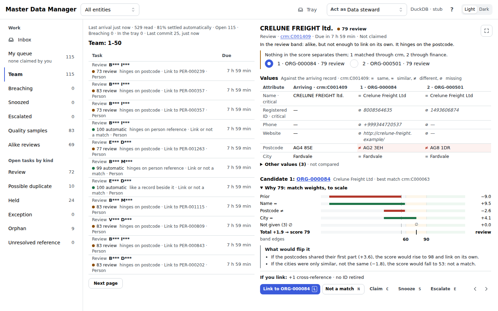
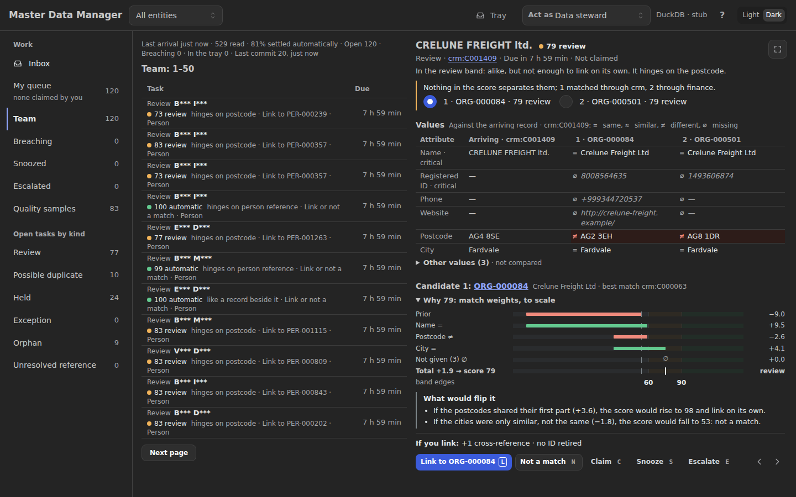
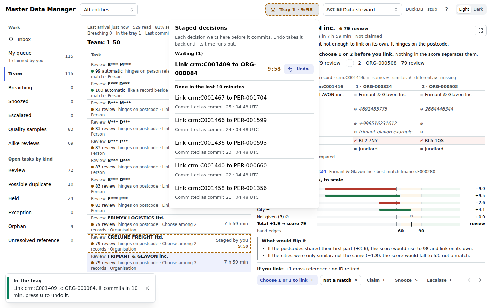
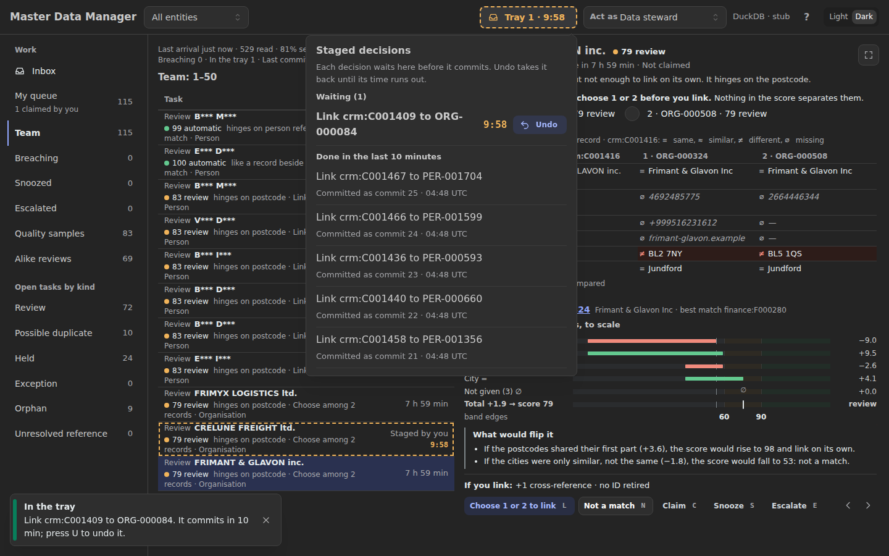
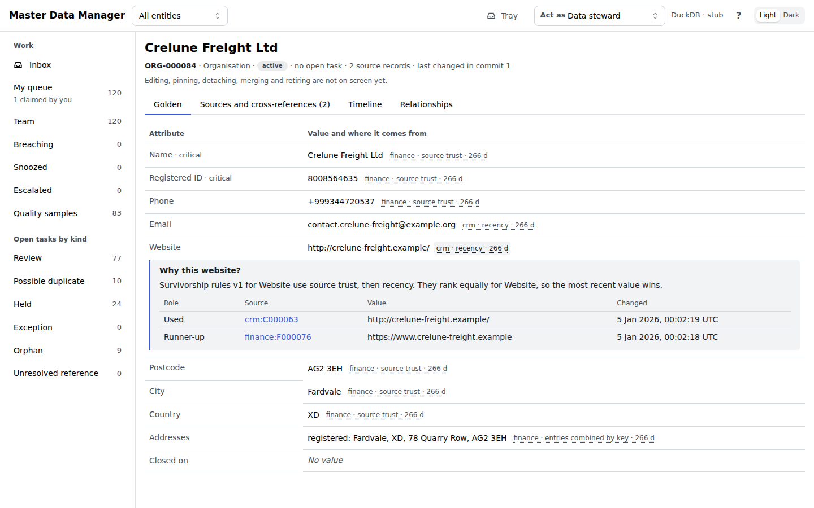
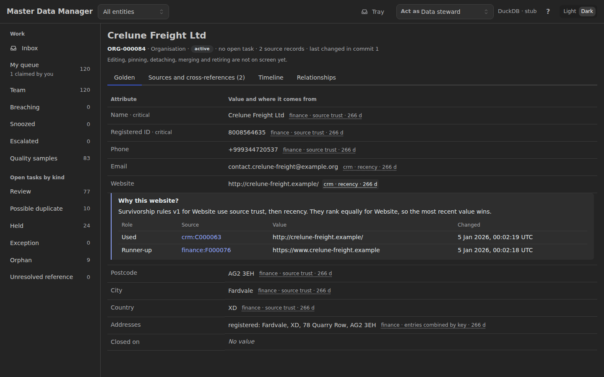
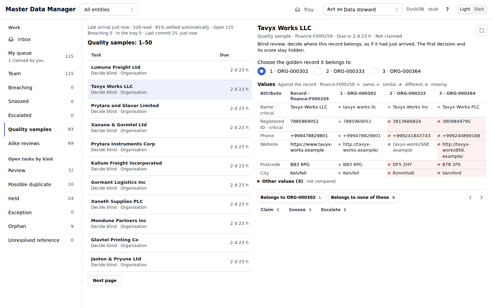
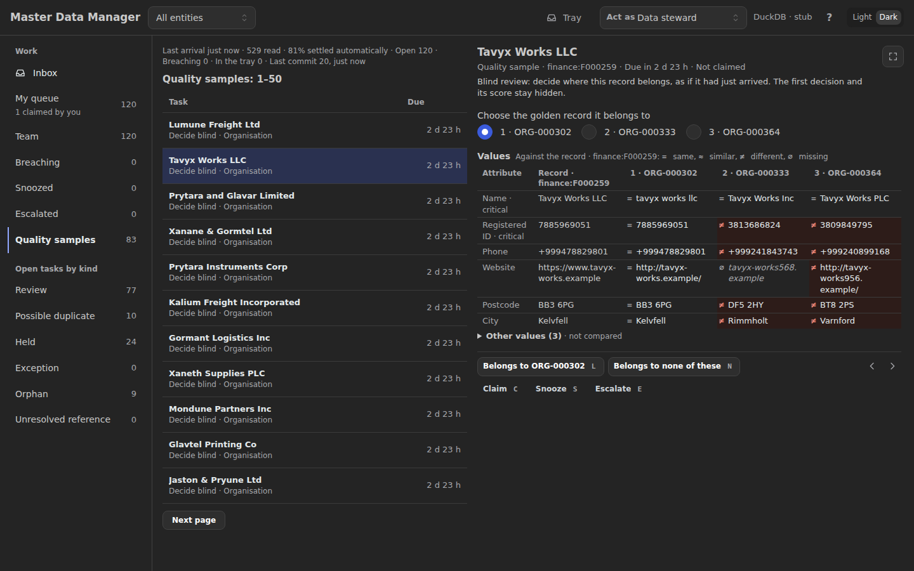

# Master Data Manager

The Master Data Manager (the hub) is a Databricks App, with a local mode on
DuckDB, in which data stewards and data owners turn source records into golden
records they can explain and reverse.

## Status

Foundations, initiative 2, has built the hub's core. From the command line,
on DuckDB and on Postgres, it reads the source changes the integration
platform lands, matches them with explainable rules, and commits golden
records with an ordered change feed. It masks personal values, keeps their
history in a vault, and names the authority behind every commit. The same test
suite runs on both engines locally and in continuous integration (CI), on
invented data only.

The steward workbench, initiative 3, is under way. Locally, a steward
decides tasks one at a time in an inbox, undoes a decision within its window,
and reads any record with its provenance, masked by role. The automated
matcher's checkpoint is built too: blind review samples the matcher's and the
stewards' decisions, and the quality breaker demotes an entity's automatic
band when agreement falls or arrivals spike. The matcher may therefore meet
real data once initiative 4 deploys it. The later stories add decisions by
pattern, routing, search, record actions with maker and checker, and
authoring ([scope](./architecture/scope/3_steward-workbench.md)). Nothing is
deployed yet: tuning, governance and the deployment to Databricks follow in
initiative 4. Release 1 proves Person and Organisation end to end. The
[roadmap](./architecture/6_transition/2_sequence.md) orders the rest.

## Try it

With Python 3.11 and [uv](https://docs.astral.sh/uv/) installed:

```bash
make install        # the environment, from uv.lock
make demo           # a fresh local store: invented changes landed, arrived, committed, and the change feed read
make ui             # the steward workbench on http://127.0.0.1:8050
uv run mdm --help   # every command
make test           # the suite across the cores, on DuckDB, and on Postgres when initdb and pg_ctl are installed
make test-gui       # the browser checks with axe-core, which CI also runs in a job of their own
```

The browser checks need a Chromium build for the pinned Playwright; `uv run
--group gui playwright install chromium` fetches it once.

The local store is one DuckDB file, `.mdm/mdm.duckdb`, and every name in it is
invented.

## The steward workbench

The workbench is where a steward decides what the rules could not settle. It
shows each task with its explanation beside it, and holds every decision in an
undo tray for a minute before it commits.

```bash
make demo           # a fresh local store with invented tasks to decide
make ui             # then open http://127.0.0.1:8050
```

The persona switcher in the header works on a local store only. Press `?` for
the keys. `mdm ui` holds the DuckDB file while it runs, so stop it before other
`mdm` commands on the same store.

A share of decisions comes back as quality samples, in a view of their own,
and a steward decides each one blind: the first decision, its suggestion and
its score stay hidden. When agreement falls or arrivals spike, the quality
breaker pauses automatic linking for that entity, and the inbox says so. Only
a data owner restores it, on the command line:

```bash
uv run mdm breaker status                                        # each entity's band, agreement, samples and arrivals
uv run mdm breaker restore --entity person --reason cause_fixed  # a data owner, after the cause is fixed
```

The screenshots show the invented demo world, taken with the stub assistant
and a ten-minute undo window, so the countdown holds still while it is
captured.



_The inbox with the decide pane open on a close call between two organisations: the candidates side by side, the match-weight waterfall, what would flip it, and the impact line._



_The same view in the dark colour scheme._



_A decision staged in the undo tray, with its countdown._



_The tray in the dark colour scheme._



_A golden record, each value followed by the source, rule and age behind it, with the Why open under one of them: the survivorship sentence, the runners-up and the rule version._



_The same record in the dark colour scheme._



_A quality sample decided blind: the record and the golden records it might belong to, with the steward's first pick made and nothing staged; no score, suggestion or first decision is shown._



_The same quality sample in the dark colour scheme._

## What it does

- Matches the source changes the integration platform writes into landing
  tables, with published, explainable rules.
- Commits minimal change sets to one set of published tables, under a named
  authority, with an ordered change feed. The integration platform carries
  them to listening systems; the hub never propagates.
- Gives stewards an inbox, decided one task at a time with the explanation
  beside it, and an undo tray, so a mistake is undone before listening
  systems see it.
- Samples a share of the automated matcher's and the stewards' decisions for
  blind review, and demotes an entity's automatic band when agreement falls or
  arrivals spike, until a data owner restores it.
- Masks personal values by role on every screen, and logs every reveal with
  its reason.
- Gives the same answers on DuckDB and on Postgres.

## What it will do

- Let stewards decide alike tasks together after a forced sample.
- Put search, record actions with maker and checker, and record authoring on
  screen.
- Run on the platform, on Lakebase, with the same answers as locally.

Language-model assistance only suggests, and arrives in Release 2;
deterministic automation acts only under published rules.

Its siblings are the Reference Data Manager, which manages code lists, and the
Enterprise Architecture (EA) Repository.

## The model

What this project knows about itself lives in
[`architecture/`](./architecture/README.md). Start there: its front page says
which parts are modelled, which belong to somebody else, and which are still
missing.

Folders appear as they earn their place. A layer with nothing to say yet is a
row on that page, not an empty directory.

## How changes are made

A requirement is worked through the model and built directly from it, layer
by layer. The Requester's approval is the pull request merging — the agent
stops earlier only for a contradiction, an ambiguity, or something needing
authorisation. [`AGENTS.md`](./AGENTS.md) states the rule and the declared
modelling depth; the `align-change-through-layers` skill runs the process.

## Public safety

The repository is public, and names no institution, no master data management
vendor and no person. `scripts/scan_public_safe.py` runs in continuous
integration (CI) on every pull request to keep it so.

## Licence

Apache-2.0: see [LICENSE](./LICENSE) and [NOTICE](./NOTICE).

## Built with

[archreator](https://github.com/roanboc/archreator) — an enterprise
architecture method that lives in git as Markdown, with humans owning the
strategy and approving at merge, and AI agents doing the modelling and the
building in between.
