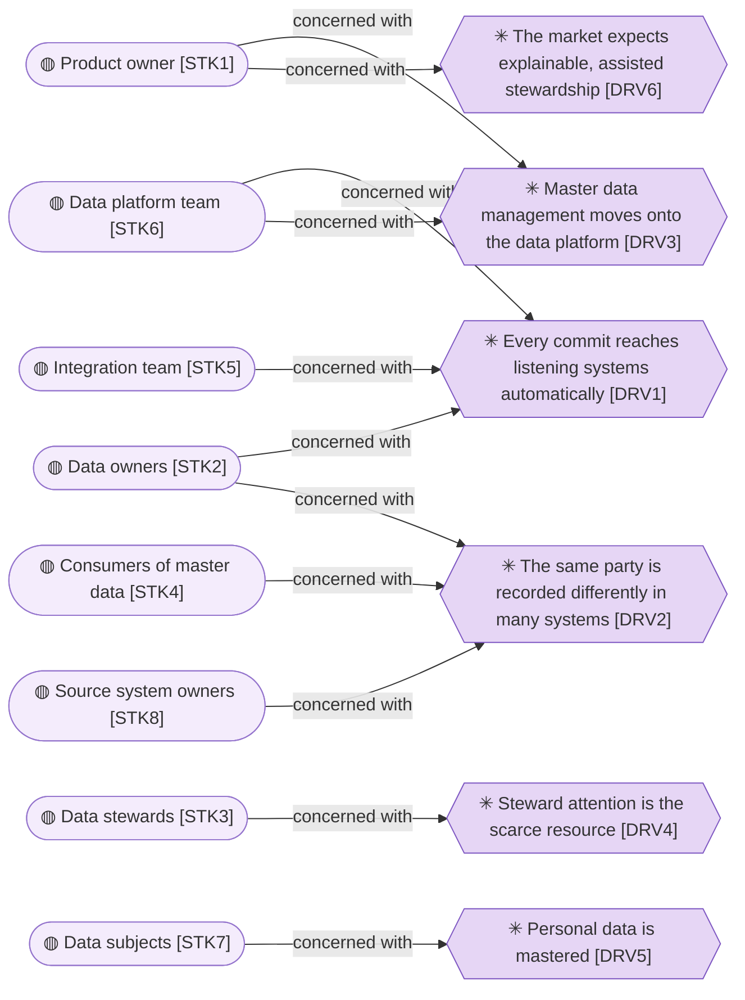
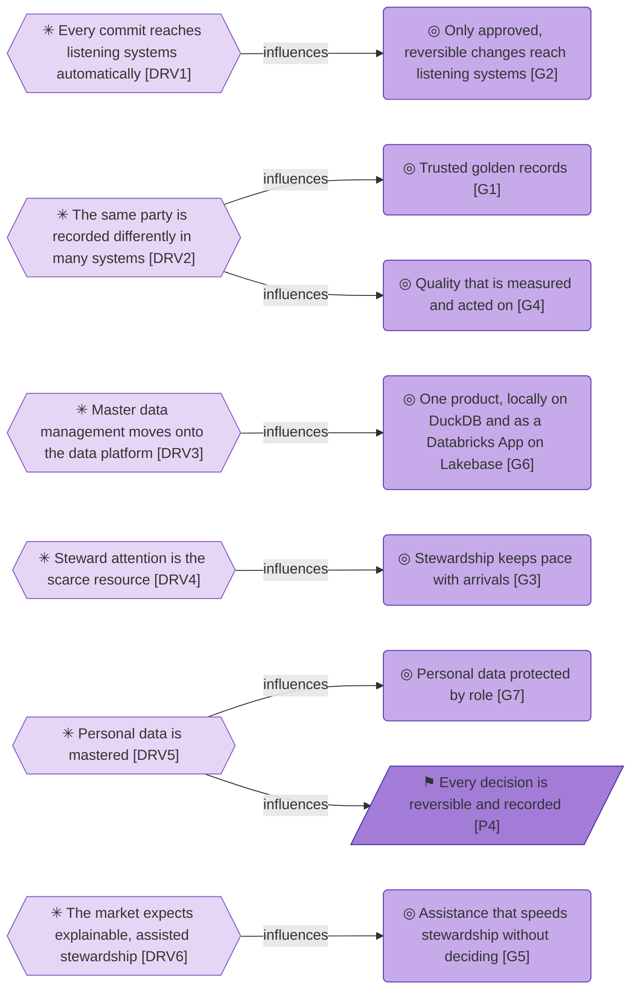
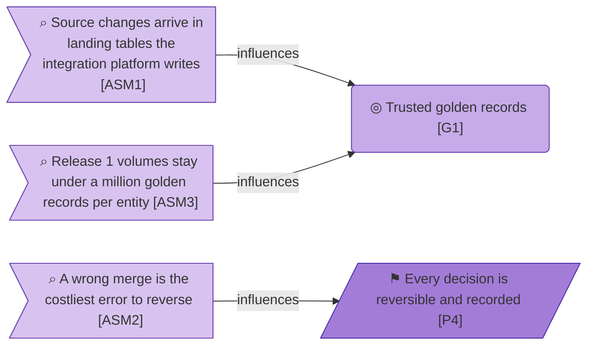
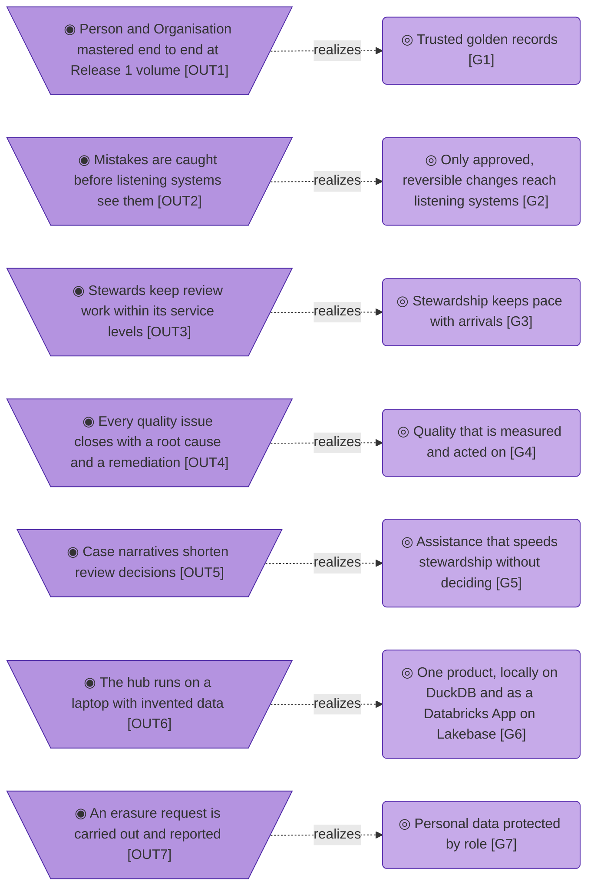
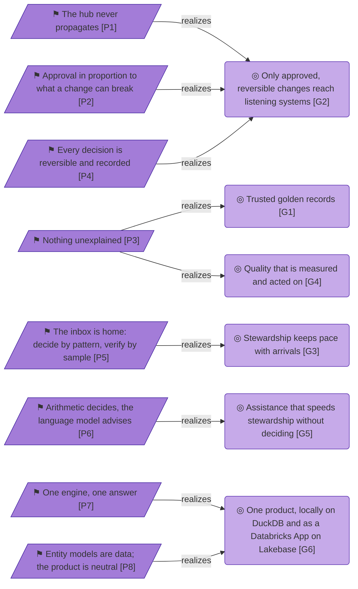

# Motivation

_[← Strategy layer](./README.md) · [Model home](../README.md)_

**ArchiMate viewpoint:** Motivation: Stakeholder, Driver, Assessment, Goal, Outcome, Principle.

**Status:** ◐ Draft catalogue — identified from the product owner's request and answers of 26 September 2026 and the approved Master Data Manager Blueprint; not yet validated.

## Stakeholders

| ID | Stakeholder | Concern | Source | Notes |
| -- | ----------- | ------- | ------ | ----- |
| `STK1` | **Product owner** — an enterprise's data and analytics unit, which commissioned the hub and decides what ships | Master data managed on the data platform, beside its Reference Data Manager, with the services leading master data management products offer | [Request](../reference/2026-09-26-request-and-answers.md#the-request) | |
| `STK2` | **Data owners** — business managers accountable for the records of a master data domain | Nothing reaches listening systems that they did not allow, and approval in proportion to what a change can break | [Blueprint](../reference/README.md#founding-material) §5.5; proposed by the Data Management Body of Knowledge (DAMA-DMBOK2 Revised) ch. 3 | |
| `STK3` | **Data stewards** — the people who curate master records day to day, including those who coordinate them, and the engineers who look after models and sources | Deciding quickly with evidence, and undoing a mistake before it spreads | Blueprint §1, §3 | |
| `STK4` | **Consumers of master data** — people who look records up, and the teams whose systems listen to changes | One trusted version of each person and organisation, a retired identifier (ID) that still resolves, and the reason a value changed | [Request](../reference/2026-09-26-request-and-answers.md#the-request); Blueprint §3 flow (d) | |
| `STK5` | **Integration team** — runs the integration platform, which writes source changes into the landing tables and carries committed changes to listening systems | A landing contract it can meet, a change feed it can read in commit order from its own watermark, and an agreed throttle | [Request](../reference/2026-09-26-request-and-answers.md#the-request); [answer 5](../reference/2026-09-26-request-and-answers.md#answers); Blueprint question 2 | |
| `STK6` | **Data platform team** — runs the platform the hub runs on, including the operational database and the change notifier | Grants and compute it can plan, and a change feed its change notifier can announce | [Request](../reference/2026-09-26-request-and-answers.md#the-request); [answer 5](../reference/2026-09-26-request-and-answers.md#answers); Blueprint §5.6 | |
| `STK7` | **Data subjects** — the people whose personal data the Person entity holds | Their personal values masked, revealed only on record, and erased on request, downstream copies included | [Answer 1](../reference/2026-09-26-request-and-answers.md#answers) | Who sets retention and signs off erasure is not yet named |
| `STK8` | **Source system owners** — own the systems of record the hub reads | Their systems are read and never written, and a defect the hub finds comes back to them as an issue | adopted — the hub reads source records and never writes them | |

## Drivers

| ID | Driver | Source | Notes |
| -- | ------ | ------ | ----- |
| `DRV1` | **Every commit reaches listening systems automatically** — every commit to the published tables reaches listening systems through the platform, so a committed change can be compensated but never recalled | [Request](../reference/2026-09-26-request-and-answers.md#the-request); [answer 5](../reference/2026-09-26-request-and-answers.md#answers) | |
| `DRV2` | **The same party is recorded differently in many systems** — people and organisations sit in many source systems with duplicates and conflicting values, and every consumer needs one reconciled version | [Request](../reference/2026-09-26-request-and-answers.md#the-request); proposed by DMBOK2 Revised ch. 10 | |
| `DRV3` | **Master data management moves onto the data platform** — the data and analytics unit is bringing master data management onto its data platform, beside its Reference Data Manager, and a migration from the incumbent hub follows as its own initiative | [Request](../reference/2026-09-26-request-and-answers.md#the-request); [founding material](../reference/README.md#founding-material): the unit's platform proposal on master data management and data quality; Blueprint §7 | |
| `DRV4` | **Steward attention is the scarce resource** — every arrival the rules cannot settle becomes a person's work, so what a steward can decide in an hour sets how much the hub can master | Blueprint §1; adopted — steward attention is treated as the binding constraint | |
| `DRV5` | **Personal data is mastered** — Person is mastered from Release 1, so the hub holds personal values that must be masked by role, revealed only on record and redacted on erasure | [Answer 1](../reference/2026-09-26-request-and-answers.md#answers) | |
| `DRV6` | **The market expects explainable, assisted stewardship** — leading master data management products explain their match scores and use artificial intelligence (AI) to help stewards, and the product owner asked for innovative AI-assisted services like those of the Enterprise Architecture Repository | [Request](../reference/2026-09-26-request-and-answers.md#the-request); proposed by the Gartner Magic Quadrant for Master Data Management Solutions (2026) | |

## Assessments

| ID | Assessment | Consequence | Source | Notes |
| -- | ---------- | ----------- | ------ | ----- |
| `ASM1` | **Source changes arrive in landing tables the integration platform writes** — the integration platform writes each source change into landing tables in the operational database, and the hub reads them on from its own watermark | The hub keeps every source version itself and never writes a landing table; service levels start when a change lands. A sync to the lakehouse serves analytics only and is never the route to listening systems | [Answers 3 and 5](../reference/2026-09-26-request-and-answers.md#answers) | |
| `ASM2` | **A wrong merge is the costliest error to reverse** — merging two different entities hides one behind the other's master ID, and listening systems have already joined on that ID | Merge is never automatic, a retired ID maps to its survivor, and unmerge brings the retired ID back | Blueprint §8; proposed by DMBOK2 Revised ch. 10 | |
| `ASM3` | **Release 1 volumes stay under a million golden records per entity** — Person and Organisation are expected below one million golden records each, and larger entities may follow | Release 1 is built and tested for under a million per entity, and keeps the path to five million easy with paged reads, stored blocking keys, resumable jobs and arrivals read from a watermark | [Answer 3](../reference/2026-09-26-request-and-answers.md#answers) | The product owner may raise the figure if Person nears one million |

## Goals

| ID | Goal | Source | Notes |
| -- | ---- | ------ | ----- |
| `G1` | **Trusted golden records** — every person and organisation the enterprise shares has one reconciled golden record, with a stable master ID and a reason for every value | [Request](../reference/2026-09-26-request-and-answers.md#the-request); [answer 1](../reference/2026-09-26-request-and-answers.md#answers); proposed by DMBOK2 Revised ch. 10 | |
| `G2` | **Only approved, reversible changes reach listening systems** — every change is approved in proportion to what it can break before it commits, and can be reversed after | [Request](../reference/2026-09-26-request-and-answers.md#the-request); Blueprint §5.5 | |
| `G3` | **Stewardship keeps pace with arrivals** — stewards clear the work arrivals create by deciding patterns checked by samples, not one record at a time | Blueprint §1, §3; adopted — keeping pace with arrivals is the goal the steward-first design serves | |
| `G4` | **Quality that is measured and acted on** — every entity, attribute and source is measured against typed rules, and every issue is traced to a root cause | [Request](../reference/2026-09-26-request-and-answers.md#the-request); proposed by DMBOK2 Revised ch. 13 | |
| `G5` | **Assistance that speeds stewardship without deciding** — language-model services summarise cases, answer with cited records and draft configuration, while deterministic services act and a person decides | [Request](../reference/2026-09-26-request-and-answers.md#the-request); [answer 2](../reference/2026-09-26-request-and-answers.md#answers) | |
| `G6` | **One product, locally on DuckDB and as a Databricks App on Lakebase** — entity models are configuration, so one product serves every entity; it runs as a Databricks App on Lakebase and locally on DuckDB, and gives the same answers in both | [Request](../reference/2026-09-26-request-and-answers.md#the-request) | |
| `G7` | **Personal data protected by role** — each person sees a personal value only as far as their role allows, every reveal is on record, and a data subject's values can be erased | [Answer 1](../reference/2026-09-26-request-and-answers.md#answers); Blueprint §5.6 | |

## Outcomes

Dashed edges are not true yet, because no outcome has been observed.

| ID | Outcome | Checked by | Source | Notes |
| -- | ------- | ---------- | ------ | ----- |
| `OUT1` | **Person and Organisation mastered end to end at Release 1 volume** — both entities land, arrive and commit as golden records, at under a million golden records each | **Pending — future initiative** (initiatives 2 and 4): an end-to-end run on invented data on both stores, a throughput run at the declared volume, then a run in the platform's development environment, all before Release 1 goes live; a miss goes to the product owner with the numbers | [Answers 1 and 3](../reference/2026-09-26-request-and-answers.md#answers) | |
| `OUT2` | **Mistakes are caught before listening systems see them** — a steward's mistake is undone before it commits, rather than compensated after | **Pending — future initiative** (initiative 4): from go-live, the operations board counts steward decisions undone before commit and those compensated after; three months after go-live, at least nine in ten are undone before commit | Blueprint §4; adopted — the measure, and the target of nine in ten | The product owner may change the target |
| `OUT3` | **Stewards keep review work within its service levels** — review tasks are decided within their service levels, many of them in sampled batches | **Pending — future initiative** (initiative 4): from go-live, the operations board reports each month the share of review tasks decided within their service level, at least 95%, and the share decided in sampled batches | Blueprint §3; adopted — the measure of the steward-first design, and the target of 95% | The product owner may change the target |
| `OUT4` | **Every quality issue closes with a root cause and a remediation** — a quality issue is traced to its cause and fixed where it arose | **Pending — future initiative** (initiative 4): three months after go-live, the operations board shows no quality issue open past its service level without a named root cause | Blueprint §2; proposed by DMBOK2 Revised ch. 13; adopted — the check three months after go-live | The product owner may change the target |
| `OUT5` | **Case narratives shorten review decisions** — stewards decide a review task faster with a case narrative than without one | **Pending — future initiative** (Release 2, initiative 5): three months after Release 2 goes live, the operations board shows a shorter median time per decision with a narrative than without one | [Answer 2](../reference/2026-09-26-request-and-answers.md#answers); adopted — the measure of assisted stewardship | Release 1 sets the baseline |
| `OUT6` | **The hub runs on a laptop with invented data** — anyone can run every flow locally, with the stub in place of the language model and no platform access | **Pending — future initiative** (initiatives 3 and 4): by the end of initiative 4, an ambiguous arrival, a rule change, a batch decided by pattern and an explained change all run locally on the invented demo data | [Request](../reference/2026-09-26-request-and-answers.md#the-request) | |
| `OUT7` | **An erasure request is carried out and reported** — a data subject's personal values are redacted in the hub, and every downstream copy is named for its owner | **Pending — future initiative** (initiatives 2 and 4): masking, reveal-logging and erasure tests pass before real Person data loads | [Answer 1](../reference/2026-09-26-request-and-answers.md#answers); Blueprint §2 | |

## Principles

| ID | Principle | Test | Source | Notes |
| -- | --------- | ---- | ------ | ----- |
| `P1` | **The hub never propagates** — it commits approved, minimal change sets to one set of published tables; announcing and carrying them to listening systems belongs to the platform's change notifier and the integration platform | Nothing in the hub queues, notifies, calls or tracks a listening system, and only the commit path changes the published tables | Blueprint §1; [Request](../reference/2026-09-26-request-and-answers.md#the-request); [answer 5](../reference/2026-09-26-request-and-answers.md#answers) | |
| `P2` | **Approval in proportion to what a change can break** — an approval matrix, approved by the data owners and including each source's policy, governs every commit and is checked again at commit time | Every commit names the matrix row, source policy or published rule version that allowed it, and no person, automated actor or direct write bypasses the check | Blueprint §1, §5.5 | |
| `P3` | **Nothing unexplained** — every score shows its band, its weights and what would change it; every golden value says why it won; every figure opens its rows | Every score, golden value and figure opens its explanation or its rows in one action | Blueprint §1 | |
| `P4` | **Every decision is reversible and recorded** — undo before commit, compensate after; history only grows, and governed redaction of personal values is the one exception, itself recorded | Every committed decision has a reversing action, and history changes only through a recorded redaction | Blueprint §1 | |
| `P5` | **The inbox is home: decide by pattern, verify by sample** — stewards work from one inbox, decide alike tasks together after a forced sample, and see every row's change in a bulk edit | Every bulk decision passed a forced sample and showed every row's change before it committed | Blueprint §1 | |
| `P6` | **Arithmetic decides, the language model advises** — only deterministic services act, under a published policy; language-model services suggest, are labelled, and each has a deterministic stub | No language-model output commits, and every AI feature works on its stub | Blueprint §1; [Answer 2](../reference/2026-09-26-request-and-answers.md#answers) | |
| `P7` | **One engine, one answer** — every place the hub runs, and every way it is used, on screen, at the command line or as a job, gives the same result | The same inputs give the same candidates, scores and golden values on every store and every interface | Blueprint §1; [Request](../reference/2026-09-26-request-and-answers.md#the-request) | |
| `P8` | **Entity models are data; the product is neutral** — entities, rules and policies are versioned configuration, and the product names no organisation, vendor or person | Adding an entity needs no code change, and the public-safety scan is clean | Blueprint §1; [Request](../reference/2026-09-26-request-and-answers.md#the-request) | |
