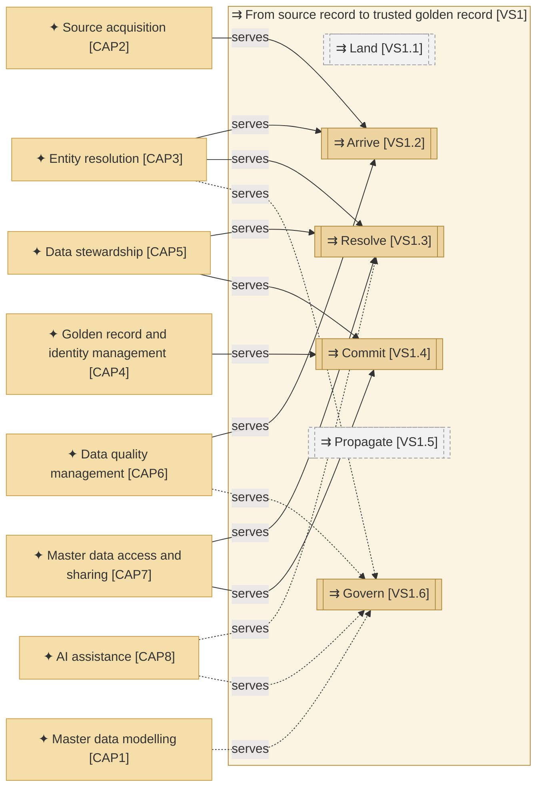
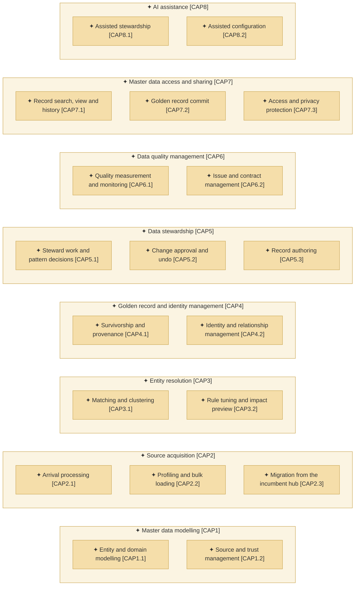
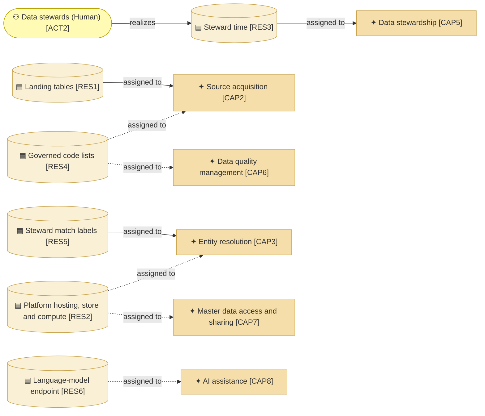

# Capabilities and resources

_[← Strategy layer](./README.md) · [Model home](../README.md)_

**ArchiMate viewpoint:** Strategy: Capability, Resource.

**Status:** ● Validated, 2026-09-27.

## Capabilities

Areas `CAP1`–`CAP5` and `CAP7` follow the processing steps of master data management in the Data Management Body of Knowledge (DAMA-DMBOK2 Revised), chapter 10. Data quality management follows chapter 13, and assistance by artificial intelligence (AI) is the product owner's request.

### Level 1 — the areas

Solid edges are true: the hub reads, resolves and commits arrivals by the published rules, and stewards decide the rest on screen. Dashed edges wait for governance on the platform and the language model. Nothing in the hub serves Land or Propagate, which happen outside it.

| ID | Capability area | Source | Notes |
| -- | --------------- | ------ | ----- |
| `CAP1` | **Master data modelling** — defining what each entity is, how its master data domain relates to sources, and whom to trust | [Blueprint](../reference/README.md#founding-material) §2 (model group); adopted — grouped as the data model management step of DMBOK2 Revised ch. 10 | |
| `CAP2` | **Source acquisition** — taking in what the integration platform writes into the landing tables, and what the incumbent hub holds | Blueprint §2 (ingest group); adopted — grouped as the acquisition, validation and standardisation steps of DMBOK2 Revised ch. 10 | |
| `CAP3` | **Entity resolution** — deciding which records describe the same real-world entity | Blueprint §2 (match and merge group); adopted — grouped as the entity resolution step of DMBOK2 Revised ch. 10 | |
| `CAP4` | **Golden record and identity management** — keeping each golden record, its master identifier (ID) and its relationships true | Blueprint §2 (golden record and relationship groups); adopted — merged as the identifier and affiliation management step of DMBOK2 Revised ch. 10 | |
| `CAP5` | **Data stewardship** — the people's work of deciding, approving and correcting | Blueprint §2 (stewardship and authoring groups); adopted — merged as the stewardship of DMBOK2 Revised ch. 10 | |
| `CAP6` | **Data quality management** — measuring quality and acting on it | Blueprint §2 (quality and insight groups); adopted — merged as the data quality management of DMBOK2 Revised ch. 13 | |
| `CAP7` | **Master data access and sharing** — letting people and listening systems use golden records safely | Blueprint §2 (search, audit, administration and interface groups); adopted — merged as the sharing step of DMBOK2 Revised ch. 10 | |
| `CAP8` | **AI assistance** — help for stewards and for the people who configure the hub, through a language model | [Request](../reference/2026-09-26-request-and-answers.md#the-request); [answer 2](../reference/2026-09-26-request-and-answers.md#answers); proposed by the Gartner Magic Quadrant for Master Data Management Solutions (2026) | |

Two abilities are gaps. Enrichment from an external register needs a licensed register and a decision on data leaving the platform. A web interface for other systems, in the representational state transfer (REST) style, needs an authentication decision. Until then, the command line, masked read views and batch matching cover the need.

### Level 2 — the capabilities

| ID | Capability | Realized by | Source | Notes |
| -- | ---------- | ----------- | ------ | ----- |
| `CAP1.1` | **Entity and domain modelling** — defines versioned entity models, and the architecture style each master data domain follows | [business service [`BSVC5`] Model, source and rule governance](../2_business/2_business-services.md#business-services); promotion between environments **Pending — future initiative** ([initiative 4](../6_transition/2_sequence.md#sequence)); classification tags (Release 2, [initiative 5](../6_transition/2_sequence.md#sequence)) | Blueprint §2; proposed by DMBOK2 Revised ch. 10 (data model management, architectural approach) | |
| `CAP1.2` | **Source and trust management** — registers each source with the attributes it is the system of record for, its trust ranks and its approval policy | business service [`BSVC5`] Model, source and rule governance; source and trust screens **Pending — future initiative** ([initiative 4](../6_transition/2_sequence.md#sequence)) | Blueprint §2; proposed by DMBOK2 Revised ch. 10 (system of record) | |
| `CAP2.1` | **Arrival processing** — reads each source change from the landing tables, then checks, standardises, keys and scores it and keeps its version | [business service [`BSVC2`] Arrival resolution](../2_business/2_business-services.md#business-services) | Blueprint §2, §5.2; [Answer 5](../reference/2026-09-26-request-and-answers.md#answers); proposed by DMBOK2 Revised ch. 10 (validation, standardisation) | |
| `CAP2.2` | **Profiling and bulk loading** — profiles a new source, and loads its history in resumable chunks flagged as an initial load | business service [`BSVC5`] Model, source and rule governance, through the command line; profiling screens **Pending — future initiative** ([initiative 4](../6_transition/2_sequence.md#sequence)) | Blueprint §2; [Answer 3](../reference/2026-09-26-request-and-answers.md#answers); proposed by DMBOK2 Revised ch. 13 (profiling) | |
| `CAP2.3` | **Migration from the incumbent hub** — imports legacy IDs, history and open exceptions, then runs beside the incumbent hub until the switch-over | **Pending — future initiative** (initiative 6) | [Request](../reference/2026-09-26-request-and-answers.md#the-request); Blueprint §2, §7 | |
| `CAP3.1` | **Matching and clustering** — finds candidate records on stored keys, gives each pair an explained score and band, and keeps clusters current | business service [`BSVC2`] Arrival resolution; the decision view in the workbench's inbox, [application service [`ASVC8`] Steward work](../4_application/1_application-services.md#application-services); the cluster view **Pending — future initiative** ([initiative 3](../6_transition/2_sequence.md#sequence), story 3.6); semantic candidates on non-personal attributes (Release 3, [initiative 7](../6_transition/2_sequence.md#sequence)) | Blueprint §2, §5.2; proposed by DMBOK2 Revised ch. 10 (entity resolution) | |
| `CAP3.2` | **Rule tuning and impact preview** — tunes match and survivorship rules, and shows exactly what a new version would change, and the steward hours it would cost, before it is published | business service [`BSVC5`] Model, source and rule governance, for weight estimation and the match test; the dry run and impact preview **Pending — future initiative** ([initiative 4](../6_transition/2_sequence.md#sequence)); label tuning (Release 2, [initiative 5](../6_transition/2_sequence.md#sequence)) | Blueprint §2, §3 flow (b), §4; proposed by DMBOK2 Revised ch. 10 (false positives and false negatives) | |
| `CAP4.1` | **Survivorship and provenance** — picks each golden value by rule, and records why it won and what it beat | business service [`BSVC2`] Arrival resolution; the explanation view is the Why of each value in [application service [`ASVC10`] Record lookup](../4_application/1_application-services.md#application-services) | Blueprint §2; proposed by DMBOK2 Revised ch. 10 (golden record) and ISO 8000-120 | |
| `CAP4.2` | **Identity and relationship management** — keeps master IDs, cross-references and relationships true through link, merge, detach, unmerge, retire, reinstate and purge | [application service [`ASVC5`] Record lifecycle](../4_application/1_application-services.md#application-services), as service functions, with link on screen in the workbench; detach, merge, unmerge, retire and reinstate on screen **Pending — future initiative** ([initiative 3](../6_transition/2_sequence.md#sequence), story 3.6); hierarchies (Release 2, [initiative 5](../6_transition/2_sequence.md#sequence)); a graph explorer (Release 3, [initiative 7](../6_transition/2_sequence.md#sequence)) | Blueprint §2, §5.2; proposed by DMBOK2 Revised ch. 10 (identifier and affiliation management) and ISO 8000-115 | |
| `CAP5.1` | **Steward work and pattern decisions** — gives stewards one ranked inbox with a suggested decision per task, where alike tasks are decided together after a forced sample | [application service [`ASVC8`] Steward work](../4_application/1_application-services.md#application-services), for one inbox ordered by due time with a suggested decision per task; ranks with their reasons **Pending — future initiative** ([initiative 3](../6_transition/2_sequence.md#sequence), story 3.4); decisions by pattern after a forced sample **Pending — future initiative** (initiative 3, story 3.3); automation grants, work balancing and comments in Release 2 (initiative 5) | Blueprint §2, §3 flows (a) and (c); proposed by DMBOK2 Revised ch. 10 (stewardship) | |
| `CAP5.2` | **Change approval and undo** — approves change sets under the approval matrix, shows what each would touch, and undoes it before commit or compensates after | [application service [`ASVC9`] Undo tray](../4_application/1_application-services.md#application-services), for undo before commit [application service [`ASVC4`] Golden record commit](../4_application/1_application-services.md#application-services), for the commit path and its authority check; change sets with a checker on screen **Pending — future initiative** ([initiative 3](../6_transition/2_sequence.md#sequence), story 3.6) | Blueprint §2, §4, §5.5; proposed by DMBOK2 Revised ch. 10 (controlled change) | |
| `CAP5.3` | **Record authoring** — creates and edits records with inline validation and a live duplicate check | **Pending — future initiative** ([initiative 3](../6_transition/2_sequence.md#sequence), story 3.7); file import in Release 2 (initiative 5) | Blueprint §2; proposed by DMBOK2 Revised ch. 10 (transaction hub style) | |
| `CAP6.1` | **Quality measurement and monitoring** — runs typed quality rules, and reports health per entity, attribute, source and dimension, every figure opening its rows | [application service [`ASVC1`] Arrival resolution](../4_application/1_application-services.md#application-services), for rules on arrival; scorecards and the operations board **Pending — future initiative** ([initiative 4](../6_transition/2_sequence.md#sequence)); trends, drift and programme metrics (Release 2, [initiative 5](../6_transition/2_sequence.md#sequence)) | Blueprint §2; proposed by DMBOK2 Revised ch. 13 (rule types, dimensions, measure and monitor) | |
| `CAP6.2` | **Issue and contract management** — tracks quality issues to a root cause and remediation, and consumer data contracts to their breaches | **Pending — future initiative** (initiative 4); export in the Open Data Contract Standard (ODCS) in Release 2 (initiative 5) | Blueprint §2; proposed by DMBOK2 Revised ch. 13 (issue management) and ODCS | |
| `CAP7.1` | **Record search, view and history** — finds any golden record, held arrival or task, and shows it with its sources, relationships, quality and full history | [application service [`ASVC10`] Record lookup](../4_application/1_application-services.md#application-services), for the record view with its sources, relationships and timeline application service [`ASVC4`] Golden record commit, for the audit log; search and a record as of a date **Pending — future initiative** ([initiative 3](../6_transition/2_sequence.md#sequence), story 3.5); quality in the record view and the audit screens **Pending — future initiative** ([initiative 4](../6_transition/2_sequence.md#sequence)) | Blueprint §2, §3; proposed by DMBOK2 Revised ch. 10 (sharing, controlled change) | |
| `CAP7.2` | **Golden record commit** — commits approved change sets in order to the published tables, whose change feed gives each commit a version | [business service [`BSVC7`] Published golden records and change feed](../2_business/2_business-services.md#business-services) | Blueprint §5.4; [Answer 5](../reference/2026-09-26-request-and-answers.md#answers); proposed by the Gartner Magic Quadrant for Master Data Management Solutions (2026) market definition (integration and synchronisation) | |
| `CAP7.3` | **Access and privacy protection** — masks personal values by role on screen and in read views, logs every reveal, and redacts a data subject's values on erasure | [business service [`BSVC8`] Access and privacy administration](../2_business/2_business-services.md#business-services), for masking and logged reveals; administration and erasure **Pending — future initiative** ([initiative 4](../6_transition/2_sequence.md#sequence)) | Blueprint §2, §5.6; [Answer 1](../reference/2026-09-26-request-and-answers.md#answers); proposed by DMBOK2 Revised ch. 7 (data security) and ch. 3 (governance roles) | |
| `CAP8.1` | **Assisted stewardship** — drafts masked case narratives, and answers questions with cited records | **Pending — future initiative** (Release 2, [initiative 5](../6_transition/2_sequence.md#sequence)); the plumbing and a complete stub exist as [application service [`ASVC7`] Assistance plumbing](../4_application/1_application-services.md#application-services) | [Answer 2](../reference/2026-09-26-request-and-answers.md#answers); Blueprint §4 | |
| `CAP8.2` | **Assisted configuration** — suggests names, models and rules from a sample file or plain language, for a person to confirm | **Pending — future initiative** (Release 2, initiative 5, for onboarding; Release 3, initiative 7, for rule drafting and agent tools) | [Answer 2](../reference/2026-09-26-request-and-answers.md#answers); Blueprint §4 | |

## Resources

The landing tables serve source acquisition, steward time serves stewardship, and the stewards' labels bind the matcher. Dashed edges wait for the platform, the route from the Reference Data Manager and the language model. The yellow actor belongs to the business layer.

| ID | Resource | Held by | Source | Notes |
| -- | -------- | ------- | ------ | ----- |
| `RES1` | **Landing tables** — the source changes the integration platform writes into the operational database | External — the integration team's landing tables, which the hub reads and never writes | [Answer 5](../reference/2026-09-26-request-and-answers.md#answers) | |
| `RES2` | **Platform hosting, store and compute** — the app host, the operational database and the jobs the hub runs on | External — the product owner's platform workspace; compute beyond the smallest size is spend the product owner agrees first | [Request](../reference/2026-09-26-request-and-answers.md#the-request) | |
| `RES3` | **Steward time** — the hours data stewards can give to decisions, the scarcest resource the hub depends on | The stewards: [actor [`ACT2`] Data stewards](../2_business/1_business-actors-and-roles.md#actors) | Blueprint §1; adopted — steward time is treated as a resource the hub depends on | |
| `RES4` | **Governed code lists** — reference values, such as countries and currencies, that the Reference Data Manager governs | External — the Reference Data Manager, which the hub reads and never writes | Blueprint §2 | |
| `RES5` | **Steward match labels** — every match decision a steward makes, kept as evidence for tuning rules | [Data object [`DOBJ3.6`] Steward match label](../3_information/2_data-objects.md#resolution-work), kept as stewards decide | Blueprint §2 | |
| `RES6` | **Language-model endpoint** — a configured serving endpoint for AI assistance, off until an administrator enables it per master data domain | **Pending — future initiative** (Release 2, initiative 5); Release 1 ships a stub | [Answer 2](../reference/2026-09-26-request-and-answers.md#answers) | |
