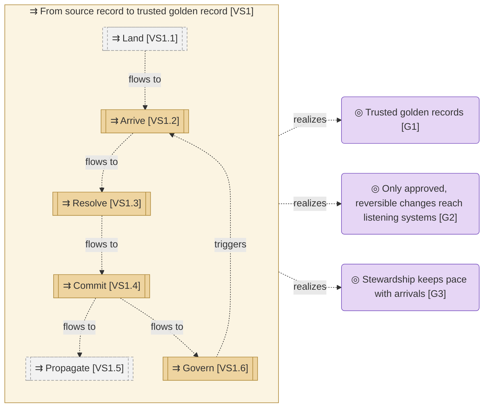

# Value stream

_[← Strategy layer](./README.md) · [Model home](../README.md)_

**ArchiMate viewpoint:** Strategy: Value Stream.

**Status:** ◐ Draft catalogue — identified from the product owner's request and answers of 26 September 2026 and the approved Master Data Manager Blueprint; not yet validated.

## Value stream

Grey stages with a dashed border happen outside the hub. Dashed edges are not true yet, because the hub is not built.

| ID | Value stream or stage | Value added | Realized by | Source | Notes |
| -- | --------------------- | ----------- | ----------- | ------ | ----- |
| `VS1` | **From source record to trusted golden record** — how a change in a source system becomes a trusted golden record that listening systems receive | Every system that uses master data relies on one reconciled version of each person and organisation | **Pending — future initiative** (initiatives 2 to 4), through its stages | [Blueprint](../reference/README.md#founding-material) §7; [Request](../reference/2026-09-26-request-and-answers.md#the-request) | |
| `VS1.1` | **Land** — the integration platform writes a source change into the landing tables | The change is in the operational database, ready for the hub to read | External — the integration platform, run by the integration team | [Answer 5](../reference/2026-09-26-request-and-answers.md#answers) | |
| `VS1.2` | **Arrive** — the hub reads the change from its watermark, checks it against the landing contract, standardises and scores it, and keeps its version | Every arrival can be compared with every golden record | **Pending — future initiative** (initiative 2): the arrival business process | adopted — stages drawn from the Blueprint's arrival flow (§3, flow (a)); [Answer 5](../reference/2026-09-26-request-and-answers.md#answers) | |
| `VS1.3` | **Resolve** — the automated matcher settles what the published rules allow, and stewards decide the rest by pattern | Every arrival has a decided place | **Pending — future initiative** (initiatives 2 and 3) | adopted — stages drawn from the Blueprint's arrival and sweep flows (§3, flows (a) and (c)) | |
| `VS1.4` | **Commit** — an approved change set reaches the published tables with its authority; a steward's decision first waits out its undo window | The golden record changes, explained and reversible | **Pending — future initiative** (initiative 2): the commit business process | adopted — stages drawn from the Blueprint's arrival flow (§3, flow (a)) | |
| `VS1.5` | **Propagate** — the platform's change notifier and the integration platform carry committed changes to listening systems | Every listening system sees the same committed change within seconds | External — the platform's change notifier and the integration platform | [Answer 5](../reference/2026-09-26-request-and-answers.md#answers) | |
| `VS1.6` | **Govern** — data owners and technical stewards define models, sources and rules, tune them with an exact dry run, and send quality issues back to sources | Fewer arrivals need a person next time | **Pending — future initiative** (initiatives 2 and 4) | adopted — stage for the Blueprint's rule change flow (§3, flow (b)) | |
