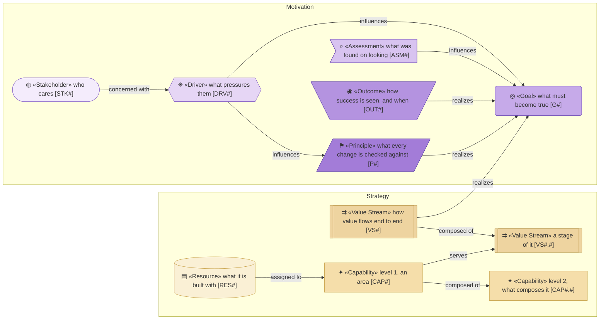
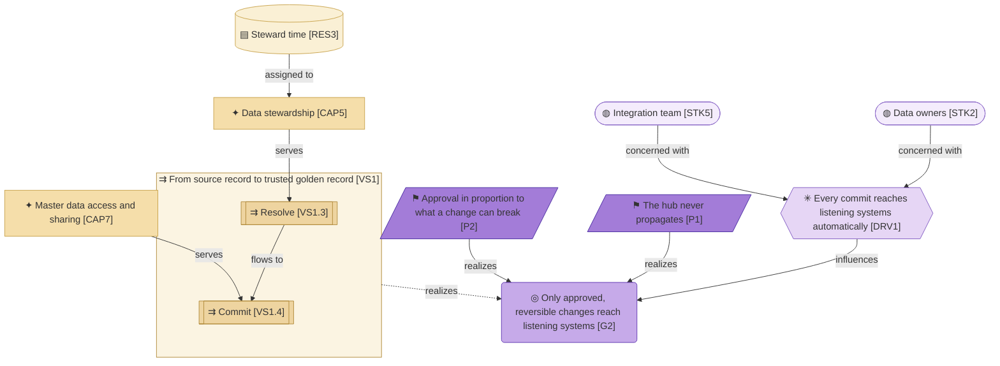

# Strategy & Motivation Layer

_[← Model home](../README.md)_

Who has a stake in the Master Data Manager, why it exists, what it must be able to do, and how value flows to listening systems.

**ArchiMate viewpoint:** Motivation and Strategy: Stakeholder, Driver, Assessment, Goal, Outcome, Principle, Value Stream, Capability, Resource.

## Documents

| # | Document | Elements | Question it answers |
| - | -------- | -------- | ------------------- |
| 1 | [1_motivation.md](./1_motivation.md) | Stakeholders, Drivers, Assessments, Goals, Outcomes, Principles | Who cares, what pressures them, and what must always be true? |
| 2 | [2_capabilities-and-resources.md](./2_capabilities-and-resources.md) | Capability areas and capabilities, Resources | What must the hub be able to do, and with what? |
| 3 | [3_value-stream.md](./3_value-stream.md) | Value Stream and its stages | How does value flow from a source record to a listening system? |

## Metamodel

Purple is Motivation and tan is Strategy. Within each, the shade darkens along the chain: from stakeholder to principle, and from resource to value stream.

## Layer view

Solid edges are true: stewards give their time to resolving what the rules leave, and resolved arrivals reach Commit, which the sharing capability serves. The dashed edge waits for the rest of the steward workbench and the platform deployment.
