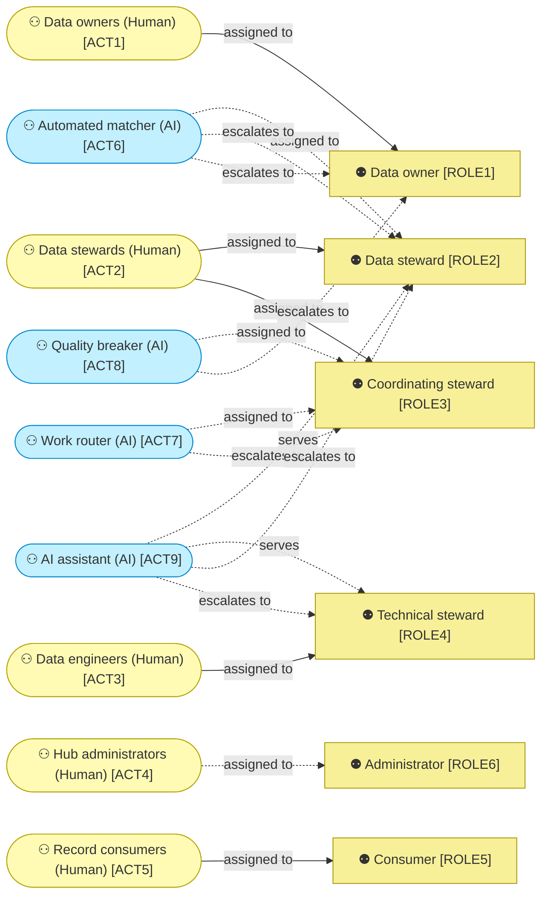

# Business actors and roles

_[← Business layer](./README.md) · [Model home](../README.md)_

**ArchiMate viewpoint:** Business layer: Business Actor, Business Role, Contract.

**Status:** ● Validated, 2026-09-27.

## Actors

Cyan, and the mark (AI) for artificial intelligence, show an automated actor, never a person. Dashed edges are not true yet, because the hub is not built.

| ID | Actor | Kind | State | Source | Notes |
| -- | ----- | ---- | ----- | ------ | ----- |
| `ACT1` | **Data owners** — business managers accountable for the records of a master data domain; the people behind [stakeholder [`STK2`] Data owners](../1_strategy/1_motivation.md#stakeholders) | Human | Exists today | [Blueprint](../reference/README.md#founding-material) §5.5 | |
| `ACT2` | **Data stewards** — the people who curate master records, the senior ones coordinating the rest; with the data engineers, the people behind [stakeholder [`STK3`] Data stewards](../1_strategy/1_motivation.md#stakeholders) | Human | Exists today | Blueprint §3 | |
| `ACT3` | **Data engineers** — the data and analytics unit's engineers who configure models, sources and jobs; with the data stewards, the people behind stakeholder [`STK3`] Data stewards | Human | Exists today | Blueprint §5.6; adopted — named for the technical steward role | |
| `ACT4` | **Hub administrators** — the product owner's staff who will run the hub | Human | **Pending — future initiative** (initiative 4): when the hub is deployed | Blueprint §5.6 | |
| `ACT5` | **Record consumers** — staff and analysts who look golden records up; among [stakeholder [`STK4`] Consumers of master data](../1_strategy/1_motivation.md#stakeholders) | Human | Exists today | Blueprint §5.6 | |
| `ACT6` | **Automated matcher** — settles the arrivals the published rules allow, recomputes golden values when a pin expires, and applies an approved rule version to existing records | Automated (AI), deterministic, with no language model — autonomous with checkpoint | **Pending — future initiative** (initiative 2) | Blueprint §4, §5.5; adopted — one actor for arrivals, pin expiry and approved re-evaluation | |
| `ACT7` | **Work router** — ranks steward tasks, escalates breached service levels and releases lapsed claims | Automated (AI), deterministic, with no language model — autonomous with checkpoint | **Pending — future initiative** (initiative 3) | Blueprint §4; adopted — named "work router" | |
| `ACT8` | **Quality breaker** — withdraws bulk rights and demotes the automatic band when agreement falls | Automated (AI), deterministic, with no language model — autonomous with checkpoint, reducing only | **Pending — future initiative** (initiative 3) | Blueprint §4 | |
| `ACT9` | **AI assistant** — drafts case narratives, answers with cited records and suggests configuration | Automated (AI), with a language model — advisory | **Pending — future initiative** (Release 2, initiative 5); the stub in initiative 2 | [Answer 2](../reference/2026-09-26-request-and-answers.md#answers); Blueprint §4 | |

### Automated matcher

The automated matcher (`ACT6`) acts for the data steward role where the published rules leave no doubt, and uses no language model.

| Aspect | Value |
| ------ | ----- |
| Decision rights | Commit what [rule [`RULE1`] Source traffic follows the source's policy](./5_domain-context-and-rules.md) lets source traffic commit automatically; recompute a golden record when a pin expires; apply an approved rule version to existing records within its dry-run fingerprint, at the agreed throttle |
| Never | Anything in [rule [`RULE6`] Some actions are never automatic](./5_domain-context-and-rules.md); a decision in the review band; a critical update its source's policy holds |
| Escalates to | `ROLE2` Data steward, for review-band tasks, possible duplicates, orphans and held arrivals `ROLE1` Data owner, when a re-evaluation stops on a changed fingerprint |
| Checkpoint | Every decision is audited with its rule version and sampled by blind review; the quality breaker (`ACT8`) can demote its automatic band; a wrong automatic link is reversed by detach |
| Decision | [Decision 1 — The automated matcher acts in the automatic band](../decisions/1_automated-matcher-autonomy.md) |

### Work router

The work router (`ACT7`) orders the stewards' work and decides no task.

| Aspect | Value |
| ------ | ----- |
| Decision rights | Rank tasks by service-level urgency, dependent consumers and health; escalate a task whose service level is breached; release a claim whose lock lapsed |
| Never | Decide a task, change a record, or change who may decide |
| Escalates to | `ROLE3` Coordinating steward, for breaches and re-routing |
| Checkpoint | Every rank shows its reasons, and the coordinating steward can re-route any task |
| Decision | [Decision 2 — The work router ranks and escalates, and decides nothing](../decisions/2_work-router-autonomy.md) |

### Quality breaker

The quality breaker (`ACT8`) can only reduce automation.

| Aspect | Value |
| ------ | ----- |
| Decision rights | Withdraw bulk rights from a signature whose blind-review agreement falls below its threshold; demote the automatic band on low agreement or on a volume spike |
| Never | Restore a right, widen a band, or change a record |
| Escalates to | `ROLE1` Data owner, who restores rights and bands |
| Checkpoint | Every trip is logged with its reason, and its thresholds are governance policy a data owner approves |
| Decision | [Decision 3 — The quality breaker may only reduce automation](../decisions/3_quality-breaker-autonomy.md) |

### AI assistant

The AI assistant (`ACT9`) advises the person using it and commits nothing.

| Aspect | Value |
| ------ | ----- |
| Decision rights | None that commit. It drafts masked case narratives, answers questions with cited records through read-only tools, and suggests names, models and rules; every output is labelled and every call logged |
| Never | Commit anything; see an unmasked personal value; run in a master data domain where an administrator has not enabled it |
| Escalates to | The person using it, who decides: `ROLE2` Data steward `ROLE4` Technical steward |
| Checkpoint | Every path has a deterministic stub, used locally and whenever the endpoint fails |
| Decision | [Decision 4 — The AI assistant is advisory](../decisions/4_ai-assistant-autonomy.md) |

## Roles

| ID | Role | Decides | Source | Notes |
| -- | ---- | ------- | ------ | ----- |
| `ROLE1` | **Data owner** — accountable for the records of a master data domain | Approves the approval matrix, source policies, models and rules; proposes governance changes with a dry run and approves another owner's; with an administrator, approves purge and erasure | Blueprint §5.5; proposed by the Data Management Body of Knowledge (DAMA-DMBOK2 Revised) ch. 3 (data owner) | |
| `ROLE2` | **Data steward** — curates the records of a master data domain | Decides review tasks; links, consolidates and detaches; creates and edits records; pins values; raises issues; makes change sets | Blueprint §5.5; proposed by DMBOK2 Revised ch. 3 (business steward) | |
| `ROLE3` | **Coordinating steward** — leads stewards across a master data domain and checks their work; any other steward who is not the maker may also check | Balances work; checks change sets another steward made; approves a governance change as second approver | Blueprint §5.5; proposed by DMBOK2 Revised ch. 3 (coordinating steward) | |
| `ROLE4` | **Technical steward** — looks after models, sources and jobs | Maintains entity models, sources, standardisers and jobs; drafts model and source changes for a data owner to propose | Blueprint §5.6; proposed by DMBOK2 Revised ch. 3 (technical steward) | |
| `ROLE5` | **Consumer** — reads master data; anyone whose role cannot be looked up is a consumer | Reads golden records, masked by role; decides nothing in the hub | Blueprint §5.6 | |
| `ROLE6` | **Administrator** — runs the hub | Maps groups to roles and enables AI per master data domain, each as a change set a second administrator approves; drafts sampling, service-level, throttle and breaker settings for a data owner to propose; with a data owner, approves purge and erasure; until a second administrator exists, commits under a flagged bootstrap authority | Blueprint §5.5, §5.6 | |

## Contracts

| ID | Contract | Realized by | Source | Notes |
| -- | -------- | ----------- | ------ | ----- |
| `CTR1` | **Landing contract** — between the hub and the integration platform run by [stakeholder [`STK5`] Integration team](../1_strategy/1_motivation.md#stakeholders) (External). Every landing table has a non-null key, a change sequence, event and landing times and a deletion marker, with no duplicates; the hub reads the landing tables and never writes them | **Pending — future initiative** (initiative 2): written as an interface contract | Blueprint §2, question 2; [Answer 5](../reference/2026-09-26-request-and-answers.md#answers) | |
| `CTR2` | **Listener contract** — among the hub, the change notifier run by [stakeholder [`STK6`] Data platform team](../1_strategy/1_motivation.md#stakeholders), and the integration platform run by stakeholder [`STK5`] Integration team (both External). Listening systems read only the published tables, whose change feed gives each commit a version. The change notifier announces new versions, and the integration platform queries the changes from its own watermark. Listening systems also read the map from retired to surviving identifiers (IDs), can skip initial loads, and receive bulk changes at an agreed throttle | **Pending — future initiative** (initiative 2): written as an interface contract | Blueprint §5.4, question 2; [Answer 5](../reference/2026-09-26-request-and-answers.md#answers) | |
