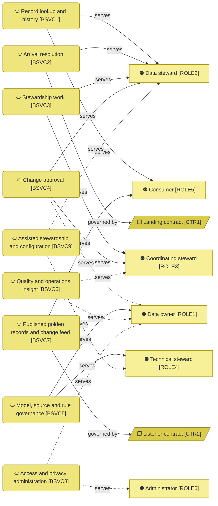

# Business services

_[← Business layer](./README.md) · [Model home](../README.md)_

**ArchiMate viewpoint:** Business layer: Business Service.

**Status:** ● Validated, 2026-09-29.

## Business services

Solid edges are true: arrivals are resolved, stewards decide tasks and read records on screen, governance runs through the command line and the published tables are written. Dashed edges wait for checkers on screen, the platform deployment, quality insight and the language model. Both contracts still need the teams' agreement before go-live.

| ID | Business service | Realized by | Source | Notes |
| -- | ---------------- | ----------- | ------ | ----- |
| `BSVC1` | **Record lookup and history** — search golden records, held arrivals and tasks, and open a record with its sources, relationships, quality, consumers and timeline, as of any date, masked by role | [application service [`ASVC10`] Record lookup](../4_application/1_application-services.md#application-services); search, held arrivals in search, and a record as of any date **Pending — future initiative** ([initiative 3](../6_transition/2_sequence.md#sequence), story 3.5); quality and consumers **Pending — future initiative** ([initiative 4](../6_transition/2_sequence.md#sequence)) | [Blueprint](../reference/README.md#founding-material) §3 | |
| `BSVC2` | **Arrival resolution** — every source change read from the landing tables is checked, standardised and scored, then settled under the published rules by the automated matcher or sent to a steward's inbox | [application service [`ASVC1`] Arrival resolution](../4_application/1_application-services.md#application-services) | Blueprint §3 flow (a); [Answer 5](../reference/2026-09-26-request-and-answers.md#answers) | |
| `BSVC3` | **Stewardship work** — one inbox of ranked tasks, decided one at a time or by pattern after a sample, with the record actions and a live duplicate check when a record is created or edited | [application service [`ASVC8`] Steward work](../4_application/1_application-services.md#application-services) [application service [`ASVC5`] Record lifecycle](../4_application/1_application-services.md#application-services), for link; detach and the other record actions, explained ranks and record authoring **Pending — future initiative** ([initiative 3](../6_transition/2_sequence.md#sequence), stories 3.4, 3.6 and 3.7) | Blueprint §3 | |
| `BSVC4` | **Change approval** — change sets approved under the approval matrix by a maker and, where required, a checker, with undo before commit and compensation after | [application service [`ASVC9`] Undo tray](../4_application/1_application-services.md#application-services), for undo before commit and a batch's second steward above 250 decisions [application service [`ASVC4`] Golden record commit](../4_application/1_application-services.md#application-services), for the authority check at commit, a batch's second steward included; makers and checkers of the other change sets **Pending — future initiative** ([initiative 3](../6_transition/2_sequence.md#sequence), story 3.6); compensation after commit is a new change set, and for a batch one per chunk, on the command line | Blueprint §5.5; adopted — a batch's second steward is the first checker on screen | |
| `BSVC5` | **Model, source and rule governance** — entity models, sources and rules defined, profiled, tuned, dry-run, published and rolled back, and source history loaded in bulk | [application service [`ASVC3`] Model and rule configuration](../4_application/1_application-services.md#application-services) [application service [`ASVC2`] Explainable matching](../4_application/1_application-services.md#application-services) application service [`ASVC1`] Arrival resolution, for bulk loading; dry runs and screens **Pending — future initiative** ([initiative 4](../6_transition/2_sequence.md#sequence)) | Blueprint §3 flow (b) | |
| `BSVC6` | **Quality and operations insight** — scorecards, issues, consumer contracts and the operations board, every figure opening its rows | **Pending — future initiative** (initiative 4) | Blueprint §2, §3 | |
| `BSVC7` | **Published golden records and change feed** — every approved change set is written in order to the published tables, with the map from retired to surviving identifiers (IDs) and an initial-load flag | application service [`ASVC4`] Golden record commit | Blueprint §5.4; [Answer 5](../reference/2026-09-26-request-and-answers.md#answers) | |
| `BSVC8` | **Access and privacy administration** — group-to-role mapping, masked read views, logged reveals, erasure reports and the consumer registry | [application service [`ASVC6`] Privacy protection](../4_application/1_application-services.md#application-services); group-to-role mapping, erasure reports and the consumer registry **Pending — future initiative** ([initiative 4](../6_transition/2_sequence.md#sequence)) | Blueprint §2, §5.6 | |
| `BSVC9` | **Assisted stewardship and configuration** — case narratives, questions answered with cited records, assisted onboarding and later rule drafting; suggestions only, each with a stub | **Pending — future initiative** (Release 2, [initiative 5](../6_transition/2_sequence.md#sequence)); the plumbing and the stub are [application service [`ASVC7`] Assistance plumbing](../4_application/1_application-services.md#application-services) | [Answer 2](../reference/2026-09-26-request-and-answers.md#answers) | |

### Services and the capabilities they realize

```mermaid
flowchart LR
  bsvc1("⬭ Record lookup and history [BSVC1]"):::service
  bsvc2("⬭ Arrival resolution [BSVC2]"):::service
  bsvc3("⬭ Stewardship work [BSVC3]"):::service
  bsvc4("⬭ Change approval [BSVC4]"):::service
  bsvc5("⬭ Model, source and rule governance [BSVC5]"):::service
  bsvc6("⬭ Quality and operations insight [BSVC6]"):::service
  bsvc7("⬭ Published golden records and change feed [BSVC7]"):::service
  bsvc8("⬭ Access and privacy administration [BSVC8]"):::service
  bsvc9("⬭ Assisted stewardship and configuration [BSVC9]"):::service

  subgraph cap1["✦ Master data modelling [CAP1]"]
    cap1_1["✦ Entity and domain modelling [CAP1.1]"]:::capability
    cap1_2["✦ Source and trust management [CAP1.2]"]:::capability
  end
  subgraph cap2["✦ Source acquisition [CAP2]"]
    cap2_1["✦ Arrival processing [CAP2.1]"]:::capability
    cap2_2["✦ Profiling and bulk loading [CAP2.2]"]:::capability
  end
  subgraph cap3["✦ Entity resolution [CAP3]"]
    cap3_1["✦ Matching and clustering [CAP3.1]"]:::capability
    cap3_2["✦ Rule tuning and impact preview [CAP3.2]"]:::capability
  end
  subgraph cap4["✦ Golden record and identity management [CAP4]"]
    cap4_1["✦ Survivorship and provenance [CAP4.1]"]:::capability
    cap4_2["✦ Identity and relationship management [CAP4.2]"]:::capability
  end
  subgraph cap5["✦ Data stewardship [CAP5]"]
    cap5_1["✦ Steward work and pattern decisions [CAP5.1]"]:::capability
    cap5_2["✦ Change approval and undo [CAP5.2]"]:::capability
    cap5_3["✦ Record authoring [CAP5.3]"]:::capability
  end
  subgraph cap6["✦ Data quality management [CAP6]"]
    cap6_1["✦ Quality measurement and monitoring [CAP6.1]"]:::capability
    cap6_2["✦ Issue and contract management [CAP6.2]"]:::capability
  end
  subgraph cap7["✦ Master data access and sharing [CAP7]"]
    cap7_1["✦ Record search, view and history [CAP7.1]"]:::capability
    cap7_2["✦ Golden record commit [CAP7.2]"]:::capability
    cap7_3["✦ Access and privacy protection [CAP7.3]"]:::capability
  end
  subgraph cap8["✦ AI assistance [CAP8]"]
    cap8_1["✦ Assisted stewardship [CAP8.1]"]:::capability
    cap8_2["✦ Assisted configuration [CAP8.2]"]:::capability
  end

  bsvc1 -->|realizes| cap7_1
  bsvc2 -->|realizes| cap2_1
  bsvc2 -->|realizes| cap3_1
  bsvc2 -->|realizes| cap4_1
  bsvc3 -->|realizes| cap4_2
  bsvc3 -->|realizes| cap5_1
  bsvc3 -.->|realizes| cap5_3
  bsvc4 -->|realizes| cap5_2
  bsvc5 -->|realizes| cap1_1
  bsvc5 -->|realizes| cap1_2
  bsvc5 -->|realizes| cap2_2
  bsvc5 -->|realizes| cap3_2
  bsvc6 -.->|realizes| cap6_1
  bsvc6 -.->|realizes| cap6_2
  bsvc7 -->|realizes| cap7_2
  bsvc8 -->|realizes| cap7_3
  bsvc9 -.->|realizes| cap8_1
  bsvc9 -.->|realizes| cap8_2

  classDef service fill:#efe57d,stroke:#9c8a00,color:#333
  classDef capability fill:#f5deaa,stroke:#c8a24a,color:#333
  style cap1 fill:#fbf4e2,stroke:#c8a24a,color:#333
  style cap2 fill:#fbf4e2,stroke:#c8a24a,color:#333
  style cap3 fill:#fbf4e2,stroke:#c8a24a,color:#333
  style cap4 fill:#fbf4e2,stroke:#c8a24a,color:#333
  style cap5 fill:#fbf4e2,stroke:#c8a24a,color:#333
  style cap6 fill:#fbf4e2,stroke:#c8a24a,color:#333
  style cap7 fill:#fbf4e2,stroke:#c8a24a,color:#333
  style cap8 fill:#fbf4e2,stroke:#c8a24a,color:#333
```

Dashed edges wait for record authoring, quality insight and the language model. The tan capabilities belong to the strategy layer, grouped by area. [Capability [`CAP2.3`] Migration from the incumbent hub](../1_strategy/2_capabilities-and-resources.md#capabilities), planned for initiative 6, has no service yet.
