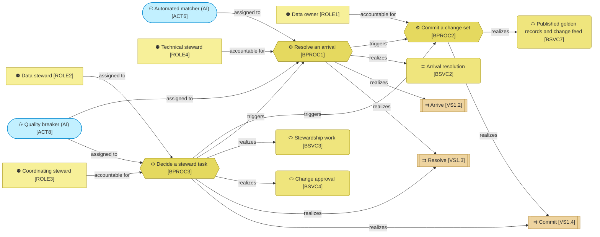
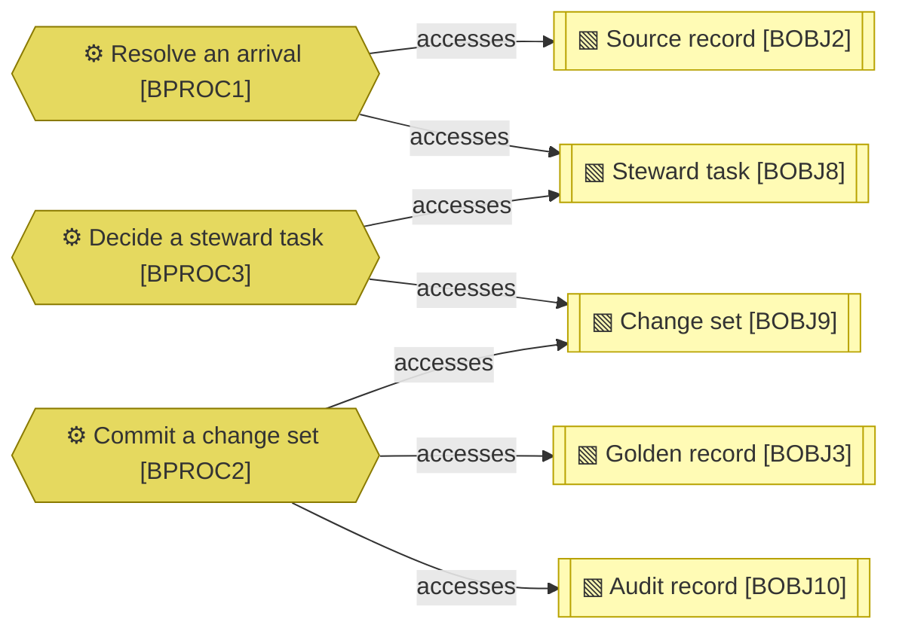

# Business processes

_[← Business layer](./README.md) · [Model home](../README.md)_

**ArchiMate viewpoint:** Business layer: Business Process, with the actor and roles assigned to it, the business services and value stream stages it realizes, and the business objects it handles.

**Status:** ◐ Draft catalogue — written for story 3.3 of initiative 3, Steward workbench; not yet validated.

## Business processes

Cyan marks an automated actor, never a person, and the tan stages visit from the value stream. `BPROC1` realizes the part of [value stream stage [`VS1.3`] Resolve](../1_strategy/3_value-stream.md#value-stream) that the published rules settle. `BPROC3` realizes the stewards' part, one task at a time or by pattern after a forced sample, and the undo window of [value stream stage [`VS1.4`] Commit](../1_strategy/3_value-stream.md#value-stream). A record a steward declines goes back to `BPROC1`. `BPROC3` also decides a quality sample blind, without the first decision or its score.

| ID | Business process | Trigger | Supplier | Input | Output | Customer | Owner role | Realized by | Source | Notes |
| -- | ---------------- | ------- | -------- | ----- | ------ | -------- | ---------- | ----------- | ------ | ----- |
| `BPROC1` | **Resolve an arrival** — turns a source change the integration platform landed into a kept source version, then settles it under the published rules, the source's policy and the quality breaker, or hands it to a steward. While the breaker has demoted an entity's automatic band, its automatic-band arrivals become review tasks, handed back to arrival after a restore | The arrival job runs: `mdm arrive` for new landing rows, `mdm load` for a source's history in bulk. It runs on demand in the local mode, and on a schedule once the hub is deployed in [initiative 4](../6_transition/2_sequence.md#sequence) | The integration platform (External), through the landing tables | A landing row | A kept source version, its standardised state, scored candidate pairs and quality results; then an automatic change set, or a steward task. A share of the automated links and creates is drawn as quality samples, and the arrivals are counted per hour for the breaker | `BPROC2`, for automatic change sets [role [`ROLE2`] Data steward](./1_business-actors-and-roles.md#roles), for tasks | [role [`ROLE4`] Technical steward](./1_business-actors-and-roles.md#roles) | `src/mdm/services/arrival.py`, performed by [actor [`ACT6`] Automated matcher](./1_business-actors-and-roles.md#actors) `src/mdm/services/quality.py`, for the draw of quality samples `src/mdm/services/breaker.py`, for the checks of [actor [`ACT8`] Quality breaker](./1_business-actors-and-roles.md#actors) | [Blueprint](../reference/README.md#founding-material) §3 flow (a), §4; [Answer 5](../reference/2026-09-26-request-and-answers.md#answers); adopted — arrival and bulk loading are one process in two batch sizes; adopted — a demoted band turns automatic-band arrivals into reviews, and arrival hands them back after a restore | |
| `BPROC2` | **Commit a change set** — turns an approved change set into published rows under one commit version, with its change-feed rows, commit-log row and audit records | A change set reaches the commit path: an automatic one from `BPROC1`, a steward's decision from `BPROC3` after its undo window, or a record action such as a detach or a merge | `BPROC1` `BPROC3` stewards, through the record actions as service functions | A change set with its authority | Golden records, cross-references, relationships and change-feed rows under one commit version; an audit record | Listening systems (External), through the change notifier and the integration platform [role [`ROLE5`] Consumer](./1_business-actors-and-roles.md#roles) | [role [`ROLE1`] Data owner](./1_business-actors-and-roles.md#roles) | `src/mdm/services/commit.py` | Blueprint §5.4, §5.5; [Answer 5](../reference/2026-09-26-request-and-answers.md#answers); adopted — the commit path writes the change feed in its own transaction ([decision 8](../decisions/8_commit-order-lock-and-change-feed.md)) | |
| `BPROC3` | **Decide a steward task** — a steward opens a task in the inbox, weighs the explanation beside it and decides; the decision waits out its undo window in the undo tray, then commits through `BPROC2`, or goes back to the task. A quality sample is decided blind, and its answer commits through the tray in the same way. Alike reviews are decided together: a steward draws a forced sample of one pattern, decides it one by one, and once it is unanimous links the rest as one staged decision, which a second steward confirms above 250 decisions and which commits in chunks | A steward presses a decision key, or its button, on a task, or answers a quality sample; or draws, checks and stages a batch of alike reviews | `BPROC1`, whose tasks the inbox orders by due time and groups by signature, with the quality samples drawn from automated and steward decisions | A task with its records, candidates, explanation, golden preview and impact line; for a quality sample, the record and the golden records it might belong to, with no first decision, suggestion or score; for a batch, the pattern's reviews with their count, label history and blind-review agreement, the forced sample's cases, and every row's change | A staged decision; after its undo window, a change set for `BPROC2` and a steward match label, or the task back in the inbox. A batch commits one change set per chunk under one batch ID, a label per review, and 2% of the links it staged, rounded up and at least one, as quality samples. A blind answer writes no label: it records whether it agrees with the first decision, and opens a review when it does not | `BPROC2` `BPROC1`, for a record a steward declined, which arrival settles again | [role [`ROLE3`] Coordinating steward](./1_business-actors-and-roles.md#roles) | `src/mdm/services/decisions.py`, `src/mdm/services/tray.py`, `src/mdm/services/quality.py` and `src/mdm/services/batches.py`, on screen in `src/mdm/ui/pages/inbox.py`, `src/mdm/ui/pages/groups.py` and `src/mdm/ui/pages/batch.py`, performed by [role [`ROLE2`] Data steward](./1_business-actors-and-roles.md#roles) `src/mdm/services/breaker.py`, for the bulk-rights check of [actor [`ACT8`] Quality breaker](./1_business-actors-and-roles.md#actors) | Blueprint §3 flows (a) and (c); adopted — one process for every decision on a task, a blind review and a batch included; [decision 19](../decisions/19_undo-tray.md); [decision 23](../decisions/23_batches-in-the-undo-tray.md) | |

### What the processes handle

`BPROC1` keeps every version of a [business object [`BOBJ2`] Source record](./4_business-objects.md#business-objects), and writes the tasks the rules cannot settle and the quality samples it draws. `BPROC3` claims and closes the tasks it decides, and prepares the change sets `BPROC2` commits. `BPROC2` alone changes a golden record, and records each change it makes in the same transaction.
