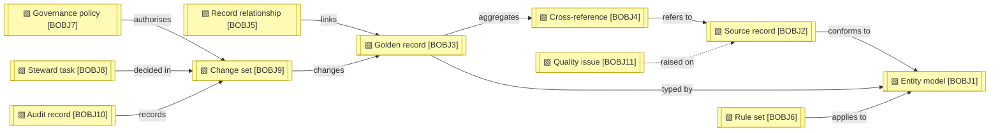

# Business objects

_[← Business layer](./README.md) · [Model home](../README.md)_

**ArchiMate viewpoint:** Business layer: Business Object.

**Status:** ● Validated, 2026-09-27.

The entities the hub masters, such as Person and Organisation, are content of an entity model, not business objects of their own.

## Business objects

Solid edges are true. The dashed edge waits for quality issues.

| ID | Business object | Held in | Source | Notes |
| -- | --------------- | ------- | ------ | ----- |
| `BOBJ1` | **Entity model** — a versioned definition of one kind of master record: attributes, references, repeating groups, masking classes and display name, in draft, published or retired state | [data object [`DOBJ1.1`] Entity model version](../3_information/2_data-objects.md#master-data-configuration) | [Blueprint](../reference/README.md#founding-material) §2, §6 | |
| `BOBJ2` | **Source record** — one record as a source system sent it, with every version the hub has seen | [data object [`DOBJ2.2`] Source record version](../3_information/2_data-objects.md#source-intake) [data object [`DOBJ2.3`] Standardised source state](../3_information/2_data-objects.md#source-intake) as landed: [data object [`DOBJ2.1`] Landing row](../3_information/2_data-objects.md#source-intake) (External) | Blueprint §6; proposed by the Data Management Body of Knowledge (DAMA-DMBOK2 Revised) ch. 10 | |
| `BOBJ3` | **Golden record** — the reconciled best version of one person or organisation, with its master identifier (ID), status and the provenance of every value | [data object [`DOBJ4.1`] Golden record](../3_information/2_data-objects.md#published-master-data) [data object [`DOBJ4.3`] Retired ID map](../3_information/2_data-objects.md#published-master-data) [data object [`DOBJ4.6`] Provenance](../3_information/2_data-objects.md#published-master-data) [data object [`DOBJ4.7`] Steward value](../3_information/2_data-objects.md#published-master-data) | Blueprint §6; proposed by DMBOK2 Revised ch. 10 | |
| `BOBJ4` | **Cross-reference** — the link from a source system and source key to a master ID | [data object [`DOBJ4.2`] Cross-reference](../3_information/2_data-objects.md#published-master-data) | Blueprint §6; proposed by DMBOK2 Revised ch. 10 | |
| `BOBJ5` | **Record relationship** — a typed, dated link between two golden records, such as a person working at an organisation | [data object [`DOBJ4.4`] Record relationship](../3_information/2_data-objects.md#published-master-data) | Blueprint §2, §6 | |
| `BOBJ6` | **Rule set** — a versioned set of match, survivorship or validation rules for one entity, with its weights and bands | [data object [`DOBJ1.2`] Rule set version](../3_information/2_data-objects.md#master-data-configuration) | Blueprint §6 | |
| `BOBJ7` | **Governance policy** — the approval matrix, source policies, sampling, quality checks, service levels, throttle and breaker settings, with the defaults the hub starts from, versioned and approved by a data owner | data object [`DOBJ1.1`] Entity model version, for source policies; the approval matrix and the other policies **Pending — future initiative** ([initiative 4](../6_transition/2_sequence.md#sequence)) | Blueprint §5.5, §6 | |
| `BOBJ8` | **Steward task** — a review, exception, approval, conflict, breach or quality sample, with its service level, claim and rank | [data object [`DOBJ3.2`] Steward task](../3_information/2_data-objects.md#resolution-work), with its due time, claim, snooze and escalation; explained ranks **Pending — future initiative** ([initiative 3](../6_transition/2_sequence.md#sequence), story 3.4) | Blueprint §6 | |
| `BOBJ9` | **Change set** — the unit of approval and commit: its items, maker, checker, authority, impact and undo deadline | [data object [`DOBJ3.5`] Staged decision](../3_information/2_data-objects.md#resolution-work), while it waits out its undo window [data object [`DOBJ5.1`] Change set record](../3_information/2_data-objects.md#audit-and-privacy) [data object [`DOBJ4.5`] Change feed](../3_information/2_data-objects.md#published-master-data) | Blueprint §6 | |
| `BOBJ10` | **Audit record** — what changed, before and after, with its evidence and authority; personal values held by reference | [data object [`DOBJ5.2`] Change log entry](../3_information/2_data-objects.md#audit-and-privacy) [data object [`DOBJ5.3`] Personal value](../3_information/2_data-objects.md#audit-and-privacy) [data object [`DOBJ5.4`] Access log entry](../3_information/2_data-objects.md#audit-and-privacy) | Blueprint §6 | |
| `BOBJ11` | **Quality issue** — a logged quality problem with its category, root cause, remediation and the records it affects | **Pending — future initiative** (initiative 4) | Blueprint §2; proposed by DMBOK2 Revised ch. 13 | |
