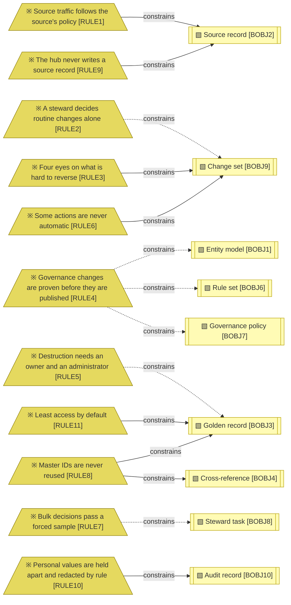

# Domain context and rules

_[← Business layer](./README.md) · [Model home](../README.md)_

**ArchiMate viewpoint:** Business layer: Business Rule, with the glossary of the domain.

**Status:** ◐ Draft catalogue — written for initiative 2, Foundations; not yet validated.

## Glossary

| Term | Meaning | Source | Notes |
| ---- | ------- | ------ | ----- |
| Agent tools | Propose-only tools, from Release 3, through which external software agents suggest changes for a person to decide | [Blueprint](../reference/README.md#founding-material) §4 | |
| Approval matrix | The owner-approved table of who may commit each action, by band and source policy; `RULE1`–`RULE3` are its defaults, and `RULE4`–`RULE6` bind the matrix itself | Blueprint §5.5 | |
| Architecture style | How a master data domain's golden records relate to its sources: registry (cross-references only), consolidated (a golden copy in the hub), coexistence (the golden record flows back to sources through listening systems), authored (records created in the hub) | Blueprint §2; proposed by the Data Management Body of Knowledge (DAMA-DMBOK2 Revised) ch. 10 | |
| Arrival | A source change read from the landing tables that the hub has not yet resolved; a held arrival waits for a reference or a decision | Blueprint §3; [Answer 5](../reference/2026-09-26-request-and-answers.md#answers) | |
| Audit record | See [business object [`BOBJ10`] Audit record](./4_business-objects.md) | — | |
| Authority | What allowed a commit: a row of the approval matrix, a source's policy, a checker, or a published rule version | Blueprint §5.5 | |
| Automation grant | A data owner's time-limited permission, from Release 2, to widen the automatic band for one pattern, with a cap, a sample and a ledger | Blueprint §4 | |
| Band | The range a match score falls in: automatic, review or distinct | Blueprint §5.2; proposed by DMBOK2 Revised ch. 10 (thresholds) | |
| Blind review | A steward re-deciding a sample of committed decisions without seeing the first decision | Blueprint §3 | |
| Blocking | Finding candidate pairs through stored keys, so not every pair is compared | Blueprint §5.2 | |
| Bootstrap authority | The flagged authority under which administrator changes commit until a second administrator exists | Blueprint §5.5 | |
| Breaker | The control that withdraws bulk rights or demotes the automatic band when agreement falls; run by [actor [`ACT8`] Quality breaker](./1_business-actors-and-roles.md) | Blueprint §4 | |
| Case narrative | A masked summary of a review task that a language model drafts for the steward, from Release 2 | Blueprint §4; [Answer 2](../reference/2026-09-26-request-and-answers.md#answers) | |
| Change feed | The record, in the operational database, of every change to the published tables, each with the version of the commit that made it | [Answer 5](../reference/2026-09-26-request-and-answers.md#answers) | |
| Change notifier | The platform's service that tells the integration platform which commit versions are new; the hub does not run it | [Answer 5](../reference/2026-09-26-request-and-answers.md#answers) | |
| Change set | See [business object [`BOBJ9`] Change set](./4_business-objects.md); committing one writes it to the published tables | Blueprint §6 | |
| Checker | The second person who approves a change set; never its maker | Blueprint §5.5 | |
| Cluster | The source records resolved to one golden record | Blueprint §2 | |
| Code list | A governed set of reference values, kept in the Reference Data Manager | Blueprint §2; proposed by DMBOK2 Revised ch. 10 (reference data) | |
| Commit path | The one route by which an approved change set reaches the published tables; it checks the authority again at commit time | Blueprint §5.5 | |
| Commit version | The number that orders commits; the change feed carries it with every change | [Answer 5](../reference/2026-09-26-request-and-answers.md#answers); Blueprint §5.4 | |
| Commit-order lock | The lock every commit takes before it takes its commit version, held until it commits, so versions become visible in the order they were given | adopted — [decision 8](../decisions/8_commit-order-lock-and-change-feed.md) | |
| Compensate | Reverse a committed change with a new, recorded change, because a commit cannot be recalled | Blueprint §1 | |
| Consolidate | Link, then recompute the golden record's values | Blueprint §1 | |
| Consumer registry | The record of which consumers read which entities and attributes; it ranks tasks and shows what a change would touch | Blueprint §2 | |
| Counterfactual | The single change to one comparison that would move a pair into another band | Blueprint §5.2 | |
| Critical attribute | An attribute whose change needs more approval, as its entity model marks it | Blueprint §2, §5.5 | |
| Cross-reference | See [business object [`BOBJ4`] Cross-reference](./4_business-objects.md) | — | |
| Data contract | A consumer's agreement for an entity: shape, rules, service levels and the attributes it relies on | Blueprint §2; proposed by the Open Data Contract Standard (ODCS) | |
| Data owner, data steward, coordinating steward, technical steward, consumer, administrator | See the roles: [role [`ROLE1`] Data owner](./1_business-actors-and-roles.md#roles) [role [`ROLE2`] Data steward](./1_business-actors-and-roles.md#roles) [role [`ROLE3`] Coordinating steward](./1_business-actors-and-roles.md#roles) [role [`ROLE4`] Technical steward](./1_business-actors-and-roles.md#roles) [role [`ROLE5`] Consumer](./1_business-actors-and-roles.md#roles) [role [`ROLE6`] Administrator](./1_business-actors-and-roles.md#roles) | — | |
| Data subject | A person whose personal data the Person entity holds | [Answer 1](../reference/2026-09-26-request-and-answers.md#answers) | |
| Deletion marker | The flag a source sends when it deletes a record; the hub detaches the record and deletes nothing | Blueprint §5.5 | |
| Detach | Reverse a link: remove a cross-reference and recompute the golden record | Blueprint §1 | |
| Deterministic service | A service whose same inputs always give the same result, such as the scorer; only such services act | Blueprint §1, §4 | |
| Dry run | An exact, uncommitted run of a new rule version over a whole entity, reporting every change it would make | Blueprint §3 flow (b) | |
| Entity | A kind of master record within a master data domain, such as Person or Organisation | Blueprint §6 | |
| Erasure | Redacting one data subject's personal values, recording the redaction and reporting downstream copies | Blueprint §2 | |
| Fingerprint | The counts, cluster hash and watermark of an approved dry run; a re-evaluation stops if the records differ from it | Blueprint §3 flow (b) | |
| Forced sample | The alike tasks a steward must decide one by one before the rest of a pattern can be decided together | Blueprint §3 flow (c) | |
| Go-live | The day a release first serves real data on the platform | adopted — the model's word for it | |
| Golden record | See [business object [`BOBJ3`] Golden record](./4_business-objects.md) | — | |
| Golden value | The value a golden record holds for one attribute, picked by survivorship | Blueprint §2 | |
| Hub | The Master Data Manager: the system of reference for the entities it masters | adopted — the word the model uses for the product; proposed by DMBOK2 Revised ch. 10 (system of reference) | |
| ID | Short for identifier: the stable key of a record, such as a master ID or a source key | adopted — the model's short form | |
| Impact line | What a change set would touch, shown before it commits: rows, relationships and the consumers that rely on them | Blueprint §3, §4 | |
| Inbox | The steward's one ranked list of tasks, where every steward decision starts | Blueprint §3 | |
| Incumbent hub | The master data management product the enterprise uses today; a later initiative migrates from it | [Request](../reference/2026-09-26-request-and-answers.md#the-request) | |
| Initial load | A source's history loaded in bulk and flagged, so listening systems can skip it | Blueprint §2, §5.4 | |
| Issue | See [business object [`BOBJ11`] Quality issue](./4_business-objects.md) | — | |
| Landing sequence | The number the operational database gives each landing row as it is written; it follows writing order, not commit order, and can skip numbers | [Answer 5](../reference/2026-09-26-request-and-answers.md#answers); adopted — [decision 9](../decisions/9_landing-table-and-watermark.md) | |
| Landing table | A table in the operational database into which the integration platform writes source changes; the hub reads it and never writes it | [Answer 5](../reference/2026-09-26-request-and-answers.md#answers) | |
| Language-model service | A service that uses a language model to draft or answer; it only suggests, and each has a deterministic stub | [Answer 2](../reference/2026-09-26-request-and-answers.md#answers); Blueprint §4 | |
| Link | A cross-reference from a source record to a golden record | Blueprint §1 | |
| Listening system | A system that receives committed changes through the integration platform, which queries them from the change feed | [Request](../reference/2026-09-26-request-and-answers.md#the-request); [answer 5](../reference/2026-09-26-request-and-answers.md#answers) | |
| Local mode | The hub running on one machine, on a DuckDB file with the stub and invented data | [Request](../reference/2026-09-26-request-and-answers.md#the-request) | |
| Maker | The person who prepares a change set; never its checker | Blueprint §5.5 | |
| Masking class | What an attribute's values are, for masking: none, or personal. Personal values are masked for people and held in the vault in history | Blueprint §2 | |
| Master data | Data about the business entities that give context to transactions, such as parties, products and locations | adopted — the domain's definition; proposed by DMBOK2 Revised ch. 10 | |
| Master data domain | A subject area, such as party, that groups related entities and declares one architecture style | Blueprint §6; proposed by DMBOK2 Revised ch. 10 | |
| Master ID | The stable ID of a golden record: opaque, never reused, always resolvable; a retired master ID resolves to its survivor | Blueprint §5.2; proposed by ISO 8000-115 | |
| Match mode | What a rule set does with an automatic match: identify (scores only), link (a cross-reference) or consolidate (a cross-reference, then golden values recomputed) | Blueprint §5.2 | |
| Match rule | The comparators, weights and blocking keys that score two records | Blueprint §5.2; proposed by DMBOK2 Revised ch. 10 | |
| Match score | A number from 0 to 100, from the odds that two records describe the same entity | Blueprint §5.2 | |
| Merge | Two golden records become one, and one master ID retires to the survivor; never automatic | Blueprint §1 | |
| Operational database | The platform's transactional database, Lakebase, where the landing tables, the hub's own tables and the published tables live; the local mode uses a DuckDB file instead | [Request](../reference/2026-09-26-request-and-answers.md#the-request); [answer 5](../reference/2026-09-26-request-and-answers.md#answers) | |
| Operations board | The team-level view of arrivals, backlog against service levels, band volumes, automation rate, blind-review agreement and freshness, every figure opening its rows | Blueprint §2 | |
| Orphan | A golden record left with no linked source record after a detach; it becomes a task | Blueprint §5.5 | |
| Persona | A role a person takes on in the local mode to act as that role; refused wherever the store is shared | Blueprint §5.6; adopted — [decision 13](../decisions/13_authority-and-personas.md) | |
| Pin | A steward's value held against survivorship until it expires | Blueprint §2 | |
| Policy clause | The part of a source's policy that allowed or held one automated change, such as "crm: critical update held" | Blueprint §5.5; adopted — [decision 16](../decisions/16_source-policies-and-clauses.md) | |
| Provenance | For each golden value: the values used, the winner, the runners-up and the rule version | Blueprint §5.2; proposed by ISO 8000-120 | |
| Published tables | The one set of tables listening systems read, with their change feed; only the commit path changes them | Blueprint §5.4; [Answer 5](../reference/2026-09-26-request-and-answers.md#answers) | |
| Purge | Hard delete of a retired record; the only hard delete | Blueprint §2 | |
| Quality dimension | Completeness, uniqueness, timeliness, validity, accuracy or consistency, with integrity and reasonability as extensions | Blueprint §2; proposed by DMBOK2 Revised ch. 13 and ISO/IEC 25012 | |
| Re-evaluation | Applying a published rule or model version to existing records, within the fingerprint of its approved dry run | Blueprint §3 flow (b) | |
| Redaction | Replacing a personal value in history, itself recorded | Blueprint §1 | |
| Reinstate | Bring a retired record back and re-run the arrivals held for it | Blueprint §2 | |
| Release | A planned set of capabilities delivered together: Release 1 masters Person and Organisation; Release 2 adds language-model services, hierarchies and trends; Release 3 adds rule drafting and agent tools | [Answers 1 and 2](../reference/2026-09-26-request-and-answers.md#answers); Blueprint §2 | |
| Retire | End a golden record's life; its ID stays resolvable | Blueprint §2 | |
| Reveal | Showing a masked personal value to a person whose role allows it, logged with a reason | Blueprint §2 | |
| Signature | The pattern of comparison results a pair shows, used to group review tasks decided together | Blueprint §3 | |
| Source policy | Per source, what its new records, updates, critical updates and end dates need before they commit | Blueprint §2 | |
| Source record | See [business object [`BOBJ2`] Source record](./4_business-objects.md) | — | |
| Source system | A system that supplies records, and the system of record for some attributes | adopted — the domain's definition; proposed by DMBOK2 Revised ch. 10 | |
| Store | Where the hub keeps its data: the operational database on the platform, or a DuckDB file in the local mode | [Request](../reference/2026-09-26-request-and-answers.md#the-request) | |
| Stub | The deterministic stand-in for a language-model service, used locally and whenever the model is unavailable | [Answer 2](../reference/2026-09-26-request-and-answers.md#answers) | |
| Survivorship | The per-attribute strategy that picks the golden value | Blueprint §2; proposed by DMBOK2 Revised ch. 10 | |
| System of record | The authoritative system where a record is created or maintained | adopted — the domain's definition; proposed by DMBOK2 Revised ch. 10 | |
| Throttle | The agreed rate at which bulk changes, re-evaluations and later loads reach the published tables | Blueprint §4 | |
| Tombstone | A retired or merged-away golden record kept in the published tables with its status and survivor, under a new commit version | adopted — listening systems must see removals | |
| Trust rank | How far a source is trusted for an attribute | Blueprint §2 | |
| Undo tray | Where a steward's decisions wait out their undo window before they commit | Blueprint §3 | |
| Undo window | The time a steward's decision waits in the undo tray, while it can still be undone | Blueprint §3 | |
| Unmerge | Reverse a merge: bring the retired master ID back and split the records | Blueprint §1 | |
| Vault | Where the personal values that history refers to are kept apart, so an erasure can redact them in one place | Blueprint §5.4, §5.6 | |
| Watermark | The last position a reader has processed, from which it reads on: the hub's in the landing tables, a listening system's in the change feed | [Answers 3 and 5](../reference/2026-09-26-request-and-answers.md#answers) | |

## Business rules

Solid edges are true: the hub enforces those rules today. Dashed edges wait for the steward workbench and for governance on the platform.

`RULE1`–`RULE3` are the approval matrix's defaults, which the data owners may change; the other rules always hold.

| ID | Business rule | Why | Enforced by | Source | Notes |
| -- | ------------- | --- | ----------- | ------ | ----- |
| `RULE1` | **Source traffic follows the source's policy** — a non-critical update, an arrival in the automatic band and a deletion marker commit automatically. An arrival carrying a retired ID is routed to its survivor and commits automatically. A critical update or an end date follows the source's policy, and anything else becomes a task. A distinct arrival creates a golden record unless its source's policy holds it; an authored master data domain holds it, and a registry domain gives it a master ID with cross-references only | Sources send most changes, and a source's policy lets its data owner hold what matters | `src/mdm/services/policy.py`, applied by `src/mdm/services/arrival.py`; each automated change names its clause | Blueprint §5.5 | |
| `RULE2` | **A steward decides routine changes alone** — one steward commits a link, consolidation, detach, non-critical edit, pin, reinstatement, re-run, or create in a consolidated domain, through the undo tray | These changes are frequent and reversible | **Pending — future initiative** (initiative 3) | Blueprint §5.5 | |
| `RULE3` | **Four eyes on what is hard to reverse** — a steward's critical edit, merge, unmerge, retirement, large bulk change, or create in a coexistence or authored domain needs a checker who is not the maker and sees what the maker saw. A data owner can relax this per entity | Listening systems receive every commit, and these changes are costly to undo | `src/mdm/services/authority.py`, checked again at commit in `src/mdm/services/commit.py`, for merge, unmerge and retirement; critical edits, large bulk changes, creates in coexistence and authored domains, and showing the checker what the maker saw **Pending — future initiative** ([initiative 3](../6_transition/2_sequence.md#sequence)) | Blueprint §5.5 | |
| `RULE4` | **Governance changes are proven before they are published** — publishing a model, rule, policy, source policy, approval matrix or automation grant needs a data owner's proposal with an exact dry run, approved by a second data owner or the coordinating steward; the approval binds the dry run's fingerprint | One rule change can move thousands of records at once | **Pending — future initiative** ([initiative 4](../6_transition/2_sequence.md#sequence)); until then `src/mdm/services/registry.py` publishes a model or rule set only while its entity holds no golden record, under a flagged bootstrap authority | Blueprint §5.5, §3 flow (b); adopted — a hard rule, because the approval matrix cannot relax the approval of its own changes | |
| `RULE5` | **Destruction needs an owner and an administrator** — purging a retired record, or erasing a data subject's personal values, needs a data owner and an administrator, with a typed confirmation | Neither can be undone | **Pending — future initiative** ([initiative 4](../6_transition/2_sequence.md#sequence)) for purge and the erasure workflow; a redaction of vault values already needs a data owner, an administrator and a typed confirmation, in `src/mdm/services/privacy.py` | Blueprint §5.5 | |
| `RULE6` | **Some actions are never automatic** — merge, unmerge, retirement, purge and erasure; changes to models, rules, policies or grants; and any change proposed through the agent tools always need a person | An automated mistake here reaches every listening system and is the costliest to reverse | `src/mdm/services/authority.py`, checked again at commit in `src/mdm/services/commit.py` | Blueprint §4 | |
| `RULE7` | **Bulk decisions pass a forced sample** — tasks decided together by pattern first pass a unanimous forced sample, one disagreement splits the group, and blind review re-checks a share afterwards | A pattern can hide an exception | **Pending — future initiative** (initiative 3) | Blueprint §3 flow (c) | |
| `RULE8` | **Master IDs are never reused** — a master ID is opaque and always resolves; a merge retires one ID to its survivor, the retired-to-survivor map is published with chains collapsed, and unmerge brings the retired ID back | Listening systems join on master IDs | `src/mdm/services/commit.py` (the master ID counter) and `src/mdm/services/lifecycle.py` (the retired ID map) | Blueprint §5.2; proposed by DMBOK2 Revised ch. 10 and ISO 8000-115 | |
| `RULE9` | **The hub never writes a source record** — source records are read, versioned and linked, never changed, and a defect found in a source goes back to its owner as an issue | Source records belong to their systems of record, and the landing tables belong to the integration platform | `src/mdm/backend/guard.py`; on the platform, the landing grants of the [landing interface](../4_application/5_interface-contracts.md#landing-interface) | [Request](../reference/2026-09-26-request-and-answers.md#the-request); [answer 5](../reference/2026-09-26-request-and-answers.md#answers) | |
| `RULE10` | **Personal values are held apart and redacted by rule** — history holds personal values only by reference, and keeps the values apart; an erasure redacts a data subject's values, records the redaction and reports downstream copies; prompts to a language model carry masked values only | History must stay complete without keeping personal data for ever | `src/mdm/services/privacy.py` (the vault) and `src/mdm/models/safety.py` (no personal value in a detail or a message); erasure **Pending — future initiative** ([initiative 4](../6_transition/2_sequence.md#sequence)) | Blueprint §5.4, §5.6; [Answer 1](../reference/2026-09-26-request-and-answers.md#answers) | |
| `RULE11` | **Least access by default** — every person sees personal values masked unless a role allows more; a failed role lookup gives the consumer role; every reveal is logged | A lookup failure must never widen access | `src/mdm/services/authority.py` and the masked views of `src/mdm/backend/ddl.py` | Blueprint §5.6 | |
