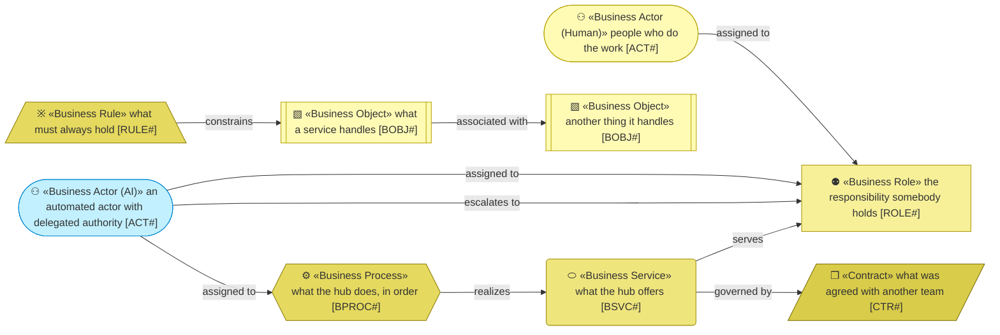
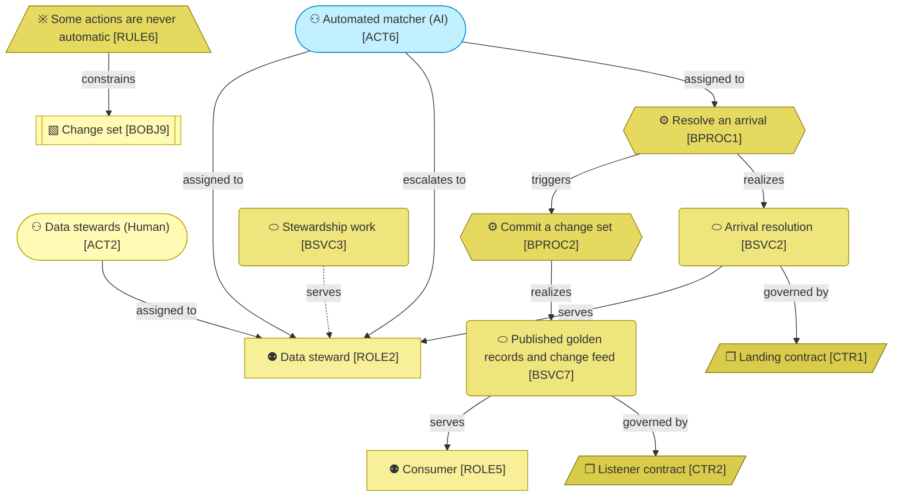

# Business Layer

_[← Model home](../README.md)_

Who works with master data in the hub, what the hub offers them, what it handles, and the vocabulary and rules that bind it.

**ArchiMate viewpoint:** Business layer: Business Actor, Business Role, Contract, Business Service, Business Process, Business Object, Business Rule.

## Documents

| # | Document | Elements | Question it answers |
| - | -------- | -------- | ------------------- |
| 1 | [1_business-actors-and-roles.md](./1_business-actors-and-roles.md) | Business Actors, human and automated; Business Roles; Contracts | Who does the work, and who does the hub depend on? |
| 2 | [2_business-services.md](./2_business-services.md) | Business Services | What does the hub offer, and to whom? |
| 3 | [3_business-processes.md](./3_business-processes.md) | Business Processes | How does a source change become a published golden record? |
| 4 | [4_business-objects.md](./4_business-objects.md) | Business Objects | What things do the services handle? |
| 5 | [5_domain-context-and-rules.md](./5_domain-context-and-rules.md) | Glossary, Business Rules | What vocabulary and constraints bind everything? |

## Metamodel

Cyan marks an automated actor, so it is never mistaken for a person. Each other type has its own shape: a service is the rounded box, and a process the hexagon.

## Layer view

Cyan marks an automated actor, never a person. Solid edges are true: the automated matcher resolves arrivals, and the commit path publishes golden records and the change feed. The dashed edge waits for the steward workbench.
