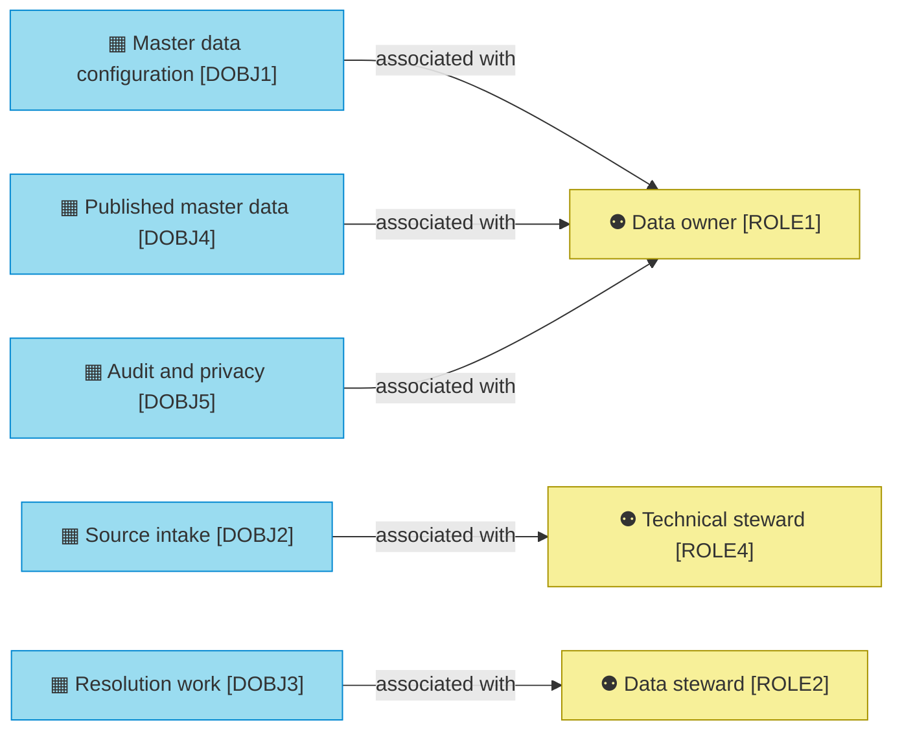

# Data domains

_[← Information layer](./README.md) · [Model home](../README.md)_

**ArchiMate viewpoint:** Information: Data Object at level 1, the data domain, with the Business Role that owns each.

**Status:** ◐ Draft catalogue — written for initiative 2, Foundations; not yet validated.

A data domain groups the information one role owns. The [schema groups](./4_data-architecture.md#schema-groups) say where each domain lives.

## Data domains

The data owner owns what configures the hub, what it publishes and what records every change. The stewards own the intake and the work between.

| ID | Data domain | Owner | Schema groups | Source | Notes |
| -- | ----------- | ----- | ------------- | ------ | ----- |
| `DOBJ1` | **Master data configuration** — the versioned entity models, rule sets and source policies, and the copies of governed code lists, that decide how the hub treats every record | [role [`ROLE1`] Data owner](../2_business/1_business-actors-and-roles.md#roles), kept by [role [`ROLE4`] Technical steward](../2_business/1_business-actors-and-roles.md#roles) | `mdm_model` | [Blueprint](../reference/README.md#founding-material) §6; adopted — the domain split | The split into five domains and the owner of each are adopted calls, open to change |
| `DOBJ2` | **Source intake** — what sources sent, as landed and as kept by the hub, and each source record's standardised current state | role [`ROLE4`] Technical steward | `mdm_landing` (External) `mdm_hub` `mdm_work` | Blueprint §6; [Answer 5](../reference/2026-09-26-request-and-answers.md#answers) | |
| `DOBJ3` | **Resolution work** — candidate pairs, steward tasks and quality results, and the arrival job's position and queue | [role [`ROLE2`] Data steward](../2_business/1_business-actors-and-roles.md#roles) | `mdm_work` | Blueprint §6 | |
| `DOBJ4` | **Published master data** — golden records, cross-references, retired identifiers (IDs), relationships and the change feed that listening systems read, with the provenance, steward values and merge records behind them | role [`ROLE1`] Data owner | `mdm_core` `mdm_read` `mdm_hub` | Blueprint §5.4, §6; [Answer 5](../reference/2026-09-26-request-and-answers.md#answers) | |
| `DOBJ5` | **Audit and privacy** — who changed what under which authority, before and after; the personal values history refers to; and every reveal, redaction and assistant call | role [`ROLE1`] Data owner | `mdm_audit` `mdm_vault` | Blueprint §5.4, §6 | |
