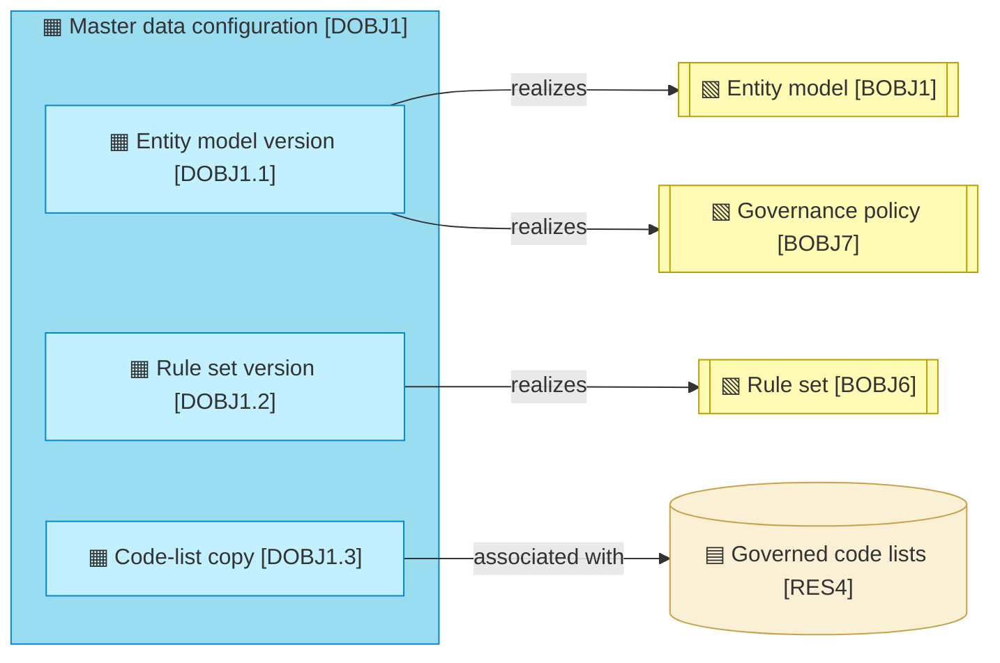
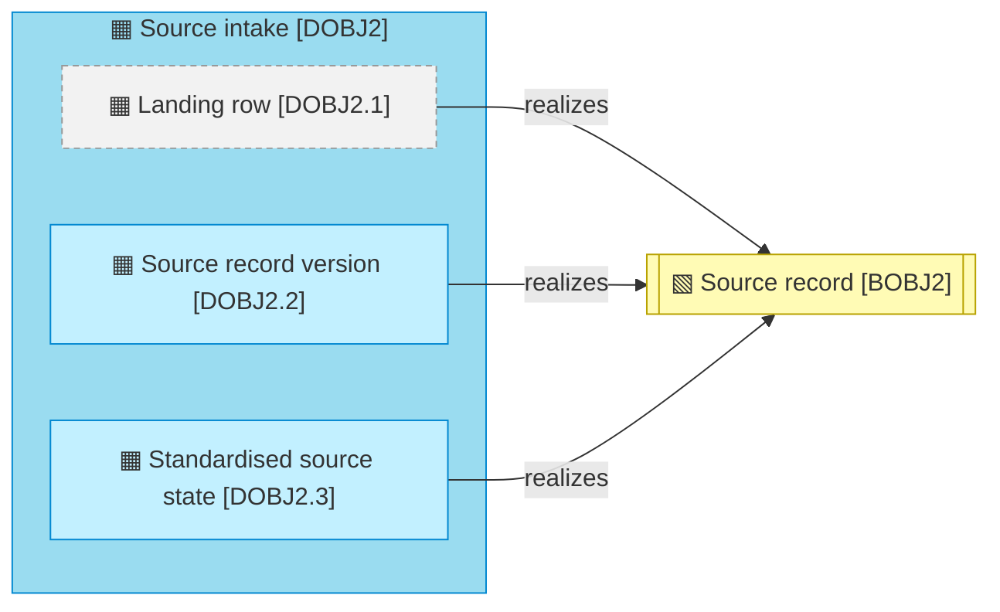
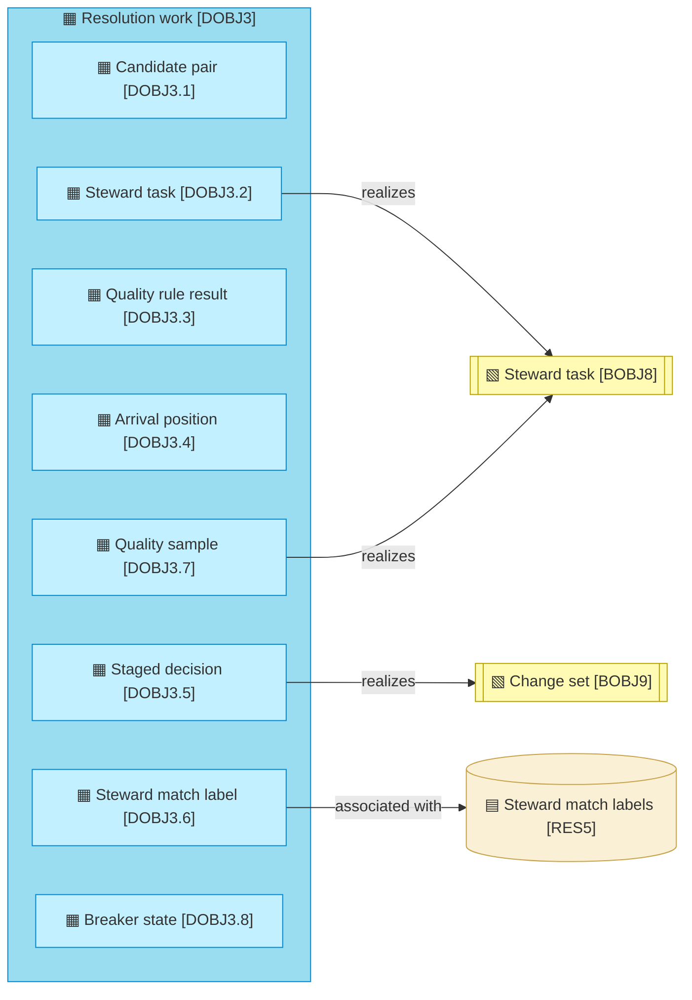
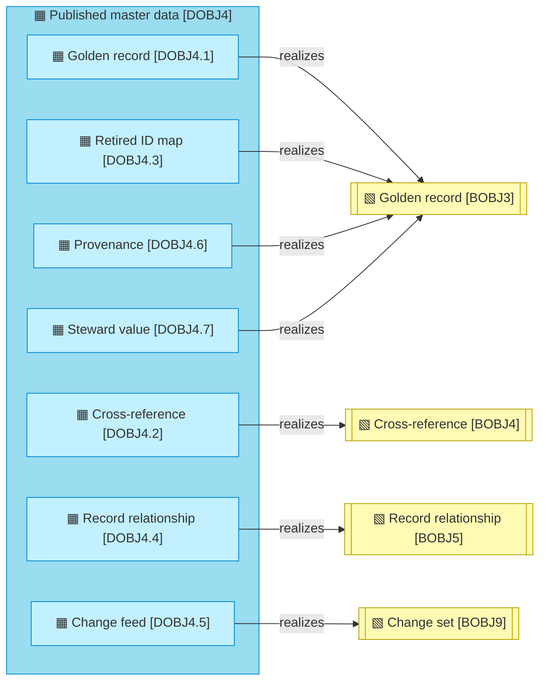
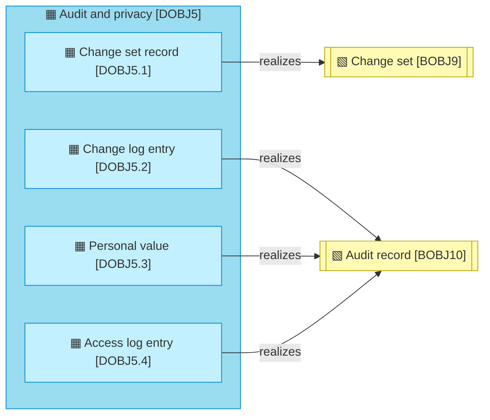

# Data objects

_[← Information layer](./README.md) · [Model home](../README.md)_

**ArchiMate viewpoint:** Information: Data Object at level 2, grouped by data domain, with the Business Object each one realizes.

**Status:** ◐ Draft catalogue — written for story 3.2 of initiative 3, Steward workbench; not yet validated.

The persons and organisations the hub masters are rows of `DOBJ4.1`, not data objects of their own. Each object belongs to one of the [data domains](./1_data-domains.md).

## Master data configuration

The hub validates against its own versioned copy of the governed code lists and never writes a code list ([decision 15](../decisions/15_code-list-snapshots.md)). The code lists themselves are [resource [`RES4`] Governed code lists](../1_strategy/2_capabilities-and-resources.md#resources), which the Reference Data Manager governs.

| ID | Data object | Realized by | Source | Notes |
| -- | ----------- | ----------- | ------ | ----- |
| `DOBJ1.1` | **Entity model version** — one entity's attributes (type, criticality, masking class, repeating groups, references), its master data domain and architecture style, its sources with their trust ranks, whether each source numbers its versions, and each source's policy, in draft, published or retired state | `mdm_model.entity_model`, created by `src/mdm/backend/ddl.py` loaded from `models/person.yaml` and `models/organisation.yaml` | [Blueprint](../reference/README.md#founding-material) §6; [decision 16](../decisions/16_source-policies-and-clauses.md) | |
| `DOBJ1.2` | **Rule set version** — the match rules (blocking passes, comparisons with their agreement probabilities for matches and non-matches, prior, bands, mode and hard rules, and how they were estimated), and the survivorship and validation rules, by kind and version | `mdm_model.rule_set`, created by `src/mdm/backend/ddl.py` drafted by `src/mdm/services/estimation.py` | Blueprint §5.2, §6 | |
| `DOBJ1.3` | **Code-list copy** — a versioned copy of a governed code list that the validation rules check against | `mdm_model.code_list_version` `mdm_model.code_list_value` created by `src/mdm/backend/ddl.py`; loaded from `models/codelists/country.yaml` in the local mode | adopted — [decision 15](../decisions/15_code-list-snapshots.md) | |

## Source intake

Grey with a dashed border marks the landing row, which the integration platform writes and owns. All three objects stand for a [business object [`BOBJ2`] Source record](../2_business/4_business-objects.md#business-objects), as delivered, as kept and as standardised.

| ID | Data object | Realized by | Source | Notes |
| -- | ----------- | ----------- | ------ | ----- |
| `DOBJ2.1` | **Landing row** — one source change as the integration platform wrote it under the [landing interface](../4_application/5_interface-contracts.md#landing-interface): event, source system and key, entity, operation, times, source version, initial-load flag and payload | External — `mdm_landing.source_change`, owned by the integration platform on the platform; its definition comes from `src/mdm/backend/ddl.py`, and the hub creates it only in the local mode | [Answer 5](../reference/2026-09-26-request-and-answers.md#answers); [decision 9](../decisions/9_landing-table-and-watermark.md) | |
| `DOBJ2.2` | **Source record version** — every version of a source record the hub has read, kept as history, with personal values held by reference to the vault | `mdm_hub.source_version`, created by `src/mdm/backend/ddl.py` | Blueprint §5.2 | |
| `DOBJ2.3` | **Standardised source state** — each source record's current standardised values, the values last approved for survivorship, comparison forms, registered identifiers (IDs), blocking keys, a hash for sampling, and its quality counts | `mdm_work.source_state` `mdm_work.blocking_key` created by `src/mdm/backend/ddl.py` | Blueprint §5.2; [Answer 3](../reference/2026-09-26-request-and-answers.md#answers) | |

## Resolution work

The steward task, the quality sample and the staged decision stand for business objects. The steward match label is the hub's copy of [resource [`RES5`] Steward match labels](../1_strategy/2_capabilities-and-resources.md#resources). The rest is the hub's own working state, which no person handles directly.

| ID | Data object | Realized by | Source | Notes |
| -- | ----------- | ----------- | ------ | ----- |
| `DOBJ3.1` | **Candidate pair** — two source records found through a shared blocking key and scored at or above the lower band, with their comparison levels, score, band, signature and explanation, per rule version | `mdm_work.candidate_pair`, created by `src/mdm/backend/ddl.py` | Blueprint §5.2 | |
| `DOBJ3.2` | **Steward task** — a review, possible duplicate, held arrival, exception, orphan or quality sample, with its candidates and suggestion, its due time from the service level of its kind (a record the quality breaker holds with no golden record to decide on waits for a data owner instead, and never breaches), and its claim, snooze and escalation; one open task per record and kind, except that a quality sample has one task per sample, and a review a blind disagreement opens sits beside the record's own; a task opened again starts afresh | `mdm_work.task` `mdm_work.open_task` created by `src/mdm/backend/ddl.py` | Blueprint §6; adopted — service levels per task kind; adopted — a task per quality sample, and a review per blind disagreement | |
| `DOBJ3.3` | **Quality rule result** — each failure of a validation rule on a source record, by quality dimension, with the code-list version it used; and each record's checked and failed counts | `mdm_work.rule_result`; the counts in `mdm_work.source_state` created by `src/mdm/backend/ddl.py` | Blueprint §2; the Data Management Body of Knowledge (DAMA-DMBOK2 Revised) ch. 13 | |
| `DOBJ3.4` | **Arrival position** — the arrival job's high-water mark in the landing sequence, the gaps below it still probed, the source records whose latest version is not yet settled, rejected rows, unresolved references and job runs | `mdm_work.arrival_position` `mdm_work.arrival_gap` `mdm_work.arrival_queue` `mdm_work.landing_reject` `mdm_work.pending_reference` `mdm_work.job_run` created by `src/mdm/backend/ddl.py` | [Answer 3](../reference/2026-09-26-request-and-answers.md#answers); [decision 9](../decisions/9_landing-table-and-watermark.md) | |
| `DOBJ3.5` | **Staged decision** — a steward's decision on a task while it waits out its undo window: the decision, its task, subject and target, the steward and role, the record's event the steward saw, the deadline, and how it settled (committed, undone or failed, with the change set or the reason) | `mdm_work.tray_entry` `mdm_work.tray_lock` created by `src/mdm/backend/ddl.py` | Blueprint §3, §4, §6; [decision 19](../decisions/19_undo-tray.md) | |
| `DOBJ3.6` | **Steward match label** — the latest decision a steward made on a pair: a source record and a golden record matched or not, or two golden records kept apart, with the rule version, score, band and signature the steward saw | `mdm_work.match_label`, created by `src/mdm/backend/ddl.py` | Blueprint §2, §6; [decision 22](../decisions/22_labels-bind-the-matcher.md) | |
| `DOBJ3.7` | **Quality sample** — a committed decision drawn for blind review: an automated link or create, or a steward's link, "Not a match" that declined a golden record, or keep apart; approving or rejecting a held update and keeping an orphan are not sampled, because blind review cannot ask them again without showing the answer. The draw is a keyed hash of the record, its event and the decision, and automated samples are capped per entity. It holds the first decision with its target, band, signature and score, and who made it; the blind answer, who gave it and whether it agreed; the review opened when it disagreed; and the voiding of a sample whose record was deleted, or whose kept-apart golden records were merged or retired. The agreement counts are kept per entity, origin, band and signature | `mdm_work.quality_sample` `mdm_work.quality_agreement` created by `src/mdm/backend/ddl.py` drawn and reviewed by `src/mdm/services/quality.py` | Blueprint §3, §4; adopted — what is sampled, the draw, what a blind review shows, and agreement measured against the first decision; proposed — the sample cap | The sample cap is proposed |
| `DOBJ3.8` | **Breaker state** — each entity's automatic band, normal or demoted; the trigger, figures, times and change sets of its last trip and restore, who restored it, and with which reason code; the start of its volume watch, and the arrivals per entity and clock hour it watches, kept 8 days | `mdm_work.breaker_state` `mdm_work.arrival_hour` created by `src/mdm/backend/ddl.py` kept by `src/mdm/services/breaker.py` | Blueprint §4, §6; [decision 3](../decisions/3_quality-breaker-autonomy.md); adopted — the agreement and volume triggers, a demotion as an overlay on arrival, and a restore by reason code; proposed — the thresholds | The thresholds are proposed settings |

## Published master data

Four objects together hold a [business object [`BOBJ3`] Golden record](../2_business/4_business-objects.md#business-objects): its row, retired IDs, value provenance and steward values. The change feed is a committed [business object [`BOBJ9`] Change set](../2_business/4_business-objects.md#business-objects) as listening systems read it.

| ID | Data object | Realized by | Source | Notes |
| -- | ----------- | ----------- | ------ | ----- |
| `DOBJ4.1` | **Golden record** — one typed row per master identifier (ID), with its status, survivor, commit version and initial-load flag; retired and merged records stay as tombstones; references are published as relationships, never as columns | `mdm_core.<entity>`, one table per published entity, created from its entity model by `src/mdm/backend/ddl.py` the masked view `mdm_read.<entity>` the master ID counter `mdm_hub.id_counter` | Blueprint §5.4 | |
| `DOBJ4.2` | **Cross-reference** — a source system and source key linked to a master ID, active or detached | `mdm_core.xref` and its view `mdm_read.xref`, created by `src/mdm/backend/ddl.py` | Blueprint §6 | |
| `DOBJ4.3` | **Retired ID map** — each retired master ID, the record it was merged into, its current survivor with chains collapsed, and the source records each merge moved | `mdm_core.retired_id` and its view `mdm_read.retired_id` `mdm_hub.merge_member` created by `src/mdm/backend/ddl.py` | Blueprint §5.2; ISO 8000-115 | |
| `DOBJ4.4` | **Record relationship** — a typed, dated link between two golden records, one per source assertion, with the source record that asserted it | `mdm_core.relationship` and its view `mdm_read.relationship`, created by `src/mdm/backend/ddl.py` | Blueprint §6 | |
| `DOBJ4.5` | **Change feed** — one change row per golden record a commit touched, and one commit-log row per commit, under gap-free commit versions | `mdm_core.change` `mdm_core.commit_log` created by `src/mdm/backend/ddl.py` | [Answer 5](../reference/2026-09-26-request-and-answers.md#answers); [decision 8](../decisions/8_commit-order-lock-and-change-feed.md) | |
| `DOBJ4.6` | **Provenance** — for each golden value, the winner, the runners-up, the strategies, the strategy that decided, and the rule version, with personal values by reference to the vault | `mdm_hub.provenance`, created by `src/mdm/backend/ddl.py` | Blueprint §5.2; ISO 8000-120 | |
| `DOBJ4.7` | **Steward value** — a value a steward set, when it was set, and its pin expiry; ranked as a source, or winning outright while pinned | `mdm_hub.steward_value`, created by `src/mdm/backend/ddl.py` | Blueprint §2 | |

## Audit and privacy

Three objects together hold a [business object [`BOBJ10`] Audit record](../2_business/4_business-objects.md#business-objects). A redaction empties a value in the vault, and every entry that refers to it keeps its shape ([decision 12](../decisions/12_personal-value-vault.md)).

| ID | Data object | Realized by | Source | Notes |
| -- | ----------- | ----------- | ------ | ----- |
| `DOBJ5.1` | **Change set record** — a change set's actor, role, checker, authority (rule versions and policy clauses), reason, evidence, fingerprint and commit version; a governance change carries no commit version | `mdm_audit.change_set`, created by `src/mdm/backend/ddl.py` | Blueprint §6; [decision 16](../decisions/16_source-policies-and-clauses.md) | |
| `DOBJ5.2` | **Change log entry** — one published or stewardship row's before and after, with the clause that allowed it, or one summary per initial-load commit; personal values by reference to the vault | `mdm_audit.change_log`, created by `src/mdm/backend/ddl.py` | Blueprint §5.3, §5.4 | |
| `DOBJ5.3` | **Personal value** — a personal value that history refers to, kept apart so a redaction can empty it in one place | `mdm_vault.personal_value`, created by `src/mdm/backend/ddl.py` | Blueprint §5.4; [decision 12](../decisions/12_personal-value-vault.md) | |
| `DOBJ5.4` | **Access log entry** — a reveal, an assistant call or a redaction, with its actor, role and reason | `mdm_audit.access_log` `mdm_audit.redaction_log` created by `src/mdm/backend/ddl.py` | Blueprint §2, §5.6 | |
