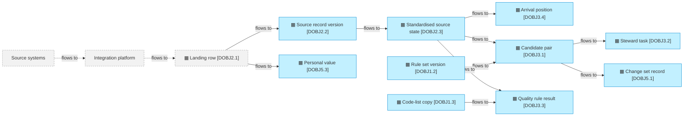
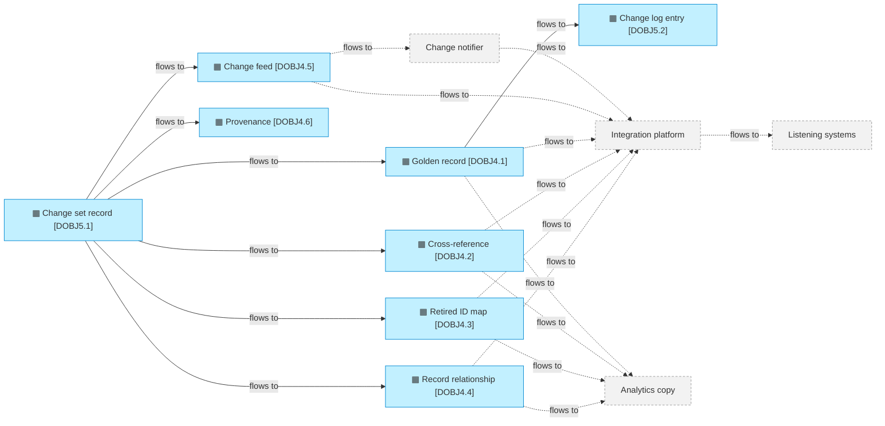

# Data flows

_[← Information layer](./README.md) · [Model home](../README.md)_

**ArchiMate viewpoint:** Information: Data Object and the flows between data objects, with the parties outside the hub that write and read them, and Representation.

**Status:** ◐ Draft catalogue — written for initiative 2, Foundations; not yet validated.

A flow between two data objects runs inside the hub. A flow to or from a party outside the hub crosses the landing interface, the listener interface or an optional copy for analytics.

## Arrival flows

Grey with a dashed border marks the source systems, the integration platform and the landing row it owns. Their dashed edges become true when the integration platform writes to the agreed landing interface, **Pending — future initiative** ([initiative 4](../6_transition/2_sequence.md#sequence)). In the local mode, the integration platform simulator writes the landing rows instead.

| From | To | What moves | How | Owner |
| ---- | -- | ---------- | --- | ----- |
| Source systems, through the integration platform (External) | [data object [`DOBJ2.1`] Landing row](./2_data-objects.md#source-intake) | A source change | The integration platform inserts one row per event under the [landing interface](../4_application/5_interface-contracts.md#landing-interface) | [stakeholder [`STK5`] Integration team](../1_strategy/1_motivation.md#stakeholders) |
| data object [`DOBJ2.1`] Landing row | [data object [`DOBJ2.2`] Source record version](./2_data-objects.md#source-intake) | Every version | The arrival job reads the rows above its high-water mark, and re-probes the gaps below it | [business process [`BPROC1`] Resolve an arrival](../2_business/3_business-processes.md#business-processes) |
| data object [`DOBJ2.1`] Landing row | [data object [`DOBJ5.3`] Personal value](./2_data-objects.md#audit-and-privacy) | Personal values, as sent and as standardised | Put in the vault at intake, before the version is kept; one value per data subject and attribute | business process [`BPROC1`] Resolve an arrival |
| data object [`DOBJ2.2`] Source record version | [data object [`DOBJ2.3`] Standardised source state](./2_data-objects.md#source-intake) | The current state | Standardised and keyed; an older version never overwrites a newer one | business process [`BPROC1`] Resolve an arrival |
| data object [`DOBJ2.3`] Standardised source state | [data object [`DOBJ3.4`] Arrival position](./2_data-objects.md#resolution-work) | The records to settle | Queued in the transaction that moves the state; settled by the commit or the task that carries their effect | business process [`BPROC1`] Resolve an arrival |
| data object [`DOBJ2.3`] Standardised source state [data object [`DOBJ1.2`] Rule set version](./2_data-objects.md#master-data-configuration) | [data object [`DOBJ3.1`] Candidate pair](./2_data-objects.md#resolution-work) | Candidate pairs | Stored blocking keys joined by equality, then scored in Python with the published weights, bands and blocking passes | business process [`BPROC1`] Resolve an arrival |
| data object [`DOBJ2.3`] Standardised source state [data object [`DOBJ1.3`] Code-list copy](./2_data-objects.md#master-data-configuration) | [data object [`DOBJ3.3`] Quality rule result](./2_data-objects.md#resolution-work) | Quality results | The published validation rules, checked on arrival against one pinned version of each code-list copy | business process [`BPROC1`] Resolve an arrival |
| data object [`DOBJ3.1`] Candidate pair | [data object [`DOBJ3.2`] Steward task](./2_data-objects.md#resolution-work) | The review band, held arrivals and possible duplicates | The source's policy and the automatic band decide what a steward must see | business process [`BPROC1`] Resolve an arrival |
| data object [`DOBJ3.1`] Candidate pair | [data object [`DOBJ5.1`] Change set record](./2_data-objects.md#audit-and-privacy) | Automatic change sets | The automated matcher, under the published rules and the clause of the source's policy that allows each change | business process [`BPROC1`] Resolve an arrival |

## Commit and feed flows

Grey with a dashed border marks the change notifier, the integration platform, the listening systems and the optional analytics copy. Their dashed edges become true when the [listener interface](../4_application/5_interface-contracts.md#listener-interface) is agreed and deployed, **Pending — future initiative** ([initiative 4](../6_transition/2_sequence.md#sequence)). The hub calls, queues and tracks none of them, as [principle [`P1`] The hub never propagates](../1_strategy/1_motivation.md#principles) requires.

| From | To | What moves | How | Owner |
| ---- | -- | ---------- | --- | ----- |
| [data object [`DOBJ5.1`] Change set record](./2_data-objects.md#audit-and-privacy) | [data object [`DOBJ4.1`] Golden record](./2_data-objects.md#published-master-data) [data object [`DOBJ4.2`] Cross-reference](./2_data-objects.md#published-master-data) [data object [`DOBJ4.3`] Retired ID map](./2_data-objects.md#published-master-data) [data object [`DOBJ4.4`] Record relationship](./2_data-objects.md#published-master-data) [data object [`DOBJ4.6`] Provenance](./2_data-objects.md#published-master-data) | Golden rows, cross-references, retired identifiers (IDs), relationships and provenance | The commit path, in one transaction under one commit version | [business process [`BPROC2`] Commit a change set](../2_business/3_business-processes.md#business-processes) |
| data object [`DOBJ5.1`] Change set record | [data object [`DOBJ4.5`] Change feed](./2_data-objects.md#published-master-data) | One change row per golden record touched, and one commit-log row | The same transaction, after the commit-order lock and the next commit version | business process [`BPROC2`] Commit a change set |
| data object [`DOBJ4.1`] Golden record | [data object [`DOBJ5.2`] Change log entry](./2_data-objects.md#audit-and-privacy) | Before and after, personal values by reference to the vault | The same transaction | business process [`BPROC2`] Commit a change set |
| data object [`DOBJ4.5`] Change feed | The change notifier (External) | "Versions up to V are committed" | The change notifier polls the commit log every few seconds; the hub neither calls nor knows it | [stakeholder [`STK6`] Data platform team](../1_strategy/1_motivation.md#stakeholders) |
| data object [`DOBJ4.1`] Golden record data object [`DOBJ4.2`] Cross-reference data object [`DOBJ4.3`] Retired ID map data object [`DOBJ4.4`] Record relationship data object [`DOBJ4.5`] Change feed | Listening systems, through the integration platform (External) | The changes since the consumer's own watermark | Notified, then queried: the change rows in version order, then the current rows of those master IDs | stakeholder [`STK5`] Integration team |
| data object [`DOBJ4.1`] Golden record data object [`DOBJ4.2`] Cross-reference data object [`DOBJ4.3`] Retired ID map data object [`DOBJ4.4`] Record relationship | An analytics copy in the lakehouse (External, optional) | A copy for analytics and history | A sync to the lakehouse, which is never the route to listening systems | No owner named; the copy is optional |

## Representations

| Representation | What it carries | Format | Read by |
| -------------- | --------------- | ------ | ------- |
| Published rows | The tables of `mdm_core`: one typed column per attribute of a golden record, and the cross-references, retired IDs, relationships and change feed | [Portable types](./4_data-architecture.md#portable-types) | Listening systems, through the integration platform; the change notifier |
| Masked views | The views of `mdm_read`, each personal value masked | The same types as the published rows | People, whatever their role |
| JSON documents | Repeating groups, payloads, provenance, match explanations, task evidence and change-log before and after, as JavaScript Object Notation (JSON) | `JSON` on DuckDB, `jsonb` on Postgres | The hub; listening systems read the repeating groups |
| Vault reference | A personal value in history, written `{"$vault": <value ID>}` in place of the value | JSON | The hub, to reveal a value to a role that allows it, with a logged reason |
| Entity model file | An entity model and its first rule sets, in `models/person.yaml` and `models/organisation.yaml` | YAML, a plain-text format | Technical stewards; `mdm model load` reads it into the store |
| Code-list file | A governed code list for the local mode, in `models/codelists/country.yaml` | YAML | `mdm codelists load` reads it into the store |
| Command-line output | Records, match explanations, tasks and feed pages, masked unless a value is revealed | Text | People at the command line |
