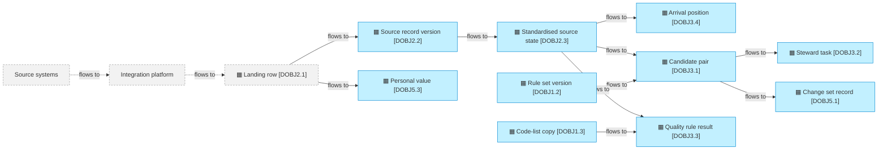
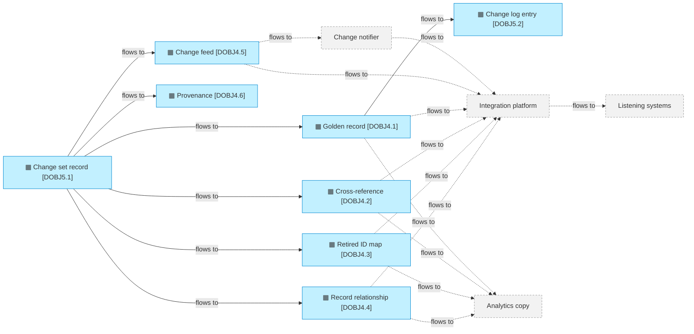
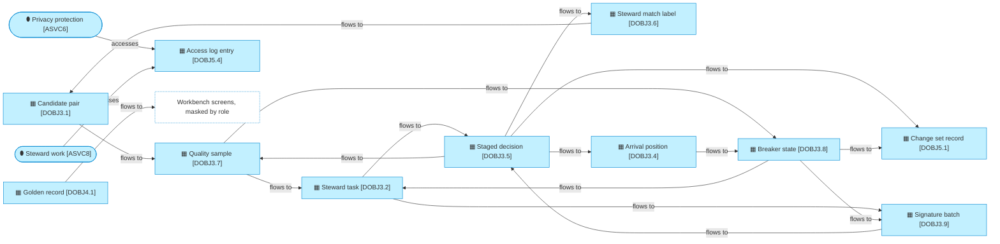

# Data flows

_[← Information layer](./README.md) · [Model home](../README.md)_

**ArchiMate viewpoint:** Information: Data Object and the flows between data objects, with the parties outside the hub that write and read them, and Representation.

**Status:** ● Validated, 2026-09-29.

A flow between two data objects runs inside the hub. A flow to or from a party outside the hub crosses the landing interface, the listener interface, the workbench's screens or an optional copy for analytics.

## Arrival flows

Grey with a dashed border marks the source systems, the integration platform and the landing row it owns. Their dashed edges become true when the integration platform writes to the agreed landing interface, **Pending — future initiative** ([initiative 4](../6_transition/2_sequence.md#sequence)). In the local mode, the integration platform simulator writes the landing rows instead.

| From | To | What moves | How | Owner |
| ---- | -- | ---------- | --- | ----- |
| Source systems, through the integration platform (External) | [data object [`DOBJ2.1`] Landing row](./2_data-objects.md#source-intake) | A source change | The integration platform inserts one row per event under the [landing interface](../4_application/5_interface-contracts.md#landing-interface) | [stakeholder [`STK5`] Integration team](../1_strategy/1_motivation.md#stakeholders) |
| data object [`DOBJ2.1`] Landing row | [data object [`DOBJ2.2`] Source record version](./2_data-objects.md#source-intake) | Every version | The arrival job reads the rows above its high-water mark, and re-probes the gaps below it | [business process [`BPROC1`] Resolve an arrival](../2_business/3_business-processes.md#business-processes) |
| data object [`DOBJ2.1`] Landing row | [data object [`DOBJ5.3`] Personal value](./2_data-objects.md#audit-and-privacy) | Personal values, as sent and as standardised | Put in the vault at intake, before the version is kept; one value per data subject and attribute | business process [`BPROC1`] Resolve an arrival |
| data object [`DOBJ2.2`] Source record version | [data object [`DOBJ2.3`] Standardised source state](./2_data-objects.md#source-intake) | The current state | Standardised and keyed; an older version never overwrites a newer one | business process [`BPROC1`] Resolve an arrival |
| data object [`DOBJ2.3`] Standardised source state | [data object [`DOBJ3.4`] Arrival position](./2_data-objects.md#resolution-work) | The records to settle | Queued in the transaction that moves the state; settled by the commit or the task that carries their effect | business process [`BPROC1`] Resolve an arrival |
| data object [`DOBJ2.3`] Standardised source state [data object [`DOBJ1.2`] Rule set version](./2_data-objects.md#master-data-configuration) | [data object [`DOBJ3.1`] Candidate pair](./2_data-objects.md#resolution-work) | Candidate pairs | Stored blocking keys joined by equality, then scored in Python with the published weights, bands and blocking passes | business process [`BPROC1`] Resolve an arrival |
| data object [`DOBJ2.3`] Standardised source state [data object [`DOBJ1.3`] Code-list copy](./2_data-objects.md#master-data-configuration) | [data object [`DOBJ3.3`] Quality rule result](./2_data-objects.md#resolution-work) | Quality results | The published validation rules, checked on arrival against one pinned version of each code-list copy | business process [`BPROC1`] Resolve an arrival |
| data object [`DOBJ3.1`] Candidate pair | [data object [`DOBJ3.2`] Steward task](./2_data-objects.md#resolution-work) | The review band, held arrivals and possible duplicates | The source's policy and the automatic band decide what a steward must see | business process [`BPROC1`] Resolve an arrival |
| data object [`DOBJ3.1`] Candidate pair | [data object [`DOBJ5.1`] Change set record](./2_data-objects.md#audit-and-privacy) | Automatic change sets | The automated matcher, under the published rules and the clause of the source's policy that allows each change | business process [`BPROC1`] Resolve an arrival |

## Commit and feed flows

Grey with a dashed border marks the change notifier, the integration platform, the listening systems and the optional analytics copy. Their dashed edges become true when the [listener interface](../4_application/5_interface-contracts.md#listener-interface) is agreed and deployed, **Pending — future initiative** ([initiative 4](../6_transition/2_sequence.md#sequence)). The hub calls, queues and tracks none of them, as [principle [`P1`] The hub never propagates](../1_strategy/1_motivation.md#principles) requires.

| From | To | What moves | How | Owner |
| ---- | -- | ---------- | --- | ----- |
| [data object [`DOBJ5.1`] Change set record](./2_data-objects.md#audit-and-privacy) | [data object [`DOBJ4.1`] Golden record](./2_data-objects.md#published-master-data) [data object [`DOBJ4.2`] Cross-reference](./2_data-objects.md#published-master-data) [data object [`DOBJ4.3`] Retired ID map](./2_data-objects.md#published-master-data) [data object [`DOBJ4.4`] Record relationship](./2_data-objects.md#published-master-data) [data object [`DOBJ4.6`] Provenance](./2_data-objects.md#published-master-data) | Golden rows, cross-references, retired identifiers (IDs), relationships and provenance | The commit path, in one transaction under one commit version | [business process [`BPROC2`] Commit a change set](../2_business/3_business-processes.md#business-processes) |
| data object [`DOBJ5.1`] Change set record | [data object [`DOBJ4.5`] Change feed](./2_data-objects.md#published-master-data) | One change row per golden record touched, and one commit-log row | The same transaction, after the commit-order lock and the next commit version | business process [`BPROC2`] Commit a change set |
| data object [`DOBJ4.1`] Golden record | [data object [`DOBJ5.2`] Change log entry](./2_data-objects.md#audit-and-privacy) | Before and after, personal values by reference to the vault | The same transaction | business process [`BPROC2`] Commit a change set |
| data object [`DOBJ4.5`] Change feed | The change notifier (External) | "Versions up to V are committed" | The change notifier polls the commit log every few seconds; the hub neither calls nor knows it | [stakeholder [`STK6`] Data platform team](../1_strategy/1_motivation.md#stakeholders) |
| data object [`DOBJ4.1`] Golden record data object [`DOBJ4.2`] Cross-reference data object [`DOBJ4.3`] Retired ID map data object [`DOBJ4.4`] Record relationship data object [`DOBJ4.5`] Change feed | Listening systems, through the integration platform (External) | The changes since the consumer's own watermark | Notified, then queried: the change rows in version order, then the current rows of those master IDs | stakeholder [`STK5`] Integration team |
| data object [`DOBJ4.1`] Golden record data object [`DOBJ4.2`] Cross-reference data object [`DOBJ4.3`] Retired ID map data object [`DOBJ4.4`] Record relationship | An analytics copy in the lakehouse (External, optional) | A copy for analytics and history | A sync to the lakehouse, which is never the route to listening systems | No owner named; the copy is optional |

## Stewardship flows

A steward's decision waits as a staged decision, then commits through the same path as every other change set. Alike reviews are staged as one batch, which commits in chunks under one batch ID. The dotted box is the [workbench screens](#representations), where people read records masked by role. [Application service [`ASVC6`] Privacy protection](../4_application/1_application-services.md#application-services) visits from the application layer: it writes one access log entry for each value it reveals, with the reason code. [Application service [`ASVC8`] Steward work](../4_application/1_application-services.md#application-services) visits too: a batch split on a personal comparison writes one access log entry for each record it takes out of the batch, and none for a record it compared and kept. A declined record goes back to the arrival queue, and its label keeps the declined golden records out of its candidates ([decision 22](../decisions/22_labels-bind-the-matcher.md)). A share of the automated and the stewards' decisions is drawn as quality samples, in the transaction that commits each one. The quality breaker reads the agreement of their blind answers, and the arrivals per hour.

| From | To | What moves | How | Owner |
| ---- | -- | ---------- | --- | ----- |
| [data object [`DOBJ3.2`] Steward task](./2_data-objects.md#resolution-work) | [data object [`DOBJ3.5`] Staged decision](./2_data-objects.md#resolution-work) | A steward's decision | The workbench stages it, one per task and record, or one per batch, for the undo window | [business process [`BPROC3`] Decide a steward task](../2_business/3_business-processes.md#business-processes) |
| data object [`DOBJ3.2`] Steward task | [data object [`DOBJ3.9`] Signature batch](./2_data-objects.md#resolution-work) | Open reviews of one pattern | The workbench groups them by signature, and a steward draws a forced sample and a batch from one group | business process [`BPROC3`] Decide a steward task |
| data object [`DOBJ3.9`] Signature batch | data object [`DOBJ3.5`] Staged decision | A batch, staged as one decision | Once its sample is unanimous and every row's change was shown; it locks every review's task and record | business process [`BPROC3`] Decide a steward task |
| data object [`DOBJ3.5`] Staged decision | [data object [`DOBJ5.1`] Change set record](./2_data-objects.md#audit-and-privacy) | The decision, as a change set under the steward's role | After the deadline, the tray's flush commits it through the commit path. The commit checks the record and the task, and settles the staged decision, in the same transaction; it is audited even when nothing is published. A batch commits one change set per chunk of at most 500 published rows, under one batch ID, each in its own transaction that checks and settles its own reviews | business process [`BPROC3`] Decide a steward task [business process [`BPROC2`] Commit a change set](../2_business/3_business-processes.md#business-processes) |
| data object [`DOBJ3.5`] Staged decision | [data object [`DOBJ3.6`] Steward match label](./2_data-objects.md#resolution-work) | The match decision | The same transaction, one label per review of a batch's chunk; a compensation's chunk withdraws the labels its original wrote, where no later decision replaced them | business process [`BPROC3`] Decide a steward task |
| data object [`DOBJ3.5`] Staged decision | [data object [`DOBJ3.4`] Arrival position](./2_data-objects.md#resolution-work) | A declined record, or a compensated batch's record, queued again | The same transaction; arrival settles it under its source's policy | [business process [`BPROC1`] Resolve an arrival](../2_business/3_business-processes.md#business-processes) |
| data object [`DOBJ3.6`] Steward match label | [data object [`DOBJ3.1`] Candidate pair](./2_data-objects.md#resolution-work) | The golden records a record must not join | Arrival drops a declined golden record's members from the record's candidates before it clusters, and names the staged decision in its evidence | business process [`BPROC1`] Resolve an arrival |
| data object [`DOBJ3.1`] Candidate pair | [data object [`DOBJ3.7`] Quality sample](./2_data-objects.md#resolution-work) | A share of the automated links and creates | Drawn by a hash of the record, its event and the decision, in the transaction that settles them, up to the cap of open automated samples per entity | business process [`BPROC1`] Resolve an arrival |
| data object [`DOBJ3.5`] Staged decision | data object [`DOBJ3.7`] Quality sample | A blind answer; and a share of the stewards' links, "Not a match" and keep apart, and 2% of the links each batch stages, rounded up | The flush's commit settles the sample with the answer, or draws a sample of the steward's decision, in the same transaction; a batch's samples, drawn at staging, are written in their chunks' transactions | business process [`BPROC3`] Decide a steward task |
| data object [`DOBJ3.7`] Quality sample | data object [`DOBJ3.2`] Steward task | A sample's task; a review when a blind answer disagrees | One task per sample, with no first decision, suggestion or score in its evidence; a disagreement opens a review of the first decision | business process [`BPROC1`] Resolve an arrival business process [`BPROC3`] Decide a steward task |
| data object [`DOBJ3.7`] Quality sample | [data object [`DOBJ3.8`] Breaker state](./2_data-objects.md#resolution-work) | The agreement of the latest automated samples, and of each pattern's batch samples | After each blind answer and each arrival run, the breaker reads the latest reviews of automatic links decided since the last restore; after a blind answer on a batch sample, it reads the latest reviewed batch samples of that pattern decided since its last restore | [actor [`ACT8`] Quality breaker](../2_business/1_business-actors-and-roles.md#actors) |
| [data object [`DOBJ3.4`] Arrival position](./2_data-objects.md#resolution-work) | data object [`DOBJ3.8`] Breaker state | The arrivals per entity and clock hour | Counted in the intake transaction, leaving initial loads aside; the breaker compares the hour with the same hour over the previous days | actor [`ACT8`] Quality breaker |
| data object [`DOBJ3.8`] Breaker state | data object [`DOBJ3.2`] Steward task | The arrivals the automatic band would have linked | While the band is demoted, they become review tasks naming the breaker's trip; after a restore, arrival hands them back and settles them under the published bands | business process [`BPROC1`] Resolve an arrival |
| data object [`DOBJ3.8`] Breaker state | data object [`DOBJ3.9`] Signature batch | Withdrawn bulk rights | No batch of that pattern is drawn or staged, and a committing one stops before its next chunk | business process [`BPROC3`] Decide a steward task |
| data object [`DOBJ3.8`] Breaker state | [data object [`DOBJ5.1`] Change set record](./2_data-objects.md#audit-and-privacy) | Each trip, withdrawal and restore | An audit change set in the same transaction: the quality breaker's trip with its reason and figures, or a data owner's restore with its reason code; a withdrawal and a restore of a pattern's bulk rights too | actor [`ACT8`] Quality breaker [role [`ROLE1`] Data owner](../2_business/1_business-actors-and-roles.md#roles) |
| [data object [`DOBJ4.1`] Golden record](./2_data-objects.md#published-master-data), and the source states, provenance and relationships behind it | The [workbench screens](#representations) | Values | Masked by role; the workbench shows what the services return, and a revealed value lives only in the rendered page | [application service [`ASVC10`] Record lookup](../4_application/1_application-services.md#application-services) |

## Representations

| Representation | What it carries | Format | Read by |
| -------------- | --------------- | ------ | ------- |
| Published rows | The tables of `mdm_core`: one typed column per attribute of a golden record, and the cross-references, retired IDs, relationships and change feed | [Portable types](./4_data-architecture.md#portable-types) | Listening systems, through the integration platform; the change notifier |
| Masked views | The views of `mdm_read`, each personal value masked | The same types as the published rows | People, whatever their role |
| JSON documents | Repeating groups, payloads, provenance, match explanations, task evidence and change-log before and after, as JavaScript Object Notation (JSON) | `JSON` on DuckDB, `jsonb` on Postgres | The hub; listening systems read the repeating groups |
| Vault reference | A personal value in history, written `{"$vault": <value ID>}` in place of the value | JSON | The hub, to reveal a value to a role that allows it, with a logged reason |
| Entity model file | An entity model and its first rule sets, in `models/person.yaml` and `models/organisation.yaml` | YAML, a plain-text format | Technical stewards; `mdm model load` reads it into the store |
| Code-list file | A governed code list for the local mode, in `models/codelists/country.yaml` | YAML | `mdm codelists load` reads it into the store |
| Command-line output | Records, match explanations, tasks and feed pages, and batches with every row's change from `mdm batch`, masked unless a value is revealed | Text | People at the command line |
| Workbench screens | The inbox, the decide pane, the undo tray, the Alike reviews and batch pages, and the record and source record views, masked by role; a quality sample shows no first decision, suggestion or score | HyperText Markup Language (HTML) pages in a browser; addresses and stored browser state carry IDs and codes only, and no response is cached | People, by role: stewards decide, and every role reads records |
