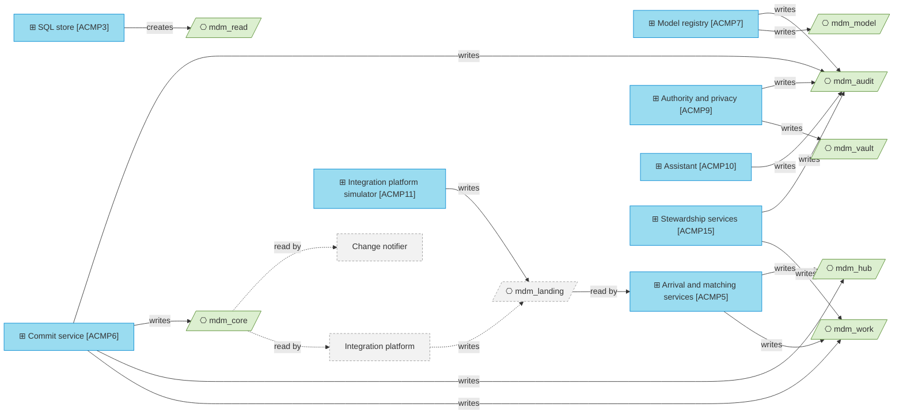

# Data architecture

_[← Information layer](./README.md) · [Model home](../README.md)_

**ArchiMate viewpoint:** Information: where each Data Object is stored, how sensitive it is and how long it is kept, with the Application Components that write it.

**Status:** ◐ Draft catalogue — written for story 3.3 of initiative 3, Steward workbench; not yet validated.

## Schema groups

The green parallelograms are the eight schema groups of [artifact [`ART3`] Store schemas](../5_technology/2_deployment.md#from-build-to-runtime). Grey with a dashed border marks the integration platform, the change notifier and the landing group the integration platform owns. Their dashed edges become true when the hub is deployed, **Pending — future initiative** ([initiative 4](../6_transition/2_sequence.md#sequence)).

Only the commit service writes `mdm_core`, inside the commit-order lock, and the store refuses any other write there ([decision 7](../decisions/7_schema-groups-and-one-published-schema.md)). Each group is one schema. Its name starts with `mdm_` unless `MDM_SCHEMA_PREFIX` sets another start, so each test run keeps to its own schemas.

| Group | Holds | Written by | Read by | Grants on the platform |
| ----- | ----- | ---------- | ------- | ---------------------- |
| `mdm_model` | [data object [`DOBJ1.1`] Entity model version](./2_data-objects.md#master-data-configuration) [data object [`DOBJ1.2`] Rule set version](./2_data-objects.md#master-data-configuration) [data object [`DOBJ1.3`] Code-list copy](./2_data-objects.md#master-data-configuration) | [application component [`ACMP7`] Model registry](../4_application/2_application-components.md#application-components) | The hub's components | The hub's role only |
| `mdm_landing` | [data object [`DOBJ2.1`] Landing row](./2_data-objects.md#source-intake) | The integration platform (External) in the local mode, [application component [`ACMP11`] Integration platform simulator](../4_application/2_application-components.md#application-components) | [application component [`ACMP5`] Arrival and matching services](../4_application/2_application-components.md#application-components) | Owned by the integration platform's role, which grants the hub's role `USAGE` on the schema and `SELECT` on the table, and nothing more ([landing interface](../4_application/5_interface-contracts.md#landing-interface)) |
| `mdm_work` | [data object [`DOBJ2.3`] Standardised source state](./2_data-objects.md#source-intake) [data object [`DOBJ3.1`] Candidate pair](./2_data-objects.md#resolution-work) [data object [`DOBJ3.2`] Steward task](./2_data-objects.md#resolution-work) [data object [`DOBJ3.3`] Quality rule result](./2_data-objects.md#resolution-work) [data object [`DOBJ3.4`] Arrival position](./2_data-objects.md#resolution-work) [data object [`DOBJ3.5`] Staged decision](./2_data-objects.md#resolution-work) [data object [`DOBJ3.6`] Steward match label](./2_data-objects.md#resolution-work) [data object [`DOBJ3.7`] Quality sample](./2_data-objects.md#resolution-work) [data object [`DOBJ3.8`] Breaker state](./2_data-objects.md#resolution-work) [data object [`DOBJ3.9`] Signature batch](./2_data-objects.md#resolution-work) | application component [`ACMP5`] Arrival and matching services [application component [`ACMP6`] Commit service](../4_application/2_application-components.md#application-components), which settles queued records, writes tasks and labels, closes decided tasks, settles staged decisions, and writes quality samples and blind answers in the commit transaction, and records each chunk of a batch, with its reviews' labels, samples and settlement [application component [`ACMP15`] Stewardship services](../4_application/2_application-components.md#application-components), for claims, snoozes, escalations and staged decisions, for the breaker's state and its arrival counts, and for signature batches | The hub's components | The hub's role only |
| `mdm_hub` | [data object [`DOBJ2.2`] Source record version](./2_data-objects.md#source-intake) [data object [`DOBJ4.3`] Retired ID map](./2_data-objects.md#published-master-data), for the source records each merge moved [data object [`DOBJ4.6`] Provenance](./2_data-objects.md#published-master-data) [data object [`DOBJ4.7`] Steward value](./2_data-objects.md#published-master-data) the master identifier (ID) counter of [data object [`DOBJ4.1`] Golden record](./2_data-objects.md#published-master-data) | application component [`ACMP5`] Arrival and matching services, for source versions application component [`ACMP6`] Commit service, for the rest | The hub's components | The hub's role only |
| `mdm_vault` | [data object [`DOBJ5.3`] Personal value](./2_data-objects.md#audit-and-privacy) | [application component [`ACMP9`] Authority and privacy](../4_application/2_application-components.md#application-components), for arrival and commit | application component [`ACMP9`] Authority and privacy, to reveal a value with a logged reason | The hub's role only; never copied out of the operational database |
| `mdm_core` | data object [`DOBJ4.1`] Golden record [data object [`DOBJ4.2`] Cross-reference](./2_data-objects.md#published-master-data) data object [`DOBJ4.3`] Retired ID map [data object [`DOBJ4.4`] Record relationship](./2_data-objects.md#published-master-data) [data object [`DOBJ4.5`] Change feed](./2_data-objects.md#published-master-data) | application component [`ACMP6`] Commit service, alone | Listening systems, through the integration platform; the change notifier; the hub's components | `USAGE` and `SELECT` for the integration platform's role, with default privileges so a new entity's table is readable without a manual grant; `USAGE` and `SELECT` on `mdm_core.commit_log` only, with no default privileges, for the change notifier's role |
| `mdm_read` | Views only: data object [`DOBJ4.1`] Golden record with each personal value masked, and data objects [`DOBJ4.2`] Cross-reference, [`DOBJ4.3`] Retired ID map and [`DOBJ4.4`] Record relationship as they are | [application component [`ACMP3`] SQL store](../4_application/2_application-components.md#application-components) creates the views; nothing writes rows | People, whatever their role | `USAGE` and `SELECT` for the roles people read through, with the same default privileges |
| `mdm_audit` | [data object [`DOBJ5.1`] Change set record](./2_data-objects.md#audit-and-privacy) [data object [`DOBJ5.2`] Change log entry](./2_data-objects.md#audit-and-privacy) [data object [`DOBJ5.4`] Access log entry](./2_data-objects.md#audit-and-privacy) | Inserts only, which the store enforces: application component [`ACMP6`] Commit service, for change sets and change logs application component [`ACMP7`] Model registry, for governance changes application component [`ACMP9`] Authority and privacy, for reveals and redactions [application component [`ACMP10`] Assistant](../4_application/2_application-components.md#application-components), for assistant calls application component [`ACMP15`] Stewardship services, for the quality breaker's trips, withdrawals and restores, and the access rows of a batch split | The hub's components | The hub's role only |

`mdm ddl --grants` prints the grants of `mdm_core` and `mdm_read` for the roles it is given. `mdm ddl --group landing` prints the landing table for the integration platform's role to create.

## Portable types

Every table uses the same eight logical types on both engines, set in `src/mdm/backend/ddl.py` and checked on both by `tests/test_backend_ddl.py` ([decision 6](../decisions/6_one-sql-store-two-engines.md)).

| Logical type | DuckDB | Postgres | Used for |
| ------------ | ------ | -------- | -------- |
| text | `VARCHAR` | `text` | Keys, names, codes and text attributes |
| big integer | `BIGINT` | `bigint` | Versions, sequences, hashes and integer attributes |
| integer | `INTEGER` | `integer` | Small counters and model versions |
| numeric | `DECIMAL(38,10)` | `numeric(38,10)` | Number attributes and scores |
| boolean | `BOOLEAN` | `boolean` | Flags |
| date | `DATE` | `date` | Dates |
| timestamp with time zone | `TIMESTAMP WITH TIME ZONE` | `timestamp with time zone` | Every time; each session runs in Coordinated Universal Time (UTC) |
| JSON | `JSON` | `jsonb` | Payloads, repeating groups, explanations and provenance, as JavaScript Object Notation (JSON) |

An entity's attributes become the columns of its table in `mdm_core` as follows.

| Attribute type in the entity model | Column in `mdm_core` |
| ---------------------------------- | -------------------- |
| text | text |
| integer | big integer |
| number | numeric |
| boolean | boolean |
| date | date |
| timestamp | timestamp with time zone |
| json, or any repeating group | JSON, one column per group ([decision 11](../decisions/11_json-for-repeating-groups.md)) |
| reference | None: the reference is published as a [data object [`DOBJ4.4`] Record relationship](./2_data-objects.md#published-master-data) |

`mdm_core` uses no array, no vector, no special key type and no partitions, so a copy to the lakehouse for analytics stays possible. A column is only ever added, and always at the end. A reader that meets a column it does not know ignores it.

## Classification

Which values are personal is set per attribute by its masking class in the entity model, such as a Person's given name and birth date. A data object takes the highest class of what it holds.

| Class | What it holds |
| ----- | ------------- |
| Public | Anything that may leave the enterprise; no data object here is Public |
| Internal | Codes, keys, IDs, counts and rules, with no personal value and no staff name |
| Confidential | The name of a staff member who drafted, started, set, made, checked or revealed something |
| Personal | A data subject's personal values in clear |

| Data object | Classification | Personal data | Masked for people | In history |
| ----------- | -------------- | ------------- | ----------------- | ---------- |
| [`DOBJ1.1`] Entity model version | Confidential | None; staff names of who drafted and published | Nothing to mask | Every version is kept |
| [`DOBJ1.2`] Rule set version | Confidential | None; staff names of who drafted and published | Nothing to mask | Every version is kept |
| [`DOBJ1.3`] Code-list copy | Confidential | None; the staff name of who loaded it | Nothing to mask | Every version is kept |
| [`DOBJ2.1`] Landing row | Personal | Values in clear | People never read it | Kept by the integration platform, as the retention below says |
| [`DOBJ2.2`] Source record version | Internal | By vault reference only | Nothing to mask | It is the history of a source record |
| [`DOBJ2.3`] Standardised source state | Personal | Values, approved values, comparison forms, registered IDs and blocking keys, in clear | Masked in every command-line output and profile | Current state only; earlier versions are in data object [`DOBJ2.2`] Source record version |
| [`DOBJ3.1`] Candidate pair | Internal | None: comparison levels, scores and explanations only | Nothing to mask | Kept per rule version |
| [`DOBJ3.2`] Steward task | Confidential | None; the staff name of the claimant and of who snoozed or escalated it. Reasons, suggestions and evidence carry codes and IDs only | Nothing to mask | Each task stays, closed when decided |
| [`DOBJ3.3`] Quality rule result | Internal | None | Nothing to mask | The latest failure per record and rule |
| [`DOBJ3.4`] Arrival position | Confidential | None; the staff name of who started each job run | Nothing to mask | Job runs and rejected rows stay |
| [`DOBJ3.5`] Staged decision | Confidential | None; the staff name and role of who decided | Nothing to mask | Kept after it settles, with its outcome |
| [`DOBJ3.6`] Steward match label | Confidential | None; the staff name of who decided | Nothing to mask | The latest decision per pair; earlier ones are in data object [`DOBJ5.1`] Change set record |
| [`DOBJ3.7`] Quality sample | Confidential | None; the staff names of who made the first decision, who answered blind, and, for a batch sample, the second steward who confirmed the batch | Nothing to mask | Each sample stays with its answer; the agreement counts are running totals |
| [`DOBJ3.8`] Breaker state | Confidential | None; the staff name of the data owner who restored the band or a pattern's bulk rights | Nothing to mask | The latest trip and restore per entity and pattern; every trip and restore is in data object [`DOBJ5.1`] Change set record |
| [`DOBJ3.9`] Signature batch | Confidential | None; the staff names of the maker, the second steward and whoever stopped it. Signatures, strata, reasons, figures and a split's comparison carry codes only | Nothing to mask | Each batch stays with its reviews and chunks; each chunk's change set is in data object [`DOBJ5.1`] Change set record |
| [`DOBJ4.1`] Golden record | Personal | Values in clear, because listening systems need them | Masked in `mdm_read` and by `mdm record show`; revealed per attribute with a logged reason | Before and after in data object [`DOBJ5.2`] Change log entry, by vault reference |
| [`DOBJ4.2`] Cross-reference | Internal | None | Nothing to mask | Before and after in data object [`DOBJ5.2`] Change log entry |
| [`DOBJ4.3`] Retired ID map | Internal | None | Nothing to mask | Before and after in data object [`DOBJ5.2`] Change log entry |
| [`DOBJ4.4`] Record relationship | Internal | None | Nothing to mask | Before and after in data object [`DOBJ5.2`] Change log entry |
| [`DOBJ4.5`] Change feed | Internal | None; the commit log names a role or an automated actor, never a person | Nothing to mask | It is the history listening systems read |
| [`DOBJ4.6`] Provenance | Internal | By vault reference only | Nothing to mask | Before and after in data object [`DOBJ5.2`] Change log entry |
| [`DOBJ4.7`] Steward value | Personal | Values in clear, and the staff name of who set each | Masked like the golden record | Before and after in data object [`DOBJ5.2`] Change log entry, by vault reference |
| [`DOBJ5.1`] Change set record | Confidential | None; staff names of maker and checker | Nothing to mask | Inserted only, never changed |
| [`DOBJ5.2`] Change log entry | Internal | By vault reference only | Nothing to mask | Inserted only, never changed |
| [`DOBJ5.3`] Personal value | Personal | Values in clear, until a redaction empties them | Never shown, except a revealed value | A redaction is recorded, and the row stays |
| [`DOBJ5.4`] Access log entry | Confidential | None; staff names and their reasons | Nothing to mask | Inserted only, never changed |

A masked view shows a personal text value as its first letter and `***`, and a personal date, number or group as empty. History refers to personal values through the vault, so a redaction empties a value in one place ([decision 12](../decisions/12_personal-value-vault.md)).

### Fields that never hold a personal value

Each field below carries attribute names, codes, IDs, source keys and counts only. `src/mdm/models/safety.py` builds every one of them and refuses free text, the store checks each again where it writes it, and `tests/test_services_personal_data.py` checks the stored rows on both engines.

| Field | Where it is kept |
| ----- | ---------------- |
| The reason and attribute names of a rejected landing row | `mdm_work.landing_reject` |
| A task's reason, suggestion, evidence and signature | `mdm_work.task` |
| A staged decision's subject, signature and outcome | `mdm_work.tray_entry` |
| A label's signature | `mdm_work.match_label` |
| A quality sample's subject, decision, signature and answer, and the agreement counts' signature | `mdm_work.quality_sample` `mdm_work.quality_agreement` |
| A breaker's trigger, figures and restore reason code, and a bulk-rights row's signature and figures | `mdm_work.breaker_state` |
| A batch's signature, strata, reasons, figures, planned changes and split comparisons, which are attribute names | `mdm_work.batch` `mdm_work.batch_item` |
| A quality rule result | `mdm_work.rule_result` |
| A candidate pair's comparison levels and explanation | `mdm_work.candidate_pair` |
| A job's progress and error code | `mdm_work.job_run` |
| A change set's evidence | `mdm_audit.change_set` |
| An access row's detail: a reveal's attribute, a match test's size, an assistant call's provider and prompt hash, and a batch split's attribute, batch ID, source key and task ID | `mdm_audit.access_log` |
| A reveal's reason, a code, from the workbench | `mdm_audit.access_log` |
| Every command-line message and every log line | Nowhere; printed or logged only |
| Every address, component ID, notification and browser-stored value of the workbench | Nowhere in the hub; built from IDs and codes only |

## Retention

| Data object | Kept | Deleted by |
| ----------- | ---- | ---------- |
| [`DOBJ2.1`] Landing row | At least 14 days, under the [landing interface](../4_application/5_interface-contracts.md#landing-interface); the arrival job re-probes a lost gap until then | The integration platform |
| [`DOBJ4.1`] Golden record tombstones and [`DOBJ4.3`] Retired ID map | As long as the golden records they resolve to, so a master ID always resolves | Only the purge of a retired record under [rule [`RULE5`] Destruction needs an owner and an administrator](../2_business/5_domain-context-and-rules.md#business-rules), which comes with [initiative 4](../6_transition/2_sequence.md#sequence) |
| [`DOBJ5.3`] Personal value | The row always stays; a redaction empties its value and records itself | A redaction, which needs a data owner, an administrator and a typed confirmation, in `src/mdm/services/privacy.py` |
| The arrival counts of [`DOBJ3.8`] Breaker state | 8 days, which covers the current hour and the same hour over the previous 7 days | The arrival job, which deletes older hours each time it checks the volume |
| Every other data object | **Pending — future initiative** ([initiative 4](../6_transition/2_sequence.md#sequence)): the product owner agrees retention periods before real Person data loads, and nothing is deleted meanwhile | Nothing yet |
