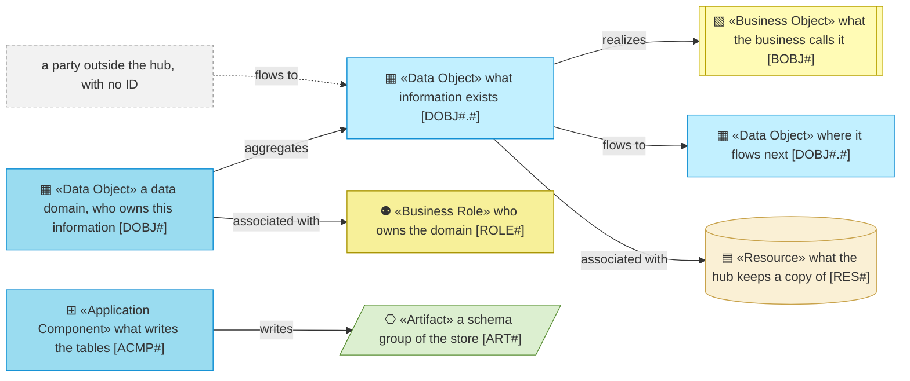
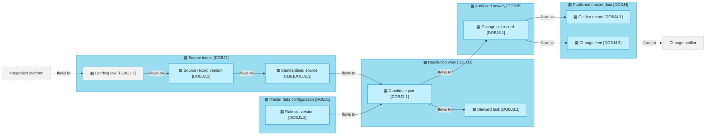

# Information Layer

_[← Model home](../README.md)_

What the hub holds, who owns it, how it flows from the landing tables to the change feed and through a steward's decisions, how it reaches the screens, and how it is stored and kept.

**ArchiMate viewpoint:** Information: Data Object, with the data domain as its level 1 and the object as its level 2, and Representation; the Business Object each one stands for and the Business Role that owns each domain visit from the business layer.

## Documents

| # | Document | Elements | Question it answers |
| - | -------- | -------- | ------------------- |
| 1 | [1_data-domains.md](./1_data-domains.md) | Data domains and their owners | Who owns which information? |
| 2 | [2_data-objects.md](./2_data-objects.md) | Data objects per domain, and the tables that hold them | What information exists, and in which domain? |
| 3 | [3_data-flows.md](./3_data-flows.md) | Flows between data objects and the parties outside the hub; the stewardship flows; representations, the workbench screens among them | How does information move from the landing tables to listening systems, and through a steward's decisions to the screens? |
| 4 | [4_data-architecture.md](./4_data-architecture.md) | Schema groups, portable types, classification, retention | Where does it live, how sensitive is it, and how long is it kept? |

## Metamodel

The darker cyan marks a data domain, and grey with a dashed border a party outside the hub or a data object it owns. The business object, role, resource, component and artifact visit from their own layers and keep their own shape and colour.

## Layer view

The view follows one source change through the five domains, from the landing tables to the change feed; [data objects](./2_data-objects.md) lists all twenty-five. The dashed edges to the two outside parties wait for both interfaces to be agreed and deployed, **Pending — future initiative** ([initiative 4](../6_transition/2_sequence.md#sequence)).
