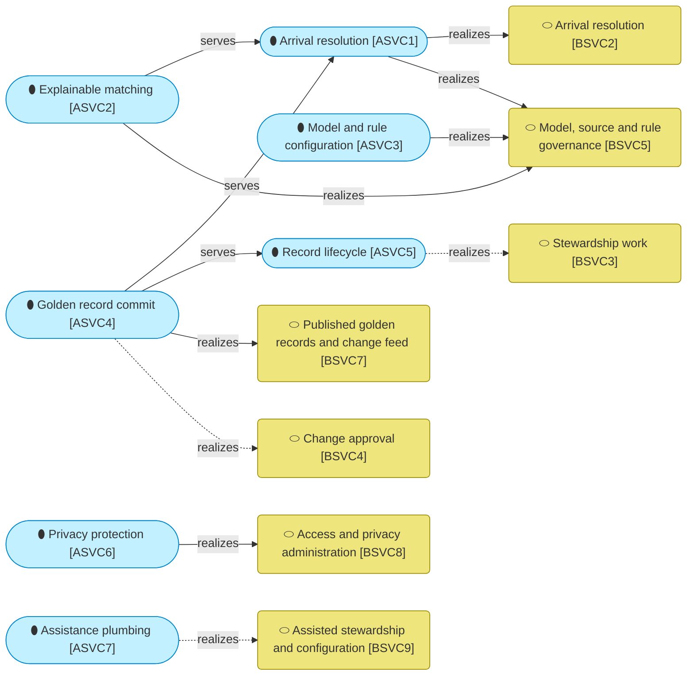
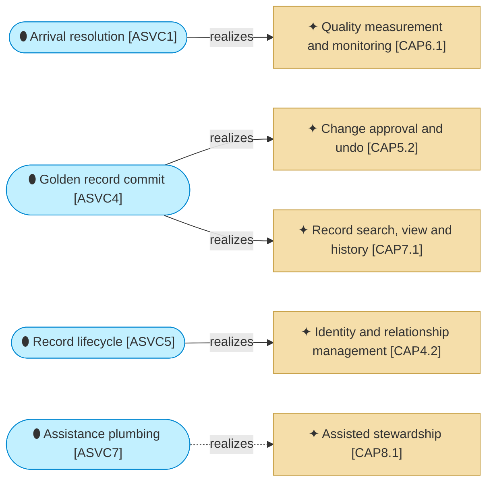

# Application services

_[← Application layer](./README.md) · [Model home](../README.md)_

**ArchiMate viewpoint:** Application layer: Application Service.

**Status:** ● Validated, 2026-09-27.

## Application services

The yellow rounded boxes are [business services](../2_business/2_business-services.md#business-services), drawn here as visitors. Dashed edges are not true yet. The steward workbench of [initiative 3](../6_transition/2_sequence.md#sequence) puts change approval and stewardship work on screen. Assisted stewardship needs the language model of [initiative 5](../6_transition/2_sequence.md#sequence).

| ID | Application service | Code | Source | Notes |
| -- | ------------------- | ---- | ------ | ----- |
| `ASVC1` | **Arrival resolution** — reads landing rows above its high-water mark and from the gaps below it, checks them against the [landing interface](./5_interface-contracts.md#landing-interface), keeps every version, standardises them, checks quality rules, keys and scores them, and settles them under the source policy or writes a task; in bulk mode it loads a source's history as an initial load | `src/mdm/services/arrival.py`, offered by `mdm arrive`, `mdm load` and `mdm task list` | [Blueprint](../reference/README.md#founding-material) §3 flow (a), §5.3; [Answer 5](../reference/2026-09-26-request-and-answers.md#answers) | |
| `ASVC2` | **Explainable matching** — scores a pair with its waterfall of weights, band, hard rules and the smallest change that would move it a band up or down, and runs the match test for a record without committing anything | `src/mdm/services/matching.py` and `src/mdm/engine/`, offered by `mdm match` | Blueprint §5.2 | |
| `ASVC3` | **Model and rule configuration** — loads, validates and publishes entity models and rule sets, estimates weights into a draft rule set, profiles sources and loads code-list copies | `src/mdm/services/registry.py`, `src/mdm/services/estimation.py`, `src/mdm/services/profiling.py` and `src/mdm/services/codelists.py`, offered by `mdm model`, `mdm rules`, `mdm estimate`, `mdm profile` and `mdm codelists` | Blueprint §2, §5.3 | |
| `ASVC4` | **Golden record commit** — commits a change set under the commit-order lock after checking its authority again, with gap-free commit versions, change-feed rows, tombstones, provenance and audit records | `src/mdm/services/commit.py`, used by arrival resolution and record lifecycle; `src/mdm/services/feed.py`, read with `mdm feed read` and through the [listener interface](./5_interface-contracts.md#listener-interface) | Blueprint §5.4, §5.5; Answer 5 | |
| `ASVC5` | **Record lifecycle** — links, detaches, merges, unmerges, retires and reinstates golden records as change sets; merge, unmerge and retirement need a checker who is not the maker | `src/mdm/services/lifecycle.py`; the record actions on screen from initiative 3 | Blueprint §1, §2 | |
| `ASVC6` | **Privacy protection** — masks personal values by default, logs every reveal with its reason, holds the personal values history refers to in the vault, and redacts them under a data owner and an administrator | `src/mdm/services/privacy.py` and `src/mdm/services/authority.py`, offered by `mdm record show --reveal`; the masked views in `mdm_read` | Blueprint §2, §5.6; [Answer 1](../reference/2026-09-26-request-and-answers.md#answers) | |
| `ASVC7` | **Assistance plumbing** — chooses the language-model endpoint or the stub, masks every prompt, and labels and logs every suggestion; the stub answers locally | `src/mdm/agent/`, offered by `mdm match --narrative` | [Answer 2](../reference/2026-09-26-request-and-answers.md#answers); Blueprint §4; [decision 17](../decisions/17_masked-prompts-and-the-stub.md) | |

### Services and the capabilities they realize

The tan boxes are [capabilities](../1_strategy/2_capabilities-and-resources.md#capabilities) visiting from the strategy layer. Arrival resolution realizes the quality rules checked on arrival. Golden record commit realizes the commit path with its authority check, and the audit log. Record lifecycle realizes the record actions as service functions. The dashed edge waits for the language model of [initiative 5](../6_transition/2_sequence.md#sequence); the plumbing and the stub exist today.
