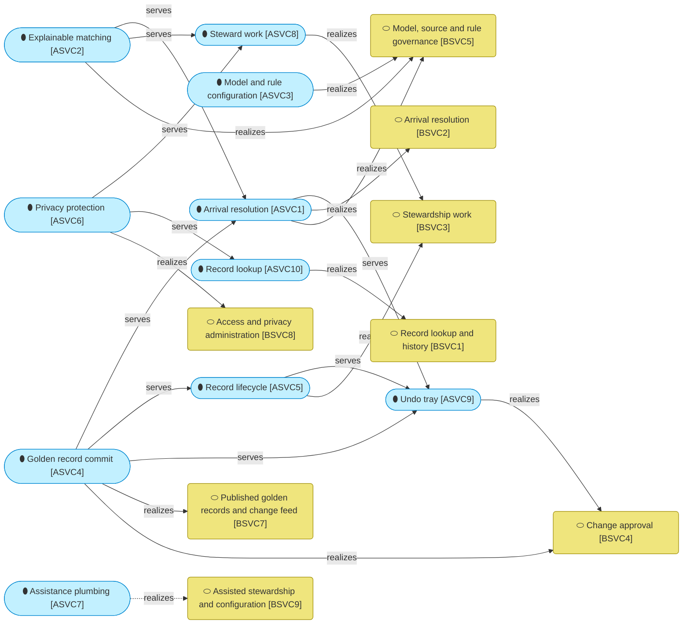
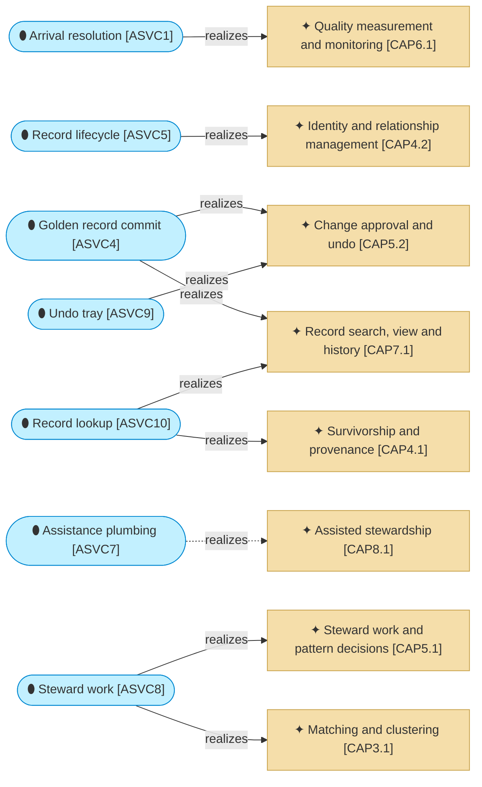

# Application services

_[← Application layer](./README.md) · [Model home](../README.md)_

**ArchiMate viewpoint:** Application layer: Application Service.

**Status:** ◐ Draft catalogue — written for initiative 3, Steward workbench; not yet validated.

## Application services

The yellow rounded boxes are [business services](../2_business/2_business-services.md#business-services), drawn here as visitors. Steward work, the undo tray and record lookup put stewardship on screen, and each calls the services below it. Dashed edges are not true yet. Change approval by makers and checkers waits for story 3.6 of [initiative 3](../6_transition/2_sequence.md#sequence), and assisted stewardship for the language model of [initiative 5](../6_transition/2_sequence.md#sequence).

| ID | Application service | Code | Source | Notes |
| -- | ------------------- | ---- | ------ | ----- |
| `ASVC1` | **Arrival resolution** — reads landing rows above its high-water mark and from the gaps below it, checks them against the [landing interface](./5_interface-contracts.md#landing-interface), keeps every version, standardises them, checks quality rules, keys and scores them, and settles them under the source policy or writes a task; in bulk mode it loads a source's history as an initial load | `src/mdm/services/arrival.py`, offered by `mdm arrive`, `mdm load` and `mdm task list` | [Blueprint](../reference/README.md#founding-material) §3 flow (a), §5.3; [Answer 5](../reference/2026-09-26-request-and-answers.md#answers) | |
| `ASVC2` | **Explainable matching** — scores a pair with its waterfall of weights, band, hard rules and the smallest change that would move it a band up or down, and runs the match test for a record without committing anything | `src/mdm/services/matching.py` and `src/mdm/engine/`, offered by `mdm match` | Blueprint §5.2 | |
| `ASVC3` | **Model and rule configuration** — loads, validates and publishes entity models and rule sets, estimates weights into a draft rule set, profiles sources and loads code-list copies | `src/mdm/services/registry.py`, `src/mdm/services/estimation.py`, `src/mdm/services/profiling.py` and `src/mdm/services/codelists.py`, offered by `mdm model`, `mdm rules`, `mdm estimate`, `mdm profile` and `mdm codelists` | Blueprint §2, §5.3 | |
| `ASVC4` | **Golden record commit** — commits a change set under the commit-order lock after checking its authority again, with gap-free commit versions, change-feed rows, tombstones, provenance and audit records | `src/mdm/services/commit.py`, used by arrival resolution and record lifecycle; `src/mdm/services/feed.py`, read with `mdm feed read` and through the [listener interface](./5_interface-contracts.md#listener-interface) | Blueprint §5.4, §5.5; Answer 5 | |
| `ASVC5` | **Record lifecycle** — links, detaches, merges, unmerges, retires and reinstates golden records as change sets; merge, unmerge and retirement need a checker who is not the maker | `src/mdm/services/lifecycle.py`; link and approving a held update on screen, through the undo tray; detach, merge, unmerge, retire and reinstate on screen **Pending — future initiative** ([initiative 3](../6_transition/2_sequence.md#sequence), story 3.6) | Blueprint §1, §2 | |
| `ASVC6` | **Privacy protection** — masks personal values by default, logs every reveal with its reason, holds the personal values history refers to in the vault, and redacts them under a data owner and an administrator | `src/mdm/services/privacy.py` and `src/mdm/services/authority.py`, offered by `mdm record show --reveal`; the masked views in `mdm_read`; on screen in the workbench, masked by role, with reveals logged per attribute under one of four reason codes: `deciding_task`, `source_defect`, `subject_request` and `audit_check` ([decision 20](../decisions/20_masking-and-reveal-on-screen.md)) | Blueprint §2, §5.6; [Answer 1](../reference/2026-09-26-request-and-answers.md#answers) | |
| `ASVC7` | **Assistance plumbing** — chooses the language-model endpoint or the stub, masks every prompt, and labels and logs every suggestion; the stub answers locally | `src/mdm/agent/`, offered by `mdm match --narrative` | [Answer 2](../reference/2026-09-26-request-and-answers.md#answers); Blueprint §4; [decision 17](../decisions/17_masked-prompts-and-the-stub.md) | |
| `ASVC8` | **Steward work** — the inbox of open tasks ordered by due time, with views, capped counts, claims, snoozes and escalations; each task's case with its records, candidates, explanation, counterfactual, golden preview and impact line; and the checks that decide which decisions a task offers | `src/mdm/services/inbox.py` and `src/mdm/services/decisions.py`, offered by the workbench's inbox and decide pane | Blueprint §3 | |
| `ASVC9` | **Undo tray** — stages a steward's decision for its undo window, undoes it on request, and commits it afterwards through the commit path exactly once. The commit checks again, in its own transaction, the authority, the record's event, the task and the target | `src/mdm/services/tray.py`, offered by the workbench's tray and by `mdm tray flush` | Blueprint §3, §4; [decision 19](../decisions/19_undo-tray.md) | |
| `ASVC10` | **Record lookup** — resolves a master ID, a retired ID or a source key, and shows a golden record with each value's provenance and the strategy that decided it, its sources, timeline and relationships, and a source record with its versions, masked by role | `src/mdm/services/lookup.py`, offered by the workbench's record and source record views | Blueprint §3; ISO 8000-120 | |

### Services and the capabilities they realize

The tan boxes are [capabilities](../1_strategy/2_capabilities-and-resources.md#capabilities) visiting from the strategy layer. Arrival resolution realizes the quality rules checked on arrival. Golden record commit realizes the commit path with its authority check, and the audit log. Record lifecycle realizes the record actions as service functions. Steward work realizes the inbox and the decision view with its explanation, the undo tray realizes undo before commit, and record lookup realizes the record view with the Why of each value. The dashed edge waits for the language model of [initiative 5](../6_transition/2_sequence.md#sequence); the plumbing and the stub exist today.
