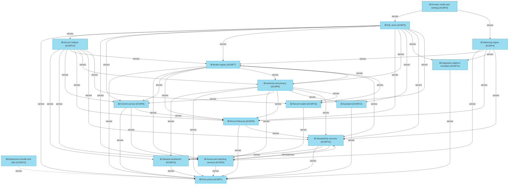
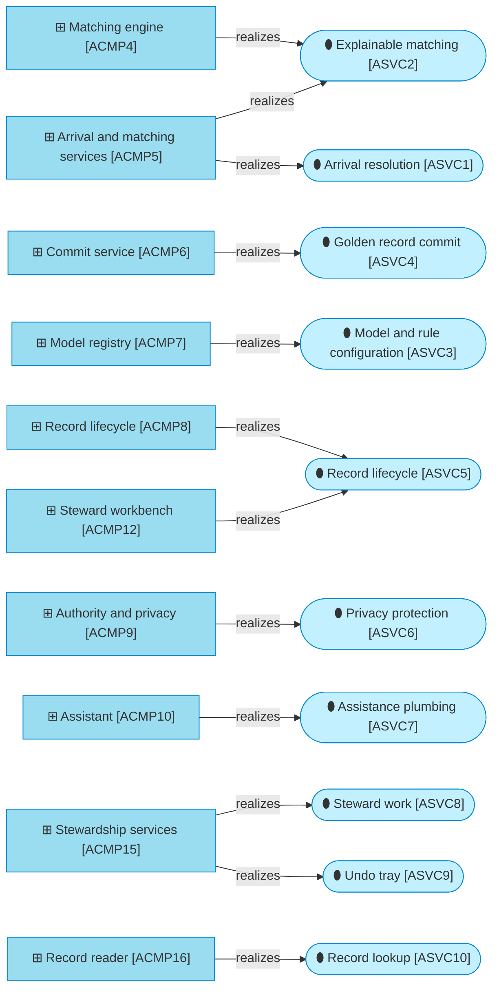

# Application components

_[← Application layer](./README.md) · [Model home](../README.md)_

**ArchiMate viewpoint:** Application layer: Application Component.

**Status:** ● Validated, 2026-09-28.

## Application components

Each edge points from the component that serves to the one it serves. The SQL store and the matching engine never use each other, and only the commit service writes the published tables. The model registry and authority and privacy use each other: every load and publish is checked against the actor's role, and the authority check reads the published model a change set names. Arrival and the stewardship services use each other too. Arrival draws its quality samples and reads the quality breaker through the stewardship services, which read candidates and explanations from arrival and matching. The domain model serves every component; only its first two edges are drawn. The rule that orders these components into layers is in the [solution design](./4_solution-design.md#layers). The workbench calls the stewardship services and the record reader, authority and privacy for the actor of each request, and the service helpers for the tray's labels; it reads no store. The dashed box is the deployment bundle of [initiative 4](../6_transition/2_sequence.md#sequence). `ACMP11` writes [data object [`DOBJ2.1`] Landing row](../3_information/2_data-objects.md#source-intake) as the integration platform would, and only on a local store.

| ID | Application component | Path | State | Source | Notes |
| -- | --------------------- | ---- | ----- | ------ | ----- |
| `ACMP1` | **Entry points** — the `mdm` command line and the wiring every entry point shares | `src/mdm/cli.py` `src/mdm/__main__.py` `src/mdm/services/__init__.py` `src/mdm/services/context.py` | Exists | [Blueprint](../reference/README.md#founding-material) §5.1 | |
| `ACMP2` | **Domain model and settings** — dataclasses with no Structured Query Language (SQL) and no input or output, the settings read from `MDM_*` variables, the declared capacity and the package version | `src/mdm/models/` `src/mdm/config.py` `src/mdm/capacity.py` `src/mdm/__init__.py` | Exists | Blueprint §5.1; [decision 14](../decisions/14_declared-capacity.md) | |
| `ACMP3` | **SQL store** — every SQL statement, written once, over two engines; the data definition language (DDL); the write guard; the Lakebase credentials | `src/mdm/backend/` | Exists | [Decision 6](../decisions/6_one-sql-store-two-engines.md) | |
| `ACMP4` | **Matching engine** — standardise, key, compare, estimate, score, explain, cluster, survive and check quality; draw quality samples and bound agreement; pure Python, with no input or output | `src/mdm/engine/` | Exists | [Decision 10](../decisions/10_explainable-scorer-and-weight-estimation.md) | |
| `ACMP5` | **Arrival and matching services** — the landing reader, the source policy, arrival and the match test | `src/mdm/services/arrival.py` `src/mdm/services/landing.py` `src/mdm/services/policy.py` `src/mdm/services/matching.py` | Exists | Blueprint §5.3 | |
| `ACMP6` | **Commit service** — the only writer of the published tables, and the change-feed reader; it refuses an automatic-band link while the quality breaker has demoted the band | `src/mdm/services/commit.py` `src/mdm/services/feed.py` | Exists | [Decision 8](../decisions/8_commit-order-lock-and-change-feed.md) | |
| `ACMP7` | **Model registry** — entity models, rule sets, code-list copies, weight estimation and profiling | `src/mdm/services/registry.py` `src/mdm/services/codelists.py` `src/mdm/services/estimation.py` `src/mdm/services/profiling.py` | Exists | Blueprint §2 | |
| `ACMP8` | **Record lifecycle** — link, detach, merge, unmerge, retire and reinstate | `src/mdm/services/lifecycle.py` | Exists | Blueprint §2 | |
| `ACMP9` | **Authority and privacy** — actors, roles, personas, the authority check, masking, reveals and the vault | `src/mdm/services/authority.py` `src/mdm/services/privacy.py` | Exists | [Decision 13](../decisions/13_authority-and-personas.md), [decision 12](../decisions/12_personal-value-vault.md) | |
| `ACMP10` | **Assistant** — provider choice, masked prompts, the stub and the case narrative | `src/mdm/agent/` | Exists | [Answer 2](../reference/2026-09-26-request-and-answers.md#answers); [decision 17](../decisions/17_masked-prompts-and-the-stub.md) | |
| `ACMP11` | **Integration platform simulator** — invented Person and Organisation source changes written into the landing tables as the integration platform would, in the local mode only; the demo evaluation | `src/mdm/demo/` | Exists; refuses any store but a local one | Blueprint §5.6; adopted — a stand-in for an External party | |
| `ACMP14` | **Service helpers** — the small helpers every service shares: safe tokens, fingerprints, relationship IDs and plain JSON forms, and the labels, value text and masking used for display; they read and write no store | `src/mdm/services/support.py` `src/mdm/services/display.py` | Exists | Blueprint §5.1 | |
| `ACMP12` | **Steward workbench** — the web interface: the shell, the inbox with the decide pane, the undo tray, and the record and source record views; it calls the services only | `src/mdm/ui/` `app.py` | Exists | Blueprint §3; [decision 18](../decisions/18_workbench-shell-and-keys.md) | |
| `ACMP15` | **Stewardship services** — the inbox, the decisions a task offers and their cases, and the undo tray with its flush; the matcher's checkpoint: blind review and the quality breaker | `src/mdm/services/inbox.py` `src/mdm/services/decisions.py` `src/mdm/services/tray.py` `src/mdm/services/quality.py` `src/mdm/services/breaker.py` | Exists | Blueprint §3, §4, §5.1; adopted — the checkpoint joins the stewardship services | |
| `ACMP16` | **Record reader** — the read side of a golden or source record: resolution of IDs, provenance and the strategy that decided each value, sources, timeline and relationships | `src/mdm/services/lookup.py` | Exists | Blueprint §3 | |
| `ACMP13` | **Deployment bundle and jobs** — the app, the scheduled jobs and the operational database as bundle resources | `databricks.yml` `resources/` | **Pending — future initiative** ([initiative 4](../6_transition/2_sequence.md#sequence)) | Blueprint §5.6 | |

### Components and the services they realize

The [application services](./1_application-services.md#application-services) are the light cyan stadiums. The steward workbench realizes the record lifecycle on screen: a link, and approving a held update, through the undo tray. The entry points, the domain model, the store, the simulator and the deployment bundle realize no service of their own. They serve the components that do.
