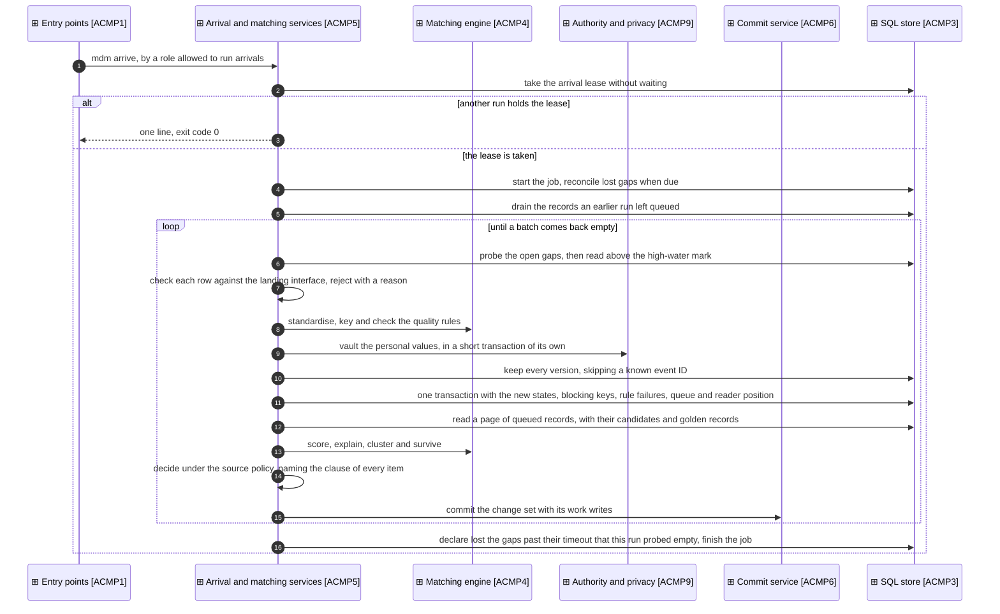
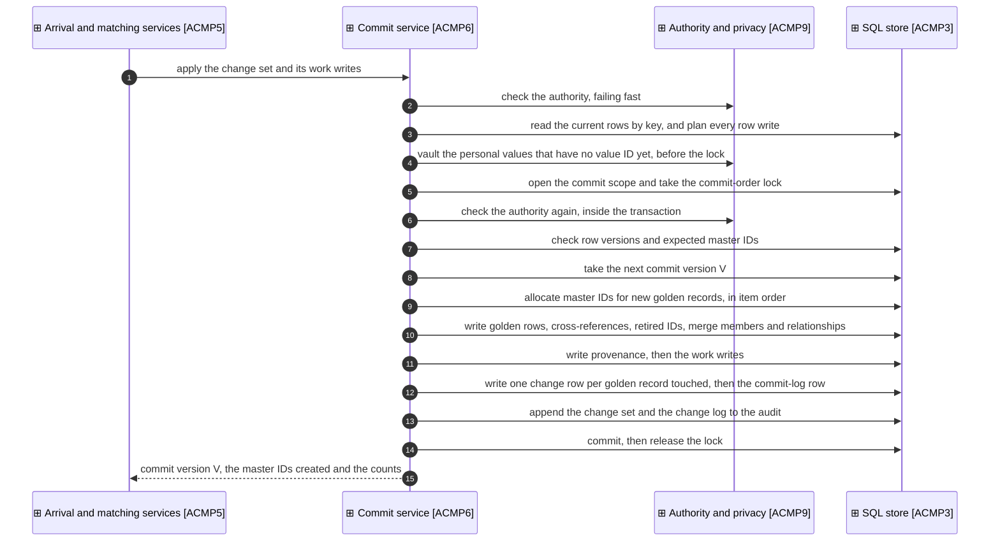
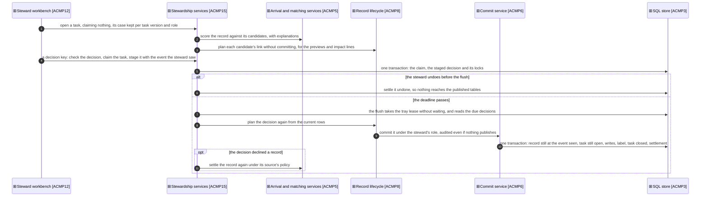

# Application collaborations

_[← Application layer](./README.md) · [Model home](../README.md)_

**ArchiMate viewpoint:** Application layer: Application Collaboration and Application Interaction, drawn as sequences.

**Status:** ● Validated, 2026-09-28.

Three sequences carry every change the hub publishes: an arrival, a steward's decision, and the commit each ends in. The record actions of [component [`ACMP8`] Record lifecycle](./2_application-components.md#application-components) end in the same commit.

## Arrival

The arrival job is [application service [`ASVC1`] Arrival resolution](./1_application-services.md#application-services), performed by [actor [`ACT6`] Automated matcher](../2_business/1_business-actors-and-roles.md#actors). Its work writes settle the queued records, approve the values that commit, hold the held ones, and store the tasks and the candidate pairs.

What can fail, and what happens:

1. A second run starts while one is running. It finds the lease held, prints one line and exits with success, so an overlapping scheduled run stays quiet.
2. A landing row breaks the [landing interface](./5_interface-contracts.md#landing-interface), or is over its size limits. The row is rejected with a reason and the attribute names involved. `mdm arrive --replay-rejects` replays it once the model or the source is fixed.
3. The run crashes after the versions are kept, or after the intake transaction. The next run first settles the records still queued. It then reads again any rows its position had not passed, and keeps no version twice.
4. The run crashes inside a commit, or a later chunk fails. The transaction rolls back, and its records stay queued for the next run.
5. Another commit changed a record since the page was planned. The page is planned again once; a second conflict turns the conflicting records into exception tasks and commits the rest.
6. A rule version is unpublished during the run. The authority check refuses the commit, and the records stay queued.
7. A reference names a record the hub has not seen yet. The hub keeps it as a pending reference and resolves it when that record arrives.
8. One record's plan fails, through a defect or data the planner cannot handle. The record becomes an exception task, `planning_failed`, and the rest of its page is planned and committed, so one record never stalls arrival.
9. The runs are further apart than the gap timeout, and a row committed late in between. The next run probes the gap before it can declare it lost, so the row is read at once.
10. The database dropped the pool's idle connections, through an idle timeout, a scale to zero or a failover. The pool checks each connection before it hands it out and replaces a dead one, so the lease and the transactions start on live connections.
11. A steward releases or approves a record while intake is moving its state. Intake never writes the hold or the approved values of a record it has already stored, so the steward's commit stands.
12. The quality breaker demotes the automatic band while a page is committing. The commit holds the band until it ends, so the next chunk refuses its automatic links with `breaker_demoted`. Arrival plans the page again, and those records become review tasks.

## Commit

The commit is [application service [`ASVC4`] Golden record commit](./1_application-services.md#application-services). The lock is a Postgres advisory lock held until the transaction ends, or the store's own lock on DuckDB. A commit runs at read committed, so the version it reads after the lock is the latest. [Decision 8](../decisions/8_commit-order-lock-and-change-feed.md) records why the commit writes the change feed itself.

A change set larger than one chunk commits in several. No chunk writes more than 500 published rows, or 10,000 in bulk. A new golden record never leaves its links behind, and a merge never leaves its repointed relationships. Each chunk is its own change set with its own commit version.

What can fail, and what happens:

1. The authority check refuses the change set, before or inside the transaction. Nothing is written, and the caller's records stay queued.
2. A golden record or a cross-reference changed since planning. The commit raises a conflict and rolls back, and the caller plans again once.
3. The process crashes before the commit. Nothing becomes visible, and the next commit takes the same version, so versions stay gap-free.
4. A vault value written before the lock is left unused by a rollback. It is redacted with its subject like any other value.
5. Nothing would be published. No version is used, but the work writes still commit, so the records settle. A steward's decision from the undo tray still writes its audit change set, with no commit version.
6. A commit scope is opened inside another transaction. The store refuses it, so a commit never takes its lock late.
7. A chunk fails after earlier chunks committed. The earlier versions stand, and the failed chunk's records stay queued for the next run.

## Deciding a task

The inbox and the decide pane are [application service [`ASVC8`] Steward work](./1_application-services.md#application-services), and the tray is [application service [`ASVC9`] Undo tray](./1_application-services.md#application-services), performed by a steward ([business process [`BPROC3`] Decide a steward task](../2_business/3_business-processes.md#business-processes)). Locally the workbench's own process runs the flush every two seconds; on the platform a job runs `mdm tray flush` ([decision 19](../decisions/19_undo-tray.md)). A quality sample is decided blind, and its answer commits through the tray like any decision. The same transaction settles the sample with its agreement, and the quality breaker then checks the agreement again.

What can fail, and what happens:

1. Another steward acts first. The claim is refused with the time it lapses, and nothing is staged.
2. The steward undoes after the flush began. The undo finds the decision settled, and says so.
3. The source record changed, the task closed or the target was merged while the decision waited, even between the flush's check and its commit. The commit's transaction finds it and rolls back. The decision settles failed with its reason, the claim is released, and the task returns to the queue.
4. Another commit moved a golden row between the plan and the commit. The flush plans again once, then settles the decision failed.
5. The process stops mid-flush. The transaction rolls back, the decision stays staged, and the next flush commits it once.
6. An unexpected failure interrupts a commit. The decision stays staged for the next pass, and settles failed after three passes.
7. Two flushes run at once. The second finds the lease held and does nothing.
8. A persona's decision meets a shared store. It settles failed, since personas act only on a local store.
9. A declined record's source holds new records. Arrival opens a held task instead of creating one. A record with another candidate in the review band opens its review task again, under its old ID. A task opened again starts afresh, with a new due time and no claim, snooze or escalation.
10. Arrival is running when a declined record is queued again. The record waits in the queue for that run, and the decision stays committed.
11. A steward rejects a held update. The golden record keeps its value, but the source still asserts the new one, so its next event is held again. A source defect goes to the coordinating steward with E, "A source defect".
12. A quality sample's record is deleted at its source while a blind answer waits. Arrival voids the sample and closes its task, and the answer settles failed with `sample_void`.
