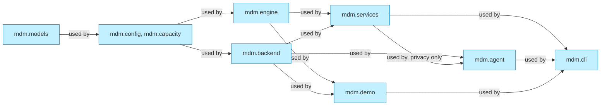
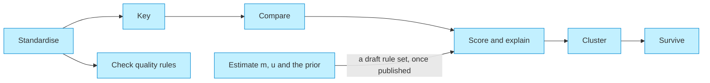
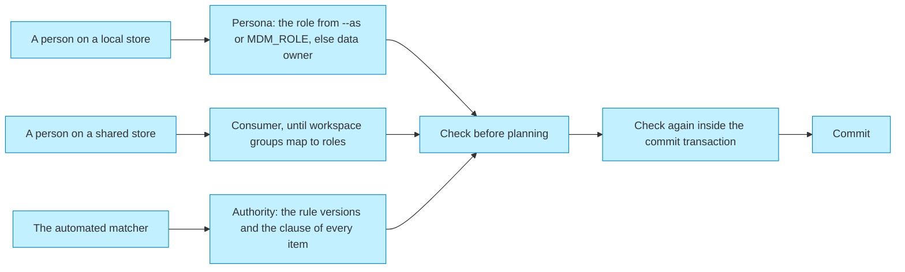

# Solution design

_[← Application layer](./README.md) · [Model home](../README.md)_

**ArchiMate viewpoint:** Layered: the application components, the store and the engines behind them.

**Status:** ● Validated, 2026-09-27.

The hub is one Python package, `mdm`, under `src/mdm/`. It runs the same code locally on DuckDB and on Postgres, and on Lakebase once deployed.

## Layers

A package uses only the packages to its left. The store and the engine sit side by side and never use each other.

| Package | Component | May use from `mdm` |
| ------- | --------- | ------------------ |
| `mdm.models` | [`ACMP2`] Domain model and settings | nothing |
| `mdm.config`, `mdm.capacity` | [`ACMP2`] Domain model and settings | `models` |
| `mdm.engine` | [`ACMP4`] Matching engine | `models`, `capacity` |
| `mdm.backend` | [`ACMP3`] SQL store | `models`, `config`, `capacity` |
| `mdm.services` | [`ACMP5`] Arrival and matching services, [`ACMP6`] Commit service, [`ACMP7`] Model registry, [`ACMP8`] Record lifecycle, [`ACMP9`] Authority and privacy, [`ACMP14`] Service helpers, and the shared wiring of [`ACMP1`] Entry points | `models`, `config`, `capacity`, `engine`, `backend` |
| `mdm.agent` | [`ACMP10`] Assistant | `models`, `config`, `capacity`, `backend`, `services.privacy` |
| `mdm.demo` | [`ACMP11`] Integration platform simulator | `models`, `config`, `capacity`, `engine`, `backend` |
| `mdm.cli` | [`ACMP1`] Entry points | everything |

The [application components](./2_application-components.md#application-components) follow these edges. Six rules hold across the layers:

1. No Structured Query Language (SQL) is written outside `src/mdm/backend/`.
2. The store in `mdm.backend` and the engine in `mdm.engine` never import each other.
3. Only `src/mdm/services/commit.py` writes `mdm_core`, inside the commit-order lock.
4. The hub never writes the landing tables, except the local simulator in `src/mdm/demo/`.
5. No detail, reason, suggestion, evidence, message or log line carries a personal value. Each carries attribute names, codes, IDs, source keys and counts only, through `src/mdm/models/safety.py`, and the store checks each one again where it writes a task, a reject, a change set or an access row.
6. Personas, the simulator and `mdm demo reset` run only on a local store.

A test, `tests/test_services_capacity.py`, reads the syntax tree of every module and fails an import that breaks the table. The same file fails a line of SQL outside `src/mdm/backend/`, and any read of a large table that is neither keyed nor paged.

## One store, two engines

The green stadiums are [technology services](../5_technology/1_technology-services.md#technology-services). [Decision 6](../decisions/6_one-sql-store-two-engines.md) records why one store serves both engines.

- `src/mdm/backend/store.py` writes every statement once, in portable SQL. Each engine adds only how to connect, bind a row document, take the commit-order lock and hold a run lease.
- Every insert and upsert binds one JavaScript Object Notation (JSON) document per chunk of up to 10,000 rows. Every keyed read joins a JSON document of keys, so both engines run the same statement.
- Every result set is ordered explicitly, and the store decodes JSON itself, so both engines return the same Python values.
- Only portable types reach `mdm_core`, as [portable types](../3_information/4_data-architecture.md#portable-types) lists. The tables sit in eight [schema groups](../3_information/4_data-architecture.md#schema-groups), as [decision 7](../decisions/7_schema-groups-and-one-published-schema.md) records.
- The store's write guard reads every statement, whatever the case of its names. It refuses a write to `mdm_core` outside a commit, and a write to `mdm_landing` outside the local simulator. It also refuses an update or delete in `mdm_audit`, a delete from `mdm_vault`, an update there outside a redaction, and any schema change the store's own setup does not make.
- The guard stops a defect in the hub, not an intruder. On the platform the database grants are the boundary: the hub's own role, the [landing grants](./5_interface-contracts.md#landing-interface) and the [listener grants](./5_interface-contracts.md#listener-interface). Initiative 4 gives `mdm_audit` an owner apart from the hub's role, which then holds only `INSERT` and `SELECT` there.

| Concern | DuckDB | Postgres and Lakebase |
| ------- | ------ | --------------------- |
| Connection | One connection per database file, with one lock held for a whole transaction | A connection pool; a transaction keeps one connection |
| Parameters | `?` | `?` rewritten to `%s`, outside literals |
| Row source | `unnest(json_transform(CAST(? AS JSON), '["JSON"]'))` | `jsonb_array_elements(CAST(%s AS JSONB))` |
| Isolation | One writer; the commit lock is taken before `BEGIN` | Read committed, set as the first statement of every commit |
| Commit-order lock | The store's own lock, one per database file | `pg_advisory_xact_lock` on a key hashed from the schema names |
| Run lease | A non-blocking lock per database file and lease name | `pg_try_advisory_lock` on a connection held for the run |
| Time zone | Coordinated Universal Time (UTC); needs `pytz` | UTC, set on every connection |
| Landing sequence | `CREATE SEQUENCE` | `CREATE SEQUENCE … CACHE 1` |
| Retry | None | The pool checks a connection before it hands it out, so one the server dropped while idle is replaced; a statement outside a transaction is retried once when its connection has gone, never inside one |
| Sign-in | None | On Lakebase, an open authorisation (OAuth) token minted through the Databricks software development kit (SDK), refreshed with 10 minutes left, sent only over TLS (`require`, `verify-ca` or `verify-full`); a connection lives at most 45 minutes |

Measured on 2026-09-27, an upsert ran at 110,000 to 160,000 rows a second on DuckDB and 65,000 to 80,000 on Postgres. A read of 2,858 keys took 17 to 19 milliseconds on both.

## Matching

[Component [`ACMP4`] Matching engine](./2_application-components.md#application-components) does all the arithmetic in pure Python, so both engines give the same candidates and scores. [Decision 10](../decisions/10_explainable-scorer-and-weight-estimation.md) records the choice.

1. **Standardise.** Each source record is cleaned once, on arrival. Names are folded, legal forms normalised, phones put in international form, and dates read in the source's own order. A registered ID is checked against its checksum, and a date a source uses for "unknown" is dropped as a placeholder.
2. **Key.** Each blocking pass computes keys from the standardised forms, and the hub stores them, so candidates are found by equality. A key shared by more than 1,000 records is dropped, and a record keeps the 200 candidates that share the most passes.
3. **Compare.** Each comparison puts a pair on a level, from agreement to disagreement, or on no level when a side is empty.
4. **Score.** Each level carries two probabilities: m, its chance for a true match, and u, its chance for a non-match. Its weight is log2(m ÷ u). A pair's weight w is the prior's weight plus the weights of its levels, and its score is 100 × 2^w ÷ (1 + 2^w).
5. **Band.** A score at or above the upper band is automatic, and one at or above the lower band goes to review. Below the lower band, the pair is distinct. The starter models set the bands at 90 and 60.
6. **Hard rules.** A must-link or cannot-link rule on a strong registered ID fires only when both sides hold a valid one. It decides the band, and the waterfall still shows the arithmetic.
7. **Explain.** A pair at or above the lower band keeps its explanation. It holds the prior, one weight per comparison, and the smallest single change that would move the pair a band up or down.
8. **Cluster.** Automatic pairs join clusters strongest first. A union that would hold two different valid strong IDs of one scheme is refused. A record with two automatic golden candidates becomes a possible duplicate, because a merge is never automatic.
9. **Survive.** Each golden value comes from the members' approved values, under the attribute's strategies: source trust, recency, completeness or frequency. A pinned steward value wins until its pin expires. Provenance records the winner, the runners-up and the strategy.

`mdm estimate` writes a draft match rule set. It runs expectation maximisation once per blocking pass, holding that pass's own key comparisons fixed, because they agree for non-matches inside the block too. Where at least 200 candidate pairs share a valid strong ID, it takes m from those pairs, and estimates only the ID's own m with the others read as known. It takes u for an exact level from value frequencies, and records the global prior apart from each pass's share of matches inside its blocks. A pass that does not converge saves nothing.

## Authority and personas

Every change set names an actor and an authority. [Component [`ACMP9`] Authority and privacy](./2_application-components.md#application-components) checks them twice: before planning, and again inside the commit transaction. [Decision 13](../decisions/13_authority-and-personas.md) and [decision 16](../decisions/16_source-policies-and-clauses.md) record the choices.

- A store is local when it is DuckDB, or a test Postgres started with `MDM_ALLOW_PERSONAS=1` on this machine. The store refuses to open with that setting unless its server is on a unix socket or a loopback address and its database is not Lakebase's `databricks_postgres`. Personas, the simulator and `mdm demo reset` run only on a local store.
- A persona is refused whenever `MDM_LAKEBASE_ENDPOINT` is set, or a Databricks App or runtime variable is present. A laptop pointed at the operational database therefore cannot take one. `DATABRICKS_CLIENT_ID` alone refuses nothing, because it is how a service principal runs from a laptop.
- Until initiative 4 maps workspace groups to roles, every person on a shared store is a consumer, as [rule [`RULE11`] Least access by default](../2_business/5_domain-context-and-rules.md#business-rules) asks.
- The automated matcher's authority names the entity model, match, survivorship and validation rule versions, then every clause its items used. A clause reads `<source>.<policy>=<value>`, such as `crm.critical_update=hold`, or `rule1:<case>` for the cases that are automatic whatever the policy: `auto_band`, `delete` and `retired_id`.
- An arrival naming an active master ID follows its source's `master_id` policy: held for a steward as a review task unless the data owner has set it to `auto`, and never linked past a cannot-link rule.
- The commit checks each clause again against the published model, and each `rule1:` clause against that fixed list.
- The commit log names a role or the automated actor, never a person. The audit's change set names the person, the checker and whether a persona acted.
- A model or rule set is published before its entity holds any golden record, under a flagged bootstrap authority. Publication over existing golden records waits for the dry run of [initiative 4](../6_transition/2_sequence.md#sequence).

The six role names in the code are the six [business roles](../2_business/1_business-actors-and-roles.md#roles): `data_owner`, `data_steward`, `coordinating_steward`, `technical_steward`, `consumer` and `administrator`.

| Action | Roles that may take it | Also needs |
| ------ | ---------------------- | ---------- |
| `read` | Every role | — |
| `reveal` | `data_steward`, `coordinating_steward`, `data_owner` | A reason; one access-log row per attribute revealed |
| `run_arrival` | `technical_steward`, `data_owner`, `administrator` | The arrival lease |
| `arrival` | The automated matcher alone | A clause on every item, and only create, update, link, detach and relationship items |
| `link`, `detach`, `reinstate` | `data_steward`, `coordinating_steward` | — |
| `merge`, `unmerge`, `retire` | `data_steward`, `coordinating_steward` | A checker who is not the maker and whose role allows the action |
| `load_model`, `estimate`, `load_code_lists` | `technical_steward`, `data_owner` | — |
| `publish_model`, `publish_rules` | `data_owner` | No golden record of the entity yet |
| `profile` | `technical_steward`, `data_owner`, `data_steward` | — |
| `match_test` | `data_steward`, `coordinating_steward`, `technical_steward`, `data_owner` | One access-log row per test, because each comparison's level could tell a masked value |
| `redact` | `data_owner` | A different person with the `administrator` role as checker, a reason and the typed confirmation `REDACT <count>` |

No automated actor may merge, unmerge, retire, purge, erase or redact. Nor may it publish a model or rules, change a policy or grant a role, as [rule [`RULE6`] Some actions are never automatic](../2_business/5_domain-context-and-rules.md#business-rules) states.

## Adding an entity

A new entity needs no code change, which is the test of [principle [`P8`] Entity models are data; the product is neutral](../1_strategy/1_motivation.md#principles).

1. A technical steward writes `models/<entity>.yaml`, a YAML (YAML Ain't Markup Language) file. It holds the attributes, the sources with their trust ranks and policies, and the match, survivorship and validation rules.
2. A data owner runs `mdm model load models/<entity>.yaml --publish`. The model is validated and published, and the hub creates `mdm_core.<entity>` and its masked view `mdm_read.<entity>`.
3. The integration platform lands rows with that `entity` value in the same landing table. No new table and no new grant are needed.
4. `mdm arrive` settles them. Listening systems read the new table through the default privileges of the [listener interface](./5_interface-contracts.md#listener-interface).

`tests/test_services_registry.py` lands and arrives a third entity from a model file alone, with no code change.
