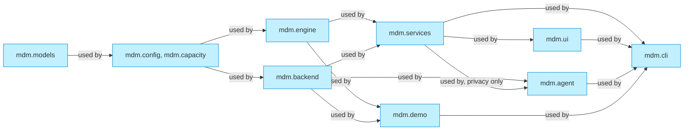
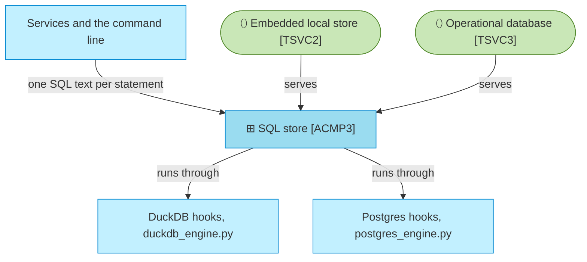
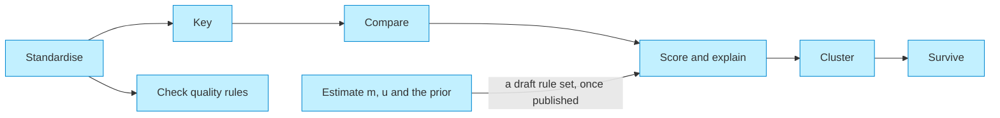
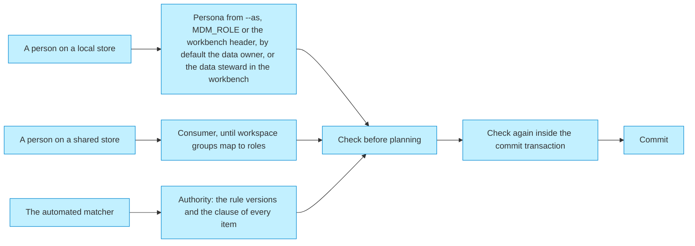
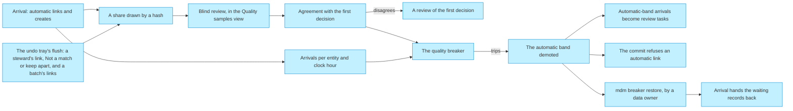
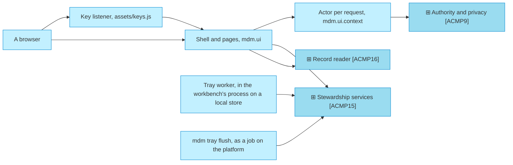

# Solution design

_[← Application layer](./README.md) · [Model home](../README.md)_

**ArchiMate viewpoint:** Layered: the application components, the store and the engines behind them.

**Status:** ◐ Draft catalogue — written for story 3.3 of initiative 3, Steward workbench; not yet validated.

The hub is one Python package, `mdm`, under `src/mdm/`. It runs the same code locally on DuckDB and on Postgres, and on Lakebase once deployed.

## Layers

A package uses only the packages to its left. The store and the engine sit side by side and never use each other.

| Package | Component | May use from `mdm` |
| ------- | --------- | ------------------ |
| `mdm.models` | [`ACMP2`] Domain model and settings | nothing |
| `mdm.config`, `mdm.capacity` | [`ACMP2`] Domain model and settings | `models` |
| `mdm.engine` | [`ACMP4`] Matching engine | `models`, `capacity` |
| `mdm.backend` | [`ACMP3`] SQL store | `models`, `config`, `capacity` |
| `mdm.services` | [`ACMP5`] Arrival and matching services, [`ACMP6`] Commit service, [`ACMP7`] Model registry, [`ACMP8`] Record lifecycle, [`ACMP9`] Authority and privacy, [`ACMP14`] Service helpers, [`ACMP15`] Stewardship services, [`ACMP16`] Record reader, and the shared wiring of [`ACMP1`] Entry points | `models`, `config`, `capacity`, `engine`, `backend` |
| `mdm.agent` | [`ACMP10`] Assistant | `models`, `config`, `capacity`, `backend`, `services.privacy` |
| `mdm.demo` | [`ACMP11`] Integration platform simulator | `models`, `config`, `capacity`, `engine`, `backend` |
| `mdm.ui` | [`ACMP12`] Steward workbench | `models`, `config`, `capacity`, `services` |
| `mdm.cli` | [`ACMP1`] Entry points | everything |

The [application components](./2_application-components.md#application-components) follow these edges. Eight rules hold across the layers:

1. No Structured Query Language (SQL) is written outside `src/mdm/backend/`.
2. The store in `mdm.backend` and the engine in `mdm.engine` never import each other.
3. Only `src/mdm/services/commit.py` writes `mdm_core`, inside the commit-order lock.
4. The hub never writes the landing tables, except the local simulator in `src/mdm/demo/`.
5. No detail, reason, suggestion, evidence, message or log line carries a personal value. Each carries attribute names, codes, IDs, source keys and counts only, through `src/mdm/models/safety.py`, and the store checks each one again where it writes a task, a reject, a staged decision, a batch, a label, a quality sample, a change set or an access row.
6. Personas, the simulator, `mdm demo reset`, and the breaker's demo trip and demo withdrawal run only on a local store.
7. The workbench calls services only, through `src/mdm/ui/context.py`. It imports no store or engine module, reads no store attribute and writes no Structured Query Language (SQL).
8. A personal value reaches the screen only as the services return it, masked by role. It never reaches an address, a component ID, browser storage, a tooltip, a log line or an error page.

A test, `tests/test_services_capacity.py`, reads the syntax tree of every module and fails an import that breaks the table, and any use of a store attribute in `src/mdm/ui/`. The same file fails a line of SQL outside `src/mdm/backend/`, and any read of a large table that is neither keyed nor paged.

## One store, two engines

The green stadiums are [technology services](../5_technology/1_technology-services.md#technology-services). [Decision 6](../decisions/6_one-sql-store-two-engines.md) records why one store serves both engines.

- `src/mdm/backend/store.py` writes every statement once, in portable SQL. Each engine adds only how to connect, bind a row document, take the commit-order lock and hold a run lease.
- Every insert and upsert binds one JavaScript Object Notation (JSON) document per chunk of up to 10,000 rows. Every keyed read joins a JSON document of keys, so both engines run the same statement.
- Every result set is ordered explicitly, and the store decodes JSON itself, so both engines return the same Python values.
- Only portable types reach `mdm_core`, as [portable types](../3_information/4_data-architecture.md#portable-types) lists. The tables sit in eight [schema groups](../3_information/4_data-architecture.md#schema-groups), as [decision 7](../decisions/7_schema-groups-and-one-published-schema.md) records.
- The store's write guard reads every statement, whatever the case of its names. It refuses a write to `mdm_core` outside a commit, and a write to `mdm_landing` outside the local simulator. It also refuses an update or delete in `mdm_audit`, a delete from `mdm_vault`, an update there outside a redaction, and any schema change the store's own setup does not make.
- The guard stops a defect in the hub, not an intruder. On the platform the database grants are the boundary: the hub's own role, the [landing grants](./5_interface-contracts.md#landing-interface) and the [listener grants](./5_interface-contracts.md#listener-interface). Initiative 4 gives `mdm_audit` an owner apart from the hub's role, which then holds only `INSERT` and `SELECT` there.

| Concern | DuckDB | Postgres and Lakebase |
| ------- | ------ | --------------------- |
| Connection | One connection per database file, with one lock held for a whole transaction | A connection pool; a transaction keeps one connection |
| Parameters | `?` | `?` rewritten to `%s`, outside literals |
| Row source | `unnest(json_transform(CAST(? AS JSON), '["JSON"]'))` | `jsonb_array_elements(CAST(%s AS JSONB))` |
| Isolation | One writer; the commit lock is taken before `BEGIN` | Read committed, set as the first statement of every commit |
| Commit-order lock | The store's own lock, one per database file | `pg_advisory_xact_lock` on a key hashed from the schema names |
| Run lease | A non-blocking lock per database file and lease name | `pg_try_advisory_lock` on a connection held for the run |
| Time zone | Coordinated Universal Time (UTC); needs `pytz` | UTC, set on every connection |
| Landing sequence | `CREATE SEQUENCE` | `CREATE SEQUENCE … CACHE 1` |
| Retry | None | The pool checks a connection before it hands it out, so one the server dropped while idle is replaced; a statement outside a transaction is retried once when its connection has gone, never inside one |
| Sign-in | None | On Lakebase, an open authorisation (OAuth) token minted through the Databricks software development kit (SDK), refreshed with 10 minutes left, sent only over TLS (`require`, `verify-ca` or `verify-full`); a connection lives at most 45 minutes |

Measured on 2026-09-27, an upsert ran at 110,000 to 160,000 rows a second on DuckDB and 65,000 to 80,000 on Postgres. A read of 2,858 keys took 17 to 19 milliseconds on both.

## Matching

[Component [`ACMP4`] Matching engine](./2_application-components.md#application-components) does all the arithmetic in pure Python, so both engines give the same candidates and scores. [Decision 10](../decisions/10_explainable-scorer-and-weight-estimation.md) records the choice.

1. **Standardise.** Each source record is cleaned once, on arrival. Names are folded, legal forms normalised, phones put in international form, and dates read in the source's own order. A registered ID is checked against its checksum, and a date a source uses for "unknown" is dropped as a placeholder.
2. **Key.** Each blocking pass computes keys from the standardised forms, and the hub stores them, so candidates are found by equality. A key shared by more than 1,000 records is dropped, and a record keeps the 200 candidates that share the most passes.
3. **Compare.** Each comparison puts a pair on a level, from agreement to disagreement, or on no level when a side is empty.
4. **Score.** Each level carries two probabilities: m, its chance for a true match, and u, its chance for a non-match. Its weight is log2(m ÷ u). A pair's weight w is the prior's weight plus the weights of its levels, and its score is 100 × 2^w ÷ (1 + 2^w).
5. **Band.** A score at or above the upper band is automatic, and one at or above the lower band goes to review. Below the lower band, the pair is distinct. The starter models set the bands at 90 and 60. While the quality breaker has demoted an entity's automatic band, an automatic pair goes to review too ([the matcher's checkpoint](#the-matchers-checkpoint)).
6. **Hard rules.** A must-link or cannot-link rule on a strong registered ID fires only when both sides hold a valid one. It decides the band, and the waterfall still shows the arithmetic.
7. **Explain.** A pair at or above the lower band keeps its explanation. It holds the prior, one weight per comparison, and the smallest single change that would move the pair a band up or down.
8. **Cluster.** Automatic pairs join clusters strongest first. A union that would hold two different valid strong IDs of one scheme is refused. A record with two automatic golden candidates becomes a possible duplicate, because a merge is never automatic.
9. **Survive.** Each golden value comes from the members' approved values, under the attribute's strategies: source trust, recency, completeness or frequency. A pinned steward value wins until its pin expires. Provenance records the winner, the runners-up, the strategies, and the strategy that decided.

`mdm estimate` writes a draft match rule set. It runs expectation maximisation once per blocking pass, holding that pass's own key comparisons fixed, because they agree for non-matches inside the block too. Where at least 200 candidate pairs share a valid strong ID, it takes m from those pairs, and estimates only the ID's own m with the others read as known. It takes u for an exact level from value frequencies, and records the global prior apart from each pass's share of matches inside its blocks. A pass that does not converge saves nothing.

## Authority and personas

Every change set names an actor and an authority. [Component [`ACMP9`] Authority and privacy](./2_application-components.md#application-components) checks them twice: before planning, and again inside the commit transaction. [Decision 13](../decisions/13_authority-and-personas.md) and [decision 16](../decisions/16_source-policies-and-clauses.md) record the choices.

- A store is local when it is DuckDB, or a test Postgres started with `MDM_ALLOW_PERSONAS=1` on this machine. The store refuses to open with that setting unless its server is on a unix socket or a loopback address and its database is not Lakebase's `databricks_postgres`. Personas, the simulator, `mdm demo reset`, and the breaker's demo trip and demo withdrawal, service methods for the browser checks and tests, run only on a local store.
- A persona is refused whenever `MDM_LAKEBASE_ENDPOINT` is set, or a Databricks App or runtime variable is present. A laptop pointed at the operational database therefore cannot take one. `DATABRICKS_CLIENT_ID` alone refuses nothing, because it is how a service principal runs from a laptop.
- Until initiative 4 maps workspace groups to roles, every person on a shared store is a consumer, as [rule [`RULE11`] Least access by default](../2_business/5_domain-context-and-rules.md#business-rules) asks.
- The automated matcher's authority names the entity model, match, survivorship and validation rule versions, then every clause its items used. A clause reads `<source>.<policy>=<value>`, such as `crm.critical_update=hold`, or `rule1:<case>` for the cases that are automatic whatever the policy: `auto_band`, `delete` and `retired_id`.
- An arrival naming an active master ID follows its source's `master_id` policy: held for a steward as a review task unless the data owner has set it to `auto`, and never linked past a cannot-link rule.
- The commit checks each clause again against the published model, and each `rule1:` clause against that fixed list.
- The commit log names a role or the automated actor, never a person. The audit's change set names the person, the checker and whether a persona acted.
- The workbench takes its actor per request. On a local store it is a persona from the header, the data steward unless `MDM_ROLE` names another. On the platform it is the user the Databricks App forwards, a consumer until initiative 4 maps workspace groups to roles ([decision 21](../decisions/21_workbench-actor.md)).
- Two browser tabs with the same persona act as the same steward.
- `mdm ui` listens on a loopback address unless a Databricks App runs it. It answers only its own host name, refuses posts from another site and cannot be framed.
- A model or rule set is published before its entity holds any golden record, under a flagged bootstrap authority. Publication over existing golden records waits for the dry run of [initiative 4](../6_transition/2_sequence.md#sequence).

The six role names in the code are the six [business roles](../2_business/1_business-actors-and-roles.md#roles): `data_owner`, `data_steward`, `coordinating_steward`, `technical_steward`, `consumer` and `administrator`.

| Action | Roles that may take it | Also needs |
| ------ | ---------------------- | ---------- |
| `read` | Every role | — |
| `reveal` | `data_steward`, `coordinating_steward`, `data_owner` | A reason; one access-log row per attribute revealed |
| `run_arrival` | `technical_steward`, `data_owner`, `administrator` | The arrival lease |
| `arrival` | The automated matcher alone | A clause on every item, and only create, update, link, detach and relationship items |
| `link`, `detach`, `reinstate` | `data_steward`, `coordinating_steward` | — |
| `merge`, `unmerge`, `retire` | `data_steward`, `coordinating_steward` | A checker who is not the maker and whose role allows the action |
| `load_model`, `estimate`, `load_code_lists` | `technical_steward`, `data_owner` | — |
| `publish_model`, `publish_rules` | `data_owner` | No golden record of the entity yet |
| `profile` | `technical_steward`, `data_owner`, `data_steward` | — |
| `match_test` | `data_steward`, `coordinating_steward`, `technical_steward`, `data_owner` | One access-log row per test, because each comparison's level could tell a masked value |
| `redact` | `data_owner` | A different person with the `administrator` role as checker, a reason and the typed confirmation `REDACT <count>` |
| `view_tasks` | `data_steward`, `coordinating_steward`, `data_owner`, `technical_steward` | — |
| `work_tasks` | `data_steward`, `coordinating_steward` | The claim; covers claim, release, snooze, escalate, stage and undo |
| `not_a_match`, `keep_apart`, `keep_orphan`, `approve_update`, `reject_update` | `data_steward`, `coordinating_steward` | The undo tray; an audit change set even when nothing is published |
| `flush_tray` | Every role but `consumer` | The tray lease; each decision is checked again under its own steward's role |
| `blind_link`, `blind_none`, `keep_decision` | `data_steward`, `coordinating_steward` | The undo tray; never the steward who made the first decision |
| `batch_link` | `data_steward`, `coordinating_steward` | The forced sample unanimous and every row shown; a disagreeing sample decision names the comparison that misled, and its split writes one access-log row per split record when the comparison's attributes are personal, reason `batch_split`; above 250 decisions, a second steward who is not the maker, recorded and checked again in every chunk |
| `batch_compensate` | `data_steward`, `coordinating_steward` | Within 30 days of the batch's last chunk; through the tray; above 250 decisions, a second steward |
| `confirm_batch` | `data_steward`, `coordinating_steward` | Never the batch's maker |
| `stop_batch` | `data_steward`, `coordinating_steward` | A committing batch; it stops before its next chunk |
| `view_breaker` | Every role but `consumer` | — |
| `restore_breaker` | `data_owner` | A reason code, `cause_fixed`, `false_alarm` or `load_expected`; the command line only; also a pattern's bulk rights, with its `bulk:` key and `cause_fixed` or `false_alarm` |
| `trip_breaker` | The quality breaker alone | Figures it computes itself from the store |

An automated actor passes only the actions whose row names it, never by its role: the automated matcher takes only `arrival`, and the quality breaker only `trip_breaker`. No automated actor may merge, unmerge, retire, purge, erase or redact. Nor may it publish a model or rules, change a policy or grant a role, as [rule [`RULE6`] Some actions are never automatic](../2_business/5_domain-context-and-rules.md#business-rules) states.

## The matcher's checkpoint

Blind review and the quality breaker are the checkpoint that [decision 1](../decisions/1_automated-matcher-autonomy.md) and [decision 3](../decisions/3_quality-breaker-autonomy.md) give [actor [`ACT6`] Automated matcher](../2_business/1_business-actors-and-roles.md#automated-matcher). Blind review, in `src/mdm/services/quality.py`, measures how often a second steward places a record where the first decision did. [Actor [`ACT8`] Quality breaker](../2_business/1_business-actors-and-roles.md#quality-breaker), in `src/mdm/services/breaker.py`, demotes an entity's automatic band when that agreement falls or arrivals spike.

### What is sampled

- Every automatic link, a record joining a new cluster included, and every link a source asserts: a `master_id=auto` hint, or a retired ID routed to its survivor.
- Every golden record the matcher creates.
- A steward's link, keep apart, and "Not a match" when it declined at least one golden record.
- Exactly 2% of each batch's links, at least one ([blind review of a batch](#blind-review-of-a-batch)).
- Approving or rejecting a held update, and keeping a golden record with no source record, are not sampled. Blind review cannot ask them again without showing the answer.

### The draw

- A decision is drawn when a keyed hash of its entity, subject, decision and occasion falls under the share, 2% by default. The subject is the source key, or the two master IDs of a keep apart. The occasion is the record's event, or the keep apart's task.
- The hash runs in Python, so both engines draw the same decisions, and a larger share only adds to them. Its key, `MDM_SAMPLE_KEY`, is a secret of the deployment, so no steward can tell from what the workbench shows which of their decisions will be drawn.
- Initial loads are sampled at the same share, because the matcher meets real data there first.
- At most 200 automated samples are open per entity at once. Draws past the cap are skipped and counted, in landing order. Stewards' samples arrive at the pace of people, and have no cap.

### What a blind review shows

- The record, and up to three golden records in master ID order, with no score. First come the golden records the first decision named, then the best others in any band, so a missed match can be caught.
- The golden record that holds the record shows only what its other members give it. Its column never agrees because the record itself won a value.
- The first decision, who made it, the suggestion and every score, band, waterfall and impact line stay hidden, and so does every link to the record.
- "Belongs to" a golden record and "Belongs to none of these" carry equal weight, and neither is filled.
- The steward who made the first decision, or confirmed the batch it came from, cannot answer, claim, snooze or escalate its sample.

### Agreement

- An answer is compared with the first decision, never with where the record is now. A link or a create agrees when the answer names the survivor of its target, or "none of these" when that golden record was not shown.
- "Not a match" agrees when the answer is not a golden record it declined. Keep apart agrees when the answer is that the two are not the same.
- A disagreement opens a review of the first decision, saying what the first decision did and what the blind review answered. A steward keeps the first decision, or links an unlinked record to the answer. The steward who gave the blind answer may keep the first decision, but never links the record to their own answer.
- A blind answer writes no match label, so it never binds the matcher ([decision 22](../decisions/22_labels-bind-the-matcher.md)).
- A sample whose record is deleted before its review is voided, and counts nothing. So is a keep apart whose golden records were merged or retired since. A record deleted after its review closes the review its disagreement opened.
- Agreement is counted per entity, origin, band and signature.

### The breaker's triggers

- The agreement trigger reads an entity's latest 100 reviewed automatic links, first decided since the last restore. Creates, hint links and stewards' samples never trip the automatic band.
- It trips once at least 20 are reviewed and the one-sided 95% upper bound on agreement, Wilson's, is below 95%. The [declared capacity](../5_technology/3_capacity-and-throughput.md#declared-capacity) gives the counts that trip it.
- The volume trigger compares each clock hour's arrivals with the mean of the same hour over the previous 7 days, so a nightly batch meets its own hour. It trips above 5 times that mean and at least 1,000 arrivals, once arrivals were counted 7 days ago. Initial loads are not counted, so days of an initial load alone are no history.
- A trip writes the demoted state and an audit change set by the quality breaker, with its reason, `agreement_low` or `volume_spike`, and its figures.
- The bulk-rights trigger runs after a blind answer on a batch sample commits. It reads the pattern's latest 50 reviewed batch samples, first decided since its last restore.
- It withdraws the pattern's bulk rights once at least 5 are reviewed and the same upper bound is below 95%. `MDM_BULK_WINDOW`, `MDM_BULK_MIN_SAMPLES` and `MDM_BULK_AGREEMENT` set these proposed figures.
- A withdrawal writes an audit change set `breaker_trip` by the quality breaker, with the reason `bulk_agreement_low`, the pattern's `bulk:` key and its figures.

### While the band is demoted

- Nothing links or joins a new cluster automatically. Every automatic-band candidate becomes a review task with the reason `breaker_demoted`, naming the trip.
- A distinct arrival still creates under its source's policy. An update, a deletion, a retired-ID routing and a hint link behave as before.
- The commit refuses an automatic link while the band is demoted. It holds the band until it ends, so a trip waits for a commit in flight.
- Two new records that would have formed one golden record wait for the restore, naming each other. "Not a match" is disabled for them, with the reason. Nobody can settle them before a restore, so they wait for a data owner instead of a service level, and never breach.
- No code widens a band or changes a rule set to demote or restore one.
- Batches go on while the automatic band is demoted: a batch is a steward's decision. A `breaker_demoted` review with a golden candidate can be grouped, and a record waiting with no golden record never is.
- A volume spike never withdraws bulk rights ([decision 3](../decisions/3_quality-breaker-autonomy.md)).

### The restore

- Only a data owner restores a band, on the command line: `mdm breaker restore --entity <entity> --reason <code>`. The code is `cause_fixed`, `false_alarm` or `load_expected`, so no free text reaches the audit.
- On a shared store every person is a consumer until initiative 4 maps workspace groups to roles, so a restore is refused there until then.
- A restore returns exactly the published bands. The agreement trigger then reads only samples first decided after it.
- The volume trigger keeps its history after an agreement restore. After a volume trip restored for `load_expected`, it watches afresh for 7 days, so the load becomes its history. After any other volume restore, it rests for the rest of that hour.
- Arrival's next run hands every record still waiting with `breaker_demoted` back to its queue, and closes its task. It leaves a task whose decision waits in the undo tray.
- A data owner restores a pattern's bulk rights the same way: `mdm breaker restore --entity <entity> --signature bulk:<key> --reason <code>`, with `cause_fixed` or `false_alarm` only. The bulk-rights trigger then reads only batch samples first decided after it.

### Where it shows

- Quality samples have a view of their own, and stay out of the other views and the health figures. The view lists every open sample except those the viewer decided first, or confirmed the batch of. Its count turns red when one breaches its service level of 72 hours.
- The inbox names each entity whose automatic linking is paused, and the decide pane says why a record waits. The Alike reviews page says when a pattern's bulk rights are withdrawn.
- `mdm breaker status` prints each entity's band, its agreement, its open, overdue and voided samples, and its arrivals this hour. It then lists each withdrawn pattern in words, with its key and its figures.
- The share, the cap and the thresholds are settings, `MDM_SAMPLE_*`, `MDM_BREAKER_*` and `MDM_BULK_*`, until initiative 4's governance policy holds them. On a shared store the checkpoint cannot be switched off: arrival, the tray's flush and the workbench refuse to start with a share of 0, an agreement threshold below 50%, or no key.

## Signature batches

```mermaid
flowchart LR
  reviews["Open reviews of one entity"]:::layer
  groups["Groups by signature, on the Alike reviews page"]:::layer
  sample["A forced sample, decided one by one in the inbox"]:::layer
  split["A split: the reviews that share the disagreeing record's value leave"]:::layer
  rows["Every row's change"]:::layer
  checker["A second steward, above 250 decisions"]:::layer
  tray["The undo tray, one entry"]:::layer
  chunk["One chunk a flush pass"]:::layer
  blind["Labels, and 2% to blind review"]:::layer
  bulk["The breaker's bulk-rights trigger"]:::layer
  restore["mdm breaker restore, by a data owner"]:::layer
  comp["A compensation, on the command line"]:::layer

  reviews --> groups --> sample
  sample -->|disagrees| split --> sample
  sample -->|unanimous| rows
  rows --> checker --> tray
  rows --> tray
  tray --> chunk --> blind --> bulk
  bulk -->|withdraws| restore
  chunk -->|within 30 days| comp
  comp -->|back through| tray

  classDef layer fill:#c2f0ff,stroke:#0288d1,color:#333
```

[Rule [`RULE7`] Bulk decisions pass a forced sample](../2_business/5_domain-context-and-rules.md#business-rules) lets stewards decide alike reviews together. `src/mdm/services/batches.py` groups them, draws and checks the forced sample, prepares every row's change and commits the batch through the undo tray. `src/mdm/engine/batch.py` sizes, stratifies and draws the sample, splits it and packs the chunks. [Decision 23](../decisions/23_batches-in-the-undo-tray.md) records how a batch passes through the tray.

### What is grouped

- A group is the open review tasks of one entity that share a signature and a rule version. Its key is `SIG-` and the first 16 hexadecimal characters of a hash of the three, so addresses, component IDs and evidence never carry the signature text.
- Arrival keeps the signature, the rule version and the key on a review only when a steward could link it to a golden record the pattern names. Its reason is then `review_band`, or `breaker_demoted` with a golden candidate. Every other task keeps none, and a later event rewrites all three.
- A review of a record that is already linked keeps its signature and is counted, but no batch takes it. A batch only links records that belong to no golden record, so it never moves a record or empties a golden record.
- The stored signature is what arrival saw. Every batch step checks each review again, live, and a review whose live signature differs leaves the batch as `signature_changed`.
- Only the entity's current match rule version is grouped. The Alike reviews page counts in one line the reviews scored under an earlier version.
- The page groups the 1,000 open reviews due soonest, in one capped read, and lists the 25 largest groups of at least 2 reviews. Each count stops at 999. A group outside that window shows once its reviews come due sooner.
- A group's count opens its reviews in the inbox, at `/?group=SIG-…`. The inbox then lists every open review of that group, snoozed or not, whatever the view.
- The label history counts the latest label on each pair with the signature, under any rule version: "Linked in 136 of 140 labels (97%)". The agreement is the lifetime blind review of the signature's samples, by origin.
- A backfill gives a signature to review tasks that have none, from the best stored pair between the record and a member of the task's first named golden record. It runs in `mdm init` and once when the workbench starts, and stores an empty signature when it finds no pair.

### The forced sample

- A group has at most one open batch. Drawing its forced sample fixes the batch's reviews: the group's eligible reviews, at most the 1,000 due soonest.
- A review is eligible when its task is open, not staged, snoozed or escalated, and claimed by nobody else. Its record is active and linked to no golden record.
- Checked live, its best open candidate is neither blocked, declined nor a close call, and shows the group's signature. The check uses the decide pane's own search and choice of candidate, so a batch suggests what the pane suggests.
- The sample holds 5 + ⌊n/150⌋ of the n reviews, rounded down: 612 give 9. `MDM_FORCED_SAMPLE_BASE` and `MDM_FORCED_SAMPLE_PER` set it, and a shared store cannot make it smaller.
- The strata are the source-system pair of the record and its best candidate member, such as "crm and hr". The sample is shared out between them by largest remainder, at least one each while the size allows.
- Within each stratum, the draw takes the smallest keyed hashes of the entity, the task and the group key, under `MDM_SAMPLE_KEY`. Both engines draw the same reviews, and nobody can predict them without the key.
- The draw is fixed for the group. Discarding a batch and drawing again picks the same reviews that are still open, so nobody can shop for an easy sample.
- A group whose reviews do not exceed its forced sample is too small to link together, and is refused with `group_too_small`.
- The sample is decided one by one in the inbox filtered to the batch, `/?batch=BAT-…`, through the ordinary tray. Any steward may decide a sample review.
- The decide pane says the task belongs to a forced sample. It shows every decision at equal weight, with none filled, as blind review does.
- The decision's own commit records its outcome. A link to the golden record the case suggested agrees. "Not a match", or a link to another candidate, disagrees.
- A sample review is void when its task closed without a steward's decision, its record moved to another event first, or its case was a close call. The next draw replaces it.
- The forced sample writes no blind-review agreement. Its decisions may be drawn for blind review like any steward's decision.

### The split

- The rule is [the product owner's answer of 28 September 2026](../reference/2026-09-28-forced-sample-split-answer.md#the-answer). The reviews that share the disagreeing record's value on the comparison its steward names leave the batch, to be decided one by one.
- The steward who decides a disagreeing sample review names the comparison that misled, with that decision. On a forced-sample review, N, or L on another candidate, first asks "Which comparison misled?".
- The choices are the pattern's comparisons in rule order, and "Every alike review in this batch", with no default. The choice waits with the staged decision, so undoing the decision splits nothing.
- The hub refuses a disagreeing sample decision that names no comparison, `split_choice_needed`, or one that is not offered, `bad_split_choice`. An agreeing link names none, and so does a void link on a close call.
- The flush applies the split right after the decision commits, in the same pass and outside the commit-order lock. It reads the records of every review still in the batch, with keyed reads.
- It compares each record's match form on the named comparison with the disagreeing record's. A missing form matches only a missing one, and the disagreeing review is always among those that leave.
- The value is compared inside the hub only. The batch keeps the task IDs and the comparison's name, and the batch page shows a count.
- One transaction, holding the batch first, moves those reviews out of the batch. When the comparison's attributes are personal, it writes one access-log row per record it split off, with the reason `batch_split`.
- Each access row names the steward who named the comparison. Whoever later reveals the disagreeing record's value can infer the others', so each record the split read is logged.
- "Every alike review in this batch" ends the batch as discarded, with the outcome `split_all`.
- The sample must then hold 5 + ⌊n′/150⌋ of the n′ reviews left, and the next draws top it up, the strata that lack one first.
- When that would take every review left, nothing could be linked together. The batch then ends with `too_few_left`, and its reviews stay in the inbox.
- A split review stays out of every later batch of its group until its task changes with a new event, or is decided.
- A split that has not applied after a crash applies at the batch's next refresh. The batch cannot become ready meanwhile.
- With the numbers of the Blueprint, 612 reviews and a sample of 9, a disagreement on birth date splits off 38. That leaves 574, of which the sample needs 8, and 566 are linked together.

### What a batch decides

- A batch only links. Each review joins the golden record its case suggests, its best open candidate.
- "Not a match", keep apart and merge are decided one by one. A "Not a match" label binds the matcher ([decision 22](../decisions/22_labels-bind-the-matcher.md)) and sends its record back to arrival, and a merge needs a checker for each pair.
- A batch becomes ready when every disagreement's split has applied and every remaining sample review agreed. Its sample must also hold 5 + ⌊n′/150⌋, and the pattern's bulk rights must be held.
- Before the batch enters the tray, the steward who drew it, or any coordinating steward, may discard it.

### Every row's change

- "Show every change" prepares the batch. It checks each candidate again, live, and orders the planned rows by target, then by due time.
- It walks the reviews that join one target in that order. A review whose registered IDs a cannot-link rule keeps apart from the target's members, or from an earlier review of the same target, is left out as `blocked`.
- So two records with different person references never join one golden record through a batch, though each alone could.
- Each target's golden values are computed once, with every row of the batch that joins it, as arrival recomputes a golden record once per page.
- Every row is listed, 50 a page and masked by role, with its record, its target and its impact sentence. The before-and-after table opens on demand.
- The summary line counts the cross-references, the golden records updated, the chunks and the links bound for blind review. Rows left out are counted by reason.
- The plan is frozen at preparation: the targets and their row versions, the events, and the attributes each target changes. The second steward sees the same rows.
- A row whose target changed since preparation says so, and the flush checks it again.
- The batch page offers no reveal. Each row's source key opens its source record, where a reveal is asked and logged as ever.

### Chunks and Stop

- A batch is one tray entry. It locks every planned review's task and record, so nobody claims, snoozes, escalates or decides them while it waits or commits.
- Staging checks every review's locks and claims again with keyed reads. A review another steward has claimed, or another entry holds, is left out with its reason.
- The undo window runs 60 seconds from staging, or from the second steward's confirmation. U on any of its tasks, or the tray's Undo, undoes the whole batch, and nothing has committed.
- The flush commits one chunk of a batch a pass, after the single decisions due. Other stewards' decisions flush between its chunks.
- A chunk holds at most 500 published rows and 500 decisions. A link counts its cross-reference, its target's golden row once a chunk, and one relationship per reference attribute, so the count is never low.
- Each chunk is its own change set, with the action `batch_link` and its own commit version. Its ID, `CS-<the batch's 20 hexadecimal characters>-<n>`, is formed from the batch ID.
- A chunk's authority is the maker's role, with the checker's when there is one. Its evidence holds the batch ID, the chunk number and the entry, and never the signature.
- Before each chunk, the flush checks every review again with keyed reads. The task must be open, and the record at the planned event and linked to nothing.
- The target must be active, at the planned row version or the one this batch last wrote. No cannot-link rule may hold against its current members, or an earlier review of the chunk that joins it.
- A review that moved, or is now blocked, fails alone with its reason. Its lock is released, and its task returns to the queue.
- One transaction commits the chunk with its published rows, its reviews' settlement, its closed tasks, its labels, its blind-review samples and the release of its locks.
- The first chunk settles the tray entry, so Undo ends there. The last chunk settles the batch. After a crash between chunks, the next pass resumes at the next chunk.
- When no planned review is left before the first chunk, the batch fails with `nothing_left`. After a chunk, it ends committed, counting the reviews that failed alone.
- Every transaction on a batch takes the batch row first. So an Undo, a Stop and a chunk wait for one another on Postgres, and never deadlock.
- The throttle, `MDM_THROTTLE_ROWS_PER_HOUR`, paces the chunks. After a chunk of r rows, the next may commit r ÷ rate hours later, and the flush passes the batch by until then.
- Any steward may stop a committing batch, and the batch records who stopped it and when. A chunk already holding the batch finishes, and the next chunk's transaction refuses.
- A Stop clears the throttle's wait, so the next flush pass ends the batch as `stopped`. Its uncommitted reviews go back to the queue, unclaimed, and committed chunks stand.
- A chunk that conflicts inside its transaction is planned again once in the pass. An unexpected failure leaves it for the next pass.
- Three failed passes in a row stop the batch with `chunk_failed`. A chunk that commits starts the count again.
- The flush checks the roles recorded at staging, and refuses a persona's batch on a shared store.

### The second steward

- Above 250 decisions, set by `MDM_BATCH_CHECKER_ABOVE`, "Link all" becomes "Ask a second steward to confirm". The batch then waits outside the tray, holding no lock.
- Any steward but the maker may confirm it, after seeing every row as it was prepared, or send it back. Locally that is the other steward persona.
- Once confirmed, the batch enters the tray with its window. It shows in the maker's tray and in the second steward's, with its countdown, its Undo and its notices.
- At commit, the authority check refuses any chunk of such a batch that does not name its recorded checker. The checker is a person other than the maker, whose role allows `confirm_batch`.
- On a shared store the threshold cannot rise above 250. A data owner relaxing it per entity waits for the governance policy of [initiative 4](../6_transition/2_sequence.md#sequence).

### Blind review of a batch

- Exactly ⌈2% × the batch's links⌉ go to blind review, at least one, under `MDM_SAMPLE_SHARE`. A share of 0, allowed on a local store only, draws none.
- They are the smallest keyed hashes of the entity, the source key and the batch ID, chosen at staging. Each is written as a quality sample of origin `batch` in its review's chunk transaction.
- A batch sample's occasion is its record's event and the batch ID. So a record linked again at the same event after a compensation never meets its old, answered sample.
- Neither the maker nor the second steward may answer a batch sample, and the Quality samples view hides it from both.

### Bulk rights

- Each entity and signature holds its bulk rights in a row of the breaker's state, under the band `bulk:` and 16 hexadecimal characters of a hash of the two.
- The band's key leaves out the rule version, so a withdrawal survives a republish that keeps the comparisons' names. Only a data owner publishes rules, and renaming a comparison changes every signature.
- Only blind review of the pattern's batches withdraws its bulk rights, through [the breaker's triggers](#the-breakers-triggers). Steward and automated samples of the signature measure other decisions, so they do not count.
- While they are withdrawn, drawing a sample and staging a batch are refused. A committing batch of the pattern stops before its next chunk, whatever the throttle.
- Each chunk's transaction holds the pattern's bulk row, as the commit holds the automatic band. The Alike reviews page says why, and no control on screen restores them.
- Every read of the breaker is keyed on the entity and the band, so many bulk rows never slow the automatic band's reads.

### Compensation

- A steward compensates a committed batch on the command line, within 30 days of its last chunk: `mdm batch compensate BAT-… --reason pattern_wrong|source_defect|sample_missed`.
- `mdm batch show <ID> --rows` lists every row's reversal, `mdm batch stage <ID>` stages it, and `mdm batch discard <ID>` drops one not yet staged. `MDM_BATCH_UNDO_DAYS` sets the 30 days.
- Starting a compensation on screen waits for the audit screen of initiative 4. Until then the batch page shows it, with the full command.
- A compensation is a batch of kind `compensate`, created in one transaction with the mark on its original. While one is open or committed, another is refused with `already_compensated`, and nothing is written.
- It passes no forced sample, since it only reverses the batch's own links. It goes through the tray with its undo window, needs a second steward above 250 decisions, and commits chunk by chunk with Stop and the throttle.
- It writes one change set per original chunk, with the action `batch_compensate`, and each original chunk records which compensation undid it.
- For each review, it detaches the record, recomputes the golden record from its other members or opens an orphan task, and ends the record's relationships.
- The record goes back to arrival, which settles it again under the published rules. A record in the review band opens its review again.
- It withdraws the batch's match label where the label is still the batch's, so a later decision's label stays. The batch's change sets keep what it decided.
- It voids the review's open batch sample.
- A review whose cross-reference another commit moved, merged or detached since is kept, and reported.
- A compensation stopped or failed after some chunks leaves those chunks undone, and clears its original's mark. The rest can then be compensated again within the 30 days.
- A compensation, a batch with no committed chunk, a batch whose compensation is open or committed, and a batch past its 30 days cannot be compensated. Past 30 days its links are reversed one by one, which story 3.6 of initiative 3 puts on screen.

## The workbench

[Component [`ACMP12`] Steward workbench](./2_application-components.md#application-components) is one Dash application ([decision 18](../decisions/18_workbench-shell-and-keys.md)).

- Its pages are the inbox (`/`), Alike reviews (`/groups`), a batch (`/batch/<batch ID>`), the record view (`/record/<master ID>`) and the source record view (`/source/<system>/<key>`). A record view also opens by a retired ID, which resolves to its survivor, or by a source key.
- Every component ID lives in `src/mdm/ui/ids.py`, and is built from IDs and codes only.
- Every callback resolves the actor of its request, and passes it to each service call.
- The inbox is read in keyed pages of 50, and every count stops at 999.
- Moving through the inbox and choosing a candidate happen in the browser. A decision goes to the server one at a time, and a batch is one decision.
- G opens Alike reviews from the inbox. On a forced-sample review, N, or L on another candidate, first asks which comparison misled, as L waits for a choice in a close call.
- The batch page's figures poll every 2 seconds while it waits in the tray or commits. A batch shows in its maker's tray and in its second steward's.
- A task's case is kept per task version and role, masked, and the next task's case is prepared while the steward reads.
- The key listener yields to fields, lists, menus, dialogs and focused buttons, and a switch turns single-key shortcuts off.
- A decision waits in the undo tray and commits through the commit path ([decision 19](../decisions/19_undo-tray.md)).
- A revealed value is rendered once, and kept in no store of the page ([decision 20](../decisions/20_masking-and-reveal-on-screen.md)).
- The relationships of a record are grouped by type and other end, naming every asserting source; the published table keeps one row per source assertion.
- A failure is logged by its type only, and the error page shows no detail.
- The workbench's actor, and what `mdm ui` answers, follow [authority and personas](#authority-and-personas) ([decision 21](../decisions/21_workbench-actor.md)).
- A quality sample opens in blind mode, from the Quality samples view: its record and the golden records it might belong to, with no first decision, suggestion or score ([the matcher's checkpoint](#the-matchers-checkpoint)).
- A review a blind answer opened shows the first decision and the answer, with their explanations. It offers "Keep the first decision", and a link to the answer for an unlinked record.
- While the quality breaker has paused an entity's automatic linking, the inbox says so in one line, and the decide pane explains it. No control on screen restores a band.

## Adding an entity

A new entity needs no code change, which is the test of [principle [`P8`] Entity models are data; the product is neutral](../1_strategy/1_motivation.md#principles).

1. A technical steward writes `models/<entity>.yaml`, a YAML (YAML Ain't Markup Language) file. It holds the attributes, the sources with their trust ranks and policies, and the match, survivorship and validation rules.
2. A data owner runs `mdm model load models/<entity>.yaml --publish`. The model is validated and published, and the hub creates `mdm_core.<entity>` and its masked view `mdm_read.<entity>`.
3. The integration platform lands rows with that `entity` value in the same landing table. No new table and no new grant are needed.
4. `mdm arrive` settles them. Listening systems read the new table through the default privileges of the [listener interface](./5_interface-contracts.md#listener-interface).

`tests/test_services_registry.py` lands and arrives a third entity from a model file alone, with no code change.
