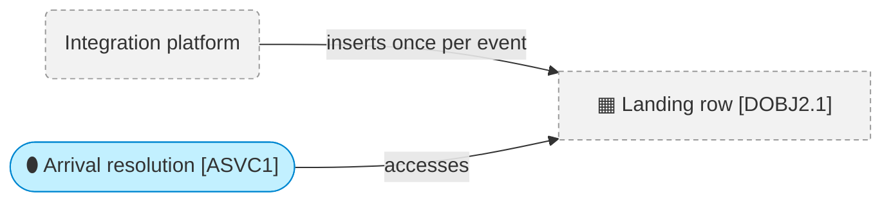
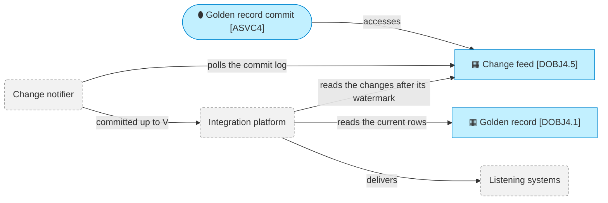

# Interface contracts

_[← Application layer](./README.md) · [Model home](../README.md)_

**ArchiMate viewpoint:** Application layer: Application Interface, with the contract each interface realizes.

**Status:** ◐ Draft catalogue — written for initiative 2, Foundations; not yet validated.

Two interfaces connect the hub to the teams around it. The integration platform writes source changes into the landing interface, and reads committed changes back through the listener interface. Both state the hub's side and its proposal. The agreement of the integration team and the data platform team is **Pending — future initiative** ([initiative 4](../6_transition/2_sequence.md#sequence)).

Every schema name below starts with `mdm`, the default. A deployment that sets `MDM_SCHEMA_PREFIX` puts its own value in place of `mdm` in every name.

## Landing interface



The grey dashed boxes are External: the integration platform, run by [stakeholder [`STK5`] Integration team](../1_strategy/1_motivation.md#stakeholders), and the landing row it owns. [Application service [`ASVC1`] Arrival resolution](./1_application-services.md#application-services) reads [data object [`DOBJ2.1`] Landing row](../3_information/2_data-objects.md#source-intake) and never writes it. In the local mode, [component [`ACMP11`] Integration platform simulator](./2_application-components.md#application-components) writes the same rows in the integration platform's place.

This interface realizes [contract [`CTR1`] Landing contract](../2_business/1_business-actors-and-roles.md#contracts). [Decision 9](../decisions/9_landing-table-and-watermark.md) records why every source shares one table, read from a high-water mark that probes every gap again.

### Shape

One table, `mdm_landing.source_change`, and its sequence, `mdm_landing.landing_seq`, serve every entity and every source. `MDM_BACKEND=postgres mdm ddl --group landing` prints the exact statements for Postgres, without connecting to any store.

| Column | Type | Rule |
| ------ | ---- | ---- |
| `event_id` | text, not null, primary key | One value per source event (its ID); a redelivery of the event reuses it |
| `source_system` | text, not null | A source registered in the entity's published model, such as `hr`, `student_records`, `crm` or `finance` |
| `source_key` | text, not null | The record's key in that source; an empty key is rejected |
| `entity` | text, not null | An entity with a published model, such as `person` or `organisation` |
| `op` | text, not null, `CHECK (op IN ('upsert', 'delete'))` | `upsert` or `delete` |
| `occurred_at` | timestamp with time zone, not null | When the change happened in the source |
| `source_version` | bigint | In a versioned source, increasing per record and present on every row, deletes included. Empty in an unversioned source |
| `initial_load` | boolean, not null, default `false` | `true` for a bulk load of a source's history |
| `payload` | JavaScript Object Notation (JSON), stored as `jsonb` on Postgres, not null | A JSON object, described below |
| `landed_at` | timestamp with time zone, not null, default the current time | When the row was written. A change's service level starts here |
| `landing_seq` | bigint, not null, unique, default `nextval('mdm_landing.landing_seq')` | The number the database gives the row as it is written. The writer never sets it |

The sequence is created as `CREATE SEQUENCE mdm_landing.landing_seq CACHE 1`.

The payload is a JSON object:

- Its keys are the attribute names of the entity model, as in `models/person.yaml` and `models/organisation.yaml`. A key the model does not name is rejected.
- A text, number, boolean or date value is a JSON scalar. A date may be written in the source's own date order, which the model records. A repeating group, such as `addresses`, is a JSON array of objects.
- A reference attribute carries the referenced record's key in the source the model names. For example, `employer` carries the organisation's `finance` key.
- An optional `master_id` key carries the hub's master ID when the source knows it.
- A delete may carry `{}`.
- A text value holds at most 4,000 characters, a repeating group at most 100 entries, and a payload at most 64 KB.

### Preconditions

The integration platform:

1. Writes one row per source change, with an `event_id` unique to that event, and reuses the `event_id` whenever it delivers the same event again.
2. Inserts with `INSERT … ON CONFLICT (event_id) DO NOTHING`, never updates a row, and deletes a row only after keeping it for 14 days.
3. Commits each inserting transaction within 60 seconds of its first insert.
4. Takes `landing_seq` only from the column default, and never resets or alters the sequence.
5. Writes only `source_system` and `entity` values that a published entity model registers.
6. Sets `occurred_at` to when the change happened in the source.
7. For a source registered as versioned, carries `source_version` on every row, deletes included, increasing per record. For an unversioned source, leaves it empty; the hub then orders the record's changes by `occurred_at`.
8. Sets `initial_load` to `true` for a bulk history load, and runs that load in an agreed window.
9. Keeps every payload within those size limits.

### Postconditions

The hub:

1. Reads every committed row at least once, for as long as the integration platform keeps it. This holds even for a row committed late, below rows already read.
2. Applies each event's effect exactly once. A known `event_id` is skipped, and a record's state only ever moves forward. Each record waits in a queue until the transaction that carries its effect removes it.
3. Keeps every version it reads, as history, with personal values held apart in the vault.
4. Never inserts, updates or deletes a landing row.
5. Rejects a row that breaks this interface with a reason, in `mdm_work.landing_reject`, and never drops a row silently.
6. Settles a delete by detaching the source record from its golden record, which stays. A golden record left with no source record becomes an orphan task for a steward.
7. Links a record whose `master_id` names a retired master ID to that ID's survivor. A `master_id` naming an active golden record follows the source's `master_id` policy: the record waits for a steward as a review task, unless the data owner has set the policy to `auto`, and it is never linked past a cannot-link rule. A `master_id` the hub does not know becomes an exception task.

The hub reads with a high-water mark and gap ranges:

1. The high-water mark is the highest `landing_seq` the hub has taken into a batch. Each run reads the rows above it, in `landing_seq` order.
2. A number below the top of a batch that did not come back is recorded as a gap, one range per run of missing numbers. A jump of a million numbers is one range.
3. Every batch probes the open gaps again, by range, before it reads new rows. A row found there is read like any other.
4. A gap older than 10 minutes, the default of `MDM_GAP_TIMEOUT_SECONDS`, is declared lost and logged only after a probe in that run read it to the end and found nothing, however long the runs are apart. The hub probes lost gaps again once a day, and on demand with `mdm arrive --reconcile`.
5. The hub drops a lost gap 14 days after declaring it lost, when the integration platform may have deleted a late row, and only after a probe read it to the end and found nothing.
6. The high-water mark and the gaps move in the same transaction as the versions they stand for.

A permanent gap therefore costs one range and never holds back the rows above it. The low-water mark, below which every number is read or declared lost, is reported by `mdm status`.

### Invariants

- `event_id` is unique.
- `landing_seq` is unique and increases in insertion order, not in commit order. It skips numbers, because a rejected duplicate and a rolled-back insert each use one.
- A version older than the record's current one is kept as history and never overwrites it. A versioned source orders a record's versions by `source_version`, then `occurred_at`, then `landing_seq`. An unversioned source orders them by `occurred_at`, then `landing_seq`.
- On the platform, the landing table belongs to the integration platform. The hub creates it only in the local mode.

### Errors

| Reason | The row |
| ------ | ------- |
| `unknown_entity` | Names an entity with no published model |
| `unknown_source` | Names a source the entity model does not register |
| `missing_key` | Has an empty `source_key` |
| `bad_op` | Has an `op` other than `upsert` or `delete`; only a table created without the `CHECK` on `op` can hold one |
| `bad_payload` | Has a payload that is not a JSON object, or a key the entity model does not name |
| `bad_type` | Has a value whose JSON type the attribute can never hold, such as an object for a text attribute, or a `master_id` that is not text |
| `missing_version` | Comes from a versioned source without a `source_version`, a delete included |
| `too_large` | Has a text value over 4,000 characters, a repeating group over 100 entries, or a payload over 64 KB; the attributes over a limit are named |

A reject records the event ID, the landing sequence, the reason and the attribute names involved, never a value. `mdm arrive --replay-rejects` replays every rejected row still in the landing table, page by page, once the model or the source is fixed; a row accepted then is marked replayed. A value of the right JSON type that the hub cannot standardise, such as an unreadable date, is not rejected. The hub leaves that attribute empty in the record's standardised state, and the quality rules that cover it report the failure.

### Grants

On the platform:

- The integration platform's role creates and owns the schema `mdm_landing`, its sequence and its table, from the statements `mdm ddl --group landing` prints.
- It grants the hub's role `USAGE` on the schema and `SELECT` on the table. The hub's role holds no other privilege there. The database itself therefore refuses a write from the hub, as [rule [`RULE9`] The hub never writes a source record](../2_business/5_domain-context-and-rules.md#business-rules) asks.

Locally, the hub creates the landing table itself, and the store's write guard lets only the simulator write it.

### Load

- Up to 200,000 source changes a day, sustained.
- A bulk load is flagged with `initial_load` and runs in an agreed window.
- The hub reads new rows within minutes. The arrival job runs on demand today; its schedule is set with the deployment in [initiative 4](../6_transition/2_sequence.md#sequence).

## Listener interface



Grey dashed boxes are External. The change notifier is [technology service [`TSVC6`] Change notifier](../5_technology/1_technology-services.md#technology-services), run by [stakeholder [`STK6`] Data platform team](../1_strategy/1_motivation.md#stakeholders). The integration platform delivers to the listening systems. [Application service [`ASVC4`] Golden record commit](./1_application-services.md#application-services) is the only writer of [data object [`DOBJ4.5`] Change feed](../3_information/2_data-objects.md#published-master-data). The hub neither calls nor knows any External party, as [principle [`P1`] The hub never propagates](../1_strategy/1_motivation.md#principles) asks.

This interface realizes [contract [`CTR2`] Listener contract](../2_business/1_business-actors-and-roles.md#contracts). [Decision 8](../decisions/8_commit-order-lock-and-change-feed.md) records why each commit takes the commit-order lock and writes the change feed itself.

### Shape

The readable tables sit in the schema `mdm_core`. Read every column by name, never by position.

| Table | One row per | Key |
| ----- | ----------- | --- |
| `mdm_core.<entity>`, such as `mdm_core.person` | Golden record, retired and merged ones included | `master_id` |
| `mdm_core.xref` | Source record linked to a golden record, active or detached | `(entity, source_system, source_key)` |
| `mdm_core.retired_id` | Master ID merged into another | `retired_id` |
| `mdm_core.relationship` | Typed, dated link between two golden records, one per source assertion | `rel_id` |
| `mdm_core.change` | Golden record a commit touched | `(commit_version, change_seq)` |
| `mdm_core.commit_log` | Commit | `commit_version` |

The statements below show each table's columns with their Postgres types. `MDM_BACKEND=postgres mdm ddl --group core` prints the fixed tables exactly, and publishing an entity model creates its table.

```sql
-- One table per published entity, named after it. The attribute columns of the entity model
-- follow survivor_id; an attribute added later is appended after the last column.
CREATE TABLE mdm_core.<entity> (
  master_id        text PRIMARY KEY,           -- such as PER-000123 or ORG-000045; never reused
  status           text NOT NULL CHECK (status IN ('active', 'retired', 'merged')),
  survivor_id      text,                       -- a merged record's current survivor, chains collapsed
  -- one column per attribute: text -> text, integer -> bigint, number -> numeric(38,10),
  -- boolean -> boolean, date -> date, timestamp -> timestamptz, json or repeating group -> jsonb
  _commit_version  bigint NOT NULL,            -- the commit that last changed the row
  _row_version     bigint NOT NULL,            -- 1 when created, plus 1 per change
  _initial_load    boolean NOT NULL,           -- last written by an initial load
  _created_at      timestamptz NOT NULL,
  _updated_at      timestamptz NOT NULL
);
CREATE TABLE mdm_core.xref (
  entity text, source_system text, source_key text,
  master_id        text NOT NULL,
  status           text NOT NULL CHECK (status IN ('active', 'detached')),
  linked_at        timestamptz NOT NULL,
  _commit_version  bigint NOT NULL,
  PRIMARY KEY (entity, source_system, source_key)
);
CREATE TABLE mdm_core.retired_id (
  retired_id       text PRIMARY KEY,
  entity           text NOT NULL,
  merged_into      text NOT NULL,              -- the record it was merged into, fixed per merge
  merge_version    bigint NOT NULL,            -- the commit version of that merge
  survivor_id      text NOT NULL,              -- its current survivor, chains collapsed
  active           boolean NOT NULL,           -- false once the merge is undone
  retired_at       timestamptz NOT NULL,
  _commit_version  bigint NOT NULL
);
CREATE TABLE mdm_core.relationship (
  rel_id           text PRIMARY KEY,           -- REL- and a hash of the assertion and its target
  rel_type         text NOT NULL,              -- such as works_at or subsidiary_of
  from_entity text NOT NULL, from_master_id text NOT NULL,
  to_entity   text NOT NULL, to_master_id   text NOT NULL,
  valid_from       date,
  valid_to         date,
  status           text NOT NULL CHECK (status IN ('active', 'ended')),
  attributes       jsonb NOT NULL,
  origin_system text, origin_key text, origin_attribute text,   -- the source record and attribute that asserted it
  _commit_version  bigint NOT NULL,
  _row_version     bigint NOT NULL
);
CREATE TABLE mdm_core.change (
  commit_version   bigint,
  change_seq       integer,                    -- 1, 2, 3 … within the commit, in (entity, master_id) order
  entity           text NOT NULL,
  master_id        text NOT NULL,
  change_kind      text NOT NULL CHECK (change_kind IN ('created', 'updated', 'merged', 'retired',
                                                     'unmerged', 'reinstated', 'remapped')),
  survivor_id      text,                       -- set on merged and remapped rows
  parts            jsonb NOT NULL,             -- a list drawn from values, xref, relationship, status, survivor
  PRIMARY KEY (commit_version, change_seq)
);
CREATE TABLE mdm_core.commit_log (
  commit_version   bigint PRIMARY KEY,
  committed_at     timestamptz NOT NULL,
  change_set_id    text NOT NULL,
  actor_kind       text NOT NULL,              -- person | automated
  actor_role       text NOT NULL,              -- a role name, or the automated actor's name; never a person
  authority_kind   text NOT NULL,              -- rule_version for the automated matcher; role, or bootstrap, for a person
  authority_ref    text NOT NULL,              -- such as "data_steward; checker data_owner", or the rule versions and clauses
  initial_load     boolean NOT NULL,
  counts           jsonb NOT NULL,             -- published rows written, per table
  row_count        bigint NOT NULL,
  change_count     integer NOT NULL            -- the change rows under this version
);
```

A reference attribute, such as a person's `employer`, has no column. It is published only as a relationship, one per source assertion, with the source record and attribute that asserted it. A golden row carries personal values in clear, because listening systems need them. People read the masked views in `mdm_read` instead. An erasure, from [initiative 4](../6_transition/2_sequence.md#sequence), redacts personal values in golden rows through a new commit, which readers apply like any other.

| Change kind | The golden record |
| ----------- | ----------------- |
| `created` | Was created by the commit |
| `updated` | Changed values, links, relationships or status |
| `merged` | Was merged into another; `survivor_id` names its survivor |
| `retired` | Was retired and stays as a tombstone |
| `unmerged` | Was brought back by undoing a merge |
| `reinstated` | Was brought back from retirement |
| `remapped` | Was already retired, and its survivor changed because a merge chain changed; `survivor_id` names the new survivor |

### Preconditions

The integration platform, reading for listening systems:

1. Keeps its own watermark W, the last commit version it has applied in full.
2. Reads `hi`, the last committed version, from `mdm_core.commit_log`.
3. Reads the `mdm_core.change` rows with W < `commit_version` ≤ `hi`, ordered by `(commit_version, change_seq)`, a page at a time. Each page continues after the last `(commit_version, change_seq)` read.
4. Uses each commit's `change_count` in `mdm_core.commit_log` to know when it holds all of that commit's rows.
5. Reads the current rows of those master IDs from `mdm_core.<entity>`, and follows `mdm_core.xref`, `mdm_core.retired_id` and `mdm_core.relationship` as it needs.
6. Applies them, then moves W only past a commit whose rows it has all read, and to `hi` once the pages run out.

```sql
-- 1. The last committed version now; nothing above it is read in this pass
SELECT COALESCE(MAX(commit_version), 0) AS hi FROM mdm_core.commit_log;

-- 2. The first page after the watermark W
SELECT commit_version, change_seq, entity, master_id, change_kind, survivor_id, parts
FROM mdm_core.change
WHERE commit_version <= :hi AND commit_version > :w
ORDER BY commit_version, change_seq
LIMIT :page;

-- 2'. Each later page, after the last row read (:v, :s)
SELECT commit_version, change_seq, entity, master_id, change_kind, survivor_id, parts
FROM mdm_core.change
WHERE commit_version <= :hi
  AND (commit_version > :v OR (commit_version = :v AND change_seq > :s))
ORDER BY commit_version, change_seq
LIMIT :page;

-- 3. The commit-log rows of the versions on the page
SELECT * FROM mdm_core.commit_log WHERE commit_version IN (:versions) ORDER BY commit_version;

-- 4. The current rows, per entity
SELECT * FROM mdm_core.person WHERE master_id IN (:master_ids) ORDER BY master_id;
```

A page shorter than its limit means every commit up to `hi` has been read. That includes commits with no row for an entity the reader filters on. A current row may carry a newer `_commit_version` than the change row that led to it, because it changed again later. The reader applies it and meets that later change again, harmlessly.

The change notifier polls `SELECT MAX(commit_version) FROM mdm_core.commit_log` every few seconds, and tells the integration platform "committed up to V".

`mdm feed read --since W [--cursor V:S] [--entity E] [--limit N]` runs the same protocol for a person at the command line. It prints the watermark and the cursor to pass next, and keeps no watermark of its own.

### Postconditions

For every commit, the hub:

1. Gives the commit exactly one commit version, one more than the last.
2. Makes its published rows, its change rows and its commit-log row visible together, in one transaction.
3. Writes one change row per golden record touched, numbered from 1 in `(entity, master_id)` order, with the parts that changed. A relationship change or a repoint adds `relationship` to the rows of both ends.
4. Keeps a merged golden record as a tombstone, with status `merged` and its current survivor, under the new version. A retired one stays the same way, with status `retired`.
5. Maps every merged master ID in `mdm_core.retired_id` to its current survivor, chains collapsed, and keeps the record it was merged into.
6. When a merge chain changes, updates each affected tombstone's `survivor_id` and writes a `remapped` change row for it.
7. Repoints relationships at both ends when records merge. An unmerge brings the retired master ID back as `unmerged` and sets its `retired_id` row to inactive. It moves back exactly the source records that merge moved.
8. Marks an initial load with `initial_load` on the commit and `_initial_load` on the rows, so a consumer may skip it.
9. Names in the commit log a role or the automated actor, never a person. An automated commit's `authority_ref` names every rule version and every source policy clause it used.

### Invariants

- Commit versions have no gaps and become visible in version order, so no version below a visible one can appear later. The commit-order lock, held until the commit is visible, guarantees it.
- A committed version never changes. Reading it again gives the same rows.
- Master IDs are never reused, and a retired or merged master ID always resolves through `mdm_core.retired_id`.
- Columns are only ever added, at the end, and a reader ignores columns it does not know.
- `mdm_core` holds only text, bigint, integer, numeric, boolean, date, timestamp with time zone and JSON columns, and no partitioned table.
- Only the commit path writes `mdm_core`. The store's write guard refuses any other write the hub itself attempts; against anyone else, the grants below are the boundary.
- The hub never calls, queues, notifies or tracks a listening system, the integration platform or the change notifier. It has no trigger and no `pg_notify`, and keeps no consumer's watermark.
- A sync of `mdm_core` to the lakehouse may serve analytics. It is never the route to listening systems.

### Errors

- The hub raises no error to a reader.
- A reader that meets a version it has already applied applies it again, with the same result.
- A reader that meets a current row newer than its change row applies it, as the read protocol describes.

### Grants

On the platform:

- The integration platform's role gets `USAGE` on `mdm_core` and `SELECT` on its tables.
- The change notifier's role gets `USAGE` on `mdm_core` and `SELECT` on `mdm_core.commit_log` alone, with no default privileges. It announces versions and never reads a record, as [rule [`RULE11`] Least access by default](../2_business/5_domain-context-and-rules.md#business-rules) asks.
- `ALTER DEFAULT PRIVILEGES FOR ROLE <hub role> IN SCHEMA mdm_core GRANT SELECT ON TABLES TO <integration platform role>` covers every table created later. A new entity's table is then readable without a manual grant, as [principle [`P8`] Entity models are data; the product is neutral](../1_strategy/1_motivation.md#principles) asks.
- People read the masked views in `mdm_read` only.

`mdm ddl --grants --hub-role H --reader-role R [--notifier-role N] [--people-role P]` prints these statements. They are applied with the deployment in [initiative 4](../6_transition/2_sequence.md#sequence).

### Load

- Up to 200,000 source changes a day arrive as commits of at most 500 published rows each. A bulk load commits up to 10,000 rows per version.
- Later bulk changes reach the tables no faster than an agreed throttle, proposed at 200,000 rows an hour. `MDM_THROTTLE_ROWS_PER_HOUR` sets it, and it is off until agreed.
- The change notifier polls every few seconds, so a consumer can read a commit within seconds.
- `mdm feed read` pages 5,000 change rows by default.
