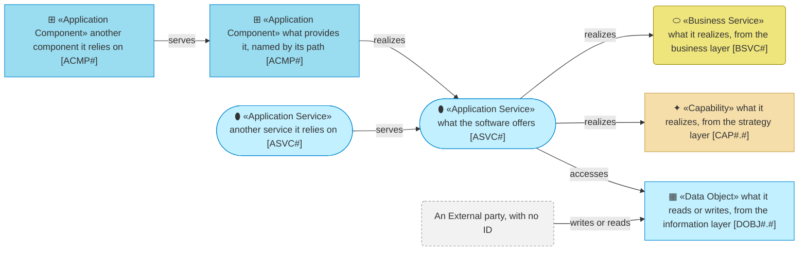
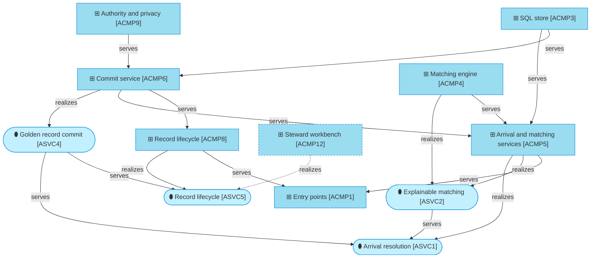

# Application Layer

_[← Model home](../README.md)_

The software that turns landing rows into published golden records, and the two interfaces the teams around the hub build against.

**ArchiMate viewpoint:** Application layer: Application Service, Application Component; collaborations drawn as interaction sequences, and interfaces written as contracts.

## Documents

| # | Document | Elements | Question it answers |
| - | -------- | -------- | ------------------- |
| 1 | [1_application-services.md](./1_application-services.md) | Application Services | What does the software offer the business layer? |
| 2 | [2_application-components.md](./2_application-components.md) | Application Components, each named by its source path | Which components provide those services, and where is each in the code? |
| 3 | [3_application-collaborations.md](./3_application-collaborations.md) | The arrival and commit sequences | How do the components work together, and what happens when a step fails? |
| 4 | [4_solution-design.md](./4_solution-design.md) | The layers, the store on two engines, matching, authority and personas | How is the code structured, and why? |
| 5 | [5_interface-contracts.md](./5_interface-contracts.md) | The landing and listener interfaces | What exactly does each interface promise the integration platform and the change notifier? |

## Metamodel

Cyan ramps from service to component. The business service, the capability and the data object are visitors from their own layers and keep their own shape and colour. A grey dashed box is an External party, such as the integration platform, and carries no ID. An element of this model that another team runs, such as the change notifier or the landing row, keeps its ID and is drawn grey dashed too.

## Layer view

Arrivals and the record actions both reach the published tables through the commit service alone, which checks each change set's authority again before it commits. The dashed box and edge are the steward workbench, which arrives with [initiative 3](../6_transition/2_sequence.md#sequence).
