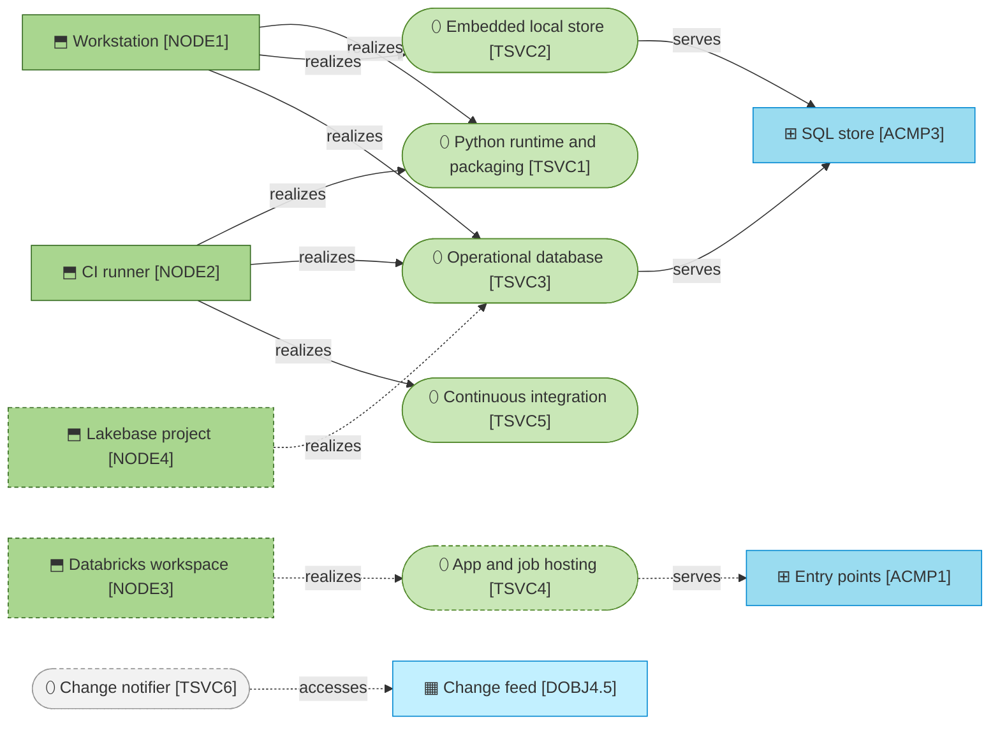
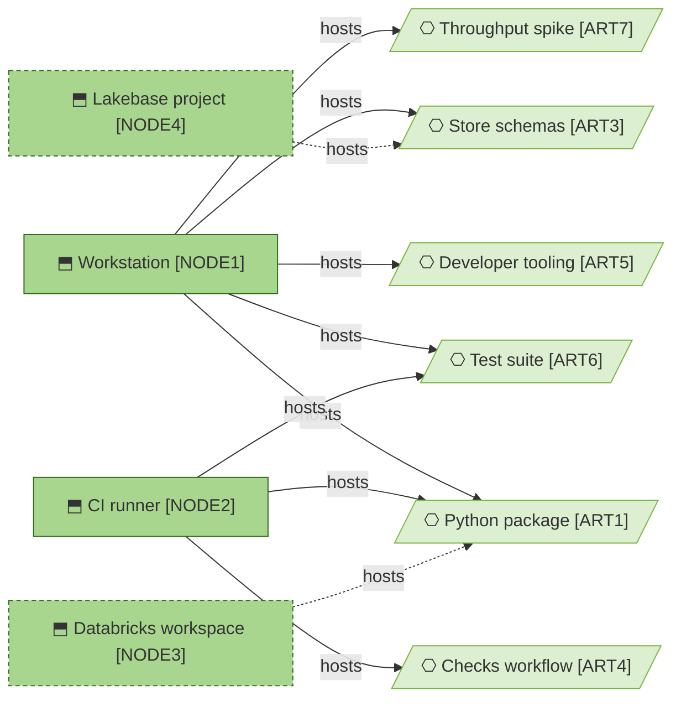

# Technology services

_[← Technology layer](./README.md) · [Model home](../README.md)_

**ArchiMate viewpoint:** Technology layer: Technology Service, Node.

**Status:** ◐ Draft catalogue — written for initiative 2, Foundations; not yet validated.

## Technology services

Both stores serve one component, [application component [`ACMP3`] SQL store](../4_application/2_application-components.md#application-components), which is why the hub gives the same answers on each. Dashed nodes and edges arrive with the deployment in [initiative 4](../6_transition/2_sequence.md#sequence). The grey change notifier is run by [stakeholder [`STK6`] Data platform team](../1_strategy/1_motivation.md#stakeholders), and will read [data object [`DOBJ4.5`] Change feed](../3_information/2_data-objects.md#published-master-data) under the [listener interface](../4_application/5_interface-contracts.md#listener-interface). The language model that Release 2 calls is [resource [`RES6`] Language-model endpoint](../1_strategy/2_capabilities-and-resources.md#resources); until then a stub answers locally.

Each product and version below was checked on 2026-09-27.

| ID | Technology service | Realized by | Alternatives considered | State | Source | Notes |
| -- | ------------------ | ----------- | ----------------------- | ----- | ------ | ----- |
| `TSVC1` | **Python runtime and packaging** — the language, the package manager and its lockfile, the build backend, the libraries every component shares, and the tools that check the code | Python 3.11 or later (3.11.15 locally); uv 0.8.17 with `uv.lock`; hatchling; Typer 0.27.2, PyYAML 6.0.3, rapidfuzz 3.14.6 and jellyfish 1.2.1; ruff 0.16.9, pytest 9.1.1 and pytest-xdist 3.8.0 for development | pip with requirements files, which lock only the top level; Poetry, a second tool beside the uv the siblings use; see [decision 5](../decisions/5_python-dash-and-typer.md) | Exists | [Blueprint](../reference/README.md#founding-material) §5.1; [decision 5](../decisions/5_python-dash-and-typer.md); versions from the Python Package Index and the uv release notes | |
| `TSVC2` | **Embedded local store** — an in-process SQL database in one file, for the local mode and the tests | DuckDB 1.5.5 in process, in one file, `.mdm/mdm.duckdb`, or in memory for the tests; pytz 2026.4, which DuckDB needs to return times with a time zone | SQLite, with no JSON type and a weaker analytic dialect; a local Postgres on every laptop, a server to run for a demo; see [decision 6](../decisions/6_one-sql-store-two-engines.md) | Exists | [Request](../reference/2026-09-26-request-and-answers.md#the-request); [decision 6](../decisions/6_one-sql-store-two-engines.md); version from the DuckDB release notes and the Python Package Index; behaviour proved by the tests on that version | A file has one writing process at a time |
| `TSVC3` | **Operational database** — the Postgres database that holds the hub's schemas: Lakebase on the platform, and a plain Postgres for the tests | Postgres through psycopg 3.3.6 and psycopg-pool 3.3.3; Postgres 16 on a workstation and 17 in CI; Lakebase Postgres 17 on the platform, signed in with an Open Authorization (OAuth) token that databricks-sdk 0.143.0 mints with `w.postgres.generate_database_credential` | The lakehouse's tables through a SQL warehouse, which [answer 5](../reference/2026-09-26-request-and-answers.md#answers) keeps off the operational route and which offers no row transactions at this latency; an object-relational mapper, see [decision 6](../decisions/6_one-sql-store-two-engines.md) | Exists on Postgres; Lakebase **Pending — future initiative** ([initiative 4](../6_transition/2_sequence.md#sequence)) | [Request](../reference/2026-09-26-request-and-answers.md#the-request); [answer 5](../reference/2026-09-26-request-and-answers.md#answers); [decision 6](../decisions/6_one-sql-store-two-engines.md); versions from the Python Package Index and the Databricks documentation for Lakebase | A Lakebase token lasts one hour, and is checked only when a connection signs in. The pool retires a connection after 45 minutes (`MDM_CONNECTION_MAX_AGE`), so each new one signs in with a fresh token |
| `TSVC4` | **App and job hosting** — where the web interface and the scheduled jobs run on the platform | Databricks Apps for the Dash interface of initiative 3; Databricks Jobs running `mdm` on a schedule | A background worker inside the app for bulk runs, which restarts with the app and is bound by the 120-second request limit; see [decision 5](../decisions/5_python-dash-and-typer.md) | **Pending — future initiative** ([initiative 4](../6_transition/2_sequence.md#sequence)) | Blueprint §5.6; the Databricks documentation for Apps | The interface libraries, as the siblings lock them in September 2026: Dash 4.4, dash-mantine-components 2.8, dash-ag-grid 35.3 and dash-cytoscape 1.0. Initiative 3 builds the interface and checks the versions again |
| `TSVC5` | **Continuous integration** — the checks that run on every pull request and every push to `main` | GitHub Actions with `actions/checkout` 4.4.0 and `astral-sh/setup-uv` 6.8.0, each pinned to its commit, and Python 3.11: the link, reference and prose checks, the public-safety scan, ruff, and pytest on DuckDB and on a `postgres:17` service container pinned to its digest | Checks run by hand; the pre-push hook alone, which a contributor may never install | Exists | Blueprint §7; [scope document 1](../scope/1_strategy-discovery.md) | What runs, and where it is defined, is in [deployment](./2_deployment.md#what-runs-on-every-change) |
| `TSVC6` | **Change notifier** — tells the integration platform which commit versions are new, by polling the hub's commit log | The data platform team's service, reading `mdm_core.commit_log` with a read grant and nothing more | `pg_notify` sent by each commit, and an outbox with a relay run by the hub, both against [principle [`P1`] The hub never propagates](../1_strategy/1_motivation.md#principles); see [decision 8](../decisions/8_commit-order-lock-and-change-feed.md) | External — run by the data platform team; reading the hub's commit log **Pending — future initiative** ([initiative 4](../6_transition/2_sequence.md#sequence)) | [Answer 5](../reference/2026-09-26-request-and-answers.md#answers) | The data platform team's agreement to the listener interface is sought before go-live |

## Nodes

The workstation hosts everything the hub needs to run and to be checked. The artifacts themselves are described under [deployment](./2_deployment.md#from-build-to-runtime). On the platform, the package runs in the workspace and the schemas live in the Lakebase project, both from [initiative 4](../6_transition/2_sequence.md#sequence).

| ID | Node | What runs there | State | Source | Notes |
| -- | ---- | --------------- | ----- | ------ | ----- |
| `NODE1` | **Workstation** — a person's machine in the local mode, with Python 3.11 and uv | The command line on a DuckDB file, the integration platform simulator, the test suite, and the throughput spike. Where `initdb` and `pg_ctl` are installed, the tests start a throwaway Postgres 16 server of their own | Exists | [Request](../reference/2026-09-26-request-and-answers.md#the-request); Blueprint §5.6 | Demo data is invented, and lives only in the local `.mdm/` directory |
| `NODE2` | **CI runner** — a GitHub-hosted Ubuntu runner with a `postgres:17` service container | The checks workflow: the model checks, the scan, the lint and the tests on both engines | Exists | Blueprint §7 | |
| `NODE3` | **Databricks workspace** — where the app and the scheduled jobs run | The Dash app and the `mdm` jobs | **Pending — future initiative** ([initiative 4](../6_transition/2_sequence.md#sequence)) | [Request](../reference/2026-09-26-request-and-answers.md#the-request); Blueprint §5.6 | The workspace region is agreed with the integration team and the data platform team before go-live |
| `NODE4` | **Lakebase project** — the production branch's read-write endpoint and its `databricks_postgres` database | The operational database: the hub's schema groups, and the landing table the integration platform owns | **Pending — future initiative** ([initiative 4](../6_transition/2_sequence.md#sequence)) | [Answer 5](../reference/2026-09-26-request-and-answers.md#answers); the Databricks documentation for Lakebase, checked 2026-09-27 | Compute beyond the smallest size is spend, raised when it is needed |
