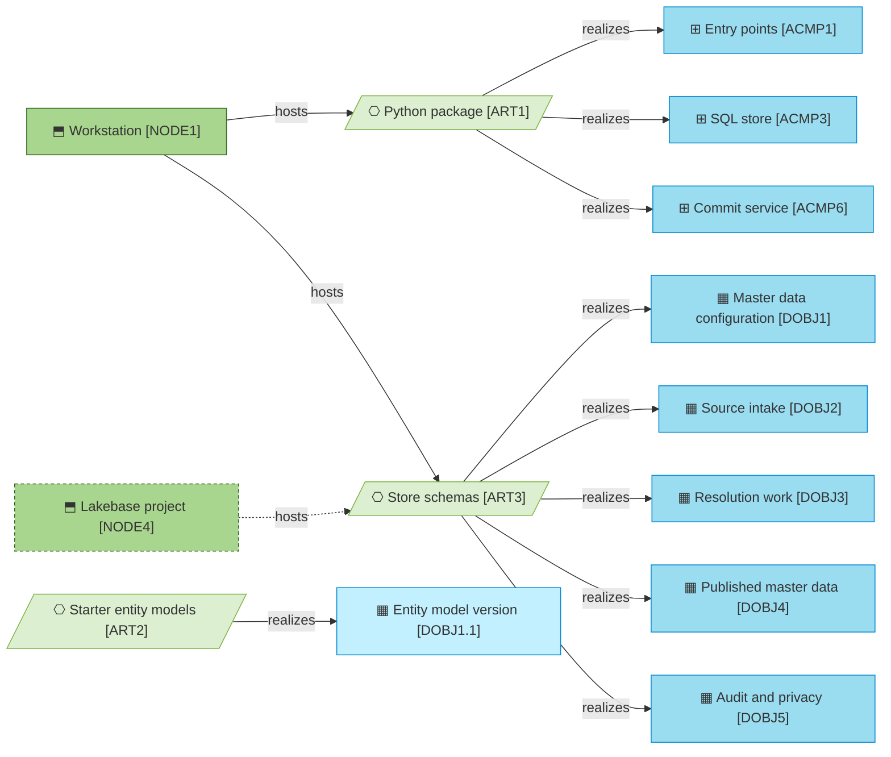

# Deployment

_[← Technology layer](./README.md) · [Model home](../README.md)_

**ArchiMate viewpoint:** Technology layer: Artifact, Node. Where the hub lives, what runs on every change, and how a built artifact reaches the place it runs.

**Status:** ● Validated, 2026-09-27.

## Where this project lives

| | |
| --- | --- |
| **Repository** | GitHub, `roanboc/dbx-master-data-manager` |
| **Visibility** | Public |
| **Checks on every change** | `.github/workflows/checks.yml` |
| **Where the model is read outside this repository** | Nowhere yet |

Everything in the repository is published, so the public-safety scan runs on every change and before every push.

## What runs on every change

| Trigger | What runs | Where it is defined |
| ------- | --------- | ------------------- |
| Every pull request, and every push to `main` | The link, reference and prose checks; the public-safety scan with its built-in patterns; an install that fails when `uv.lock` no longer matches `pyproject.toml`; ruff, for the lint rules and the formatting; pytest across the runner's cores, on DuckDB and on a `postgres:17` service container, which fails rather than skips when Postgres is missing, within 20 minutes. The jobs may only read the repository, their actions are pinned to commits and the image to its digest, and a newer push cancels the run it supersedes | `.github/workflows/checks.yml` |
| Every push from a clone where `make hooks` ran | The link, reference and prose checks; the scan with the private denylist when one is present, and with the built-in patterns otherwise; ruff's lint rules and its formatting check, from the lockfile as it stands. The test suite stays with `make test` | `scripts/hooks/pre-push` |
| On demand | The throughput spike, `make spike`; the demonstration, `make demo`; the live tests on a Lakebase endpoint, `make test-live`, once an endpoint exists | `Makefile` |

## From build to runtime

The package realizes all twelve existing [application components](../4_application/2_application-components.md#application-components); three are drawn. The store schemas realize the five [data domains](../3_information/1_data-domains.md#data-domains). The starter models become entity model versions once `mdm init --models models` loads them. The dashed node is the operational database of [initiative 4](../6_transition/2_sequence.md#sequence).

| ID | Artifact | Path | Deployed on | Source | Notes |
| -- | -------- | ---- | ----------- | ------ | ----- |
| `ART1` | **Python package** | `src/mdm/`, built from `pyproject.toml` and `uv.lock`, with the `mdm` command line as its entry point | [Node [`NODE1`] Workstation](./1_technology-services.md#nodes) node [`NODE2`] CI runner node [`NODE3`] Databricks workspace, **Pending — future initiative** ([initiative 4](../6_transition/2_sequence.md#sequence)) | [Decision 5](../decisions/5_python-dash-and-typer.md) | |
| `ART2` | **Starter entity models** | `models/person.yaml` `models/organisation.yaml` `models/codelists/` the invented starter Person and Organisation models, and the country code list | Loaded into the store by `mdm init --models models` | [Answer 1](../reference/2026-09-26-request-and-answers.md#answers); [decision 15](../decisions/15_code-list-snapshots.md) | |
| `ART3` | **Store schemas** | The eight schema groups that `src/mdm/backend/ddl.py` creates: one file, `.mdm/mdm.duckdb`, locally, and schemas in the operational database on the platform | Node [`NODE1`] Workstation node [`NODE4`] Lakebase project, **Pending — future initiative** ([initiative 4](../6_transition/2_sequence.md#sequence)) | [Decision 7](../decisions/7_schema-groups-and-one-published-schema.md) | |
| `ART4` | **Checks workflow** | `.github/workflows/checks.yml` | Node [`NODE2`] CI runner | Blueprint §7 | |
| `ART5` | **Developer tooling** | `Makefile` `scripts/hooks/pre-push` | Node [`NODE1`] Workstation | Blueprint §7 | |
| `ART6` | **Test suite** | `tests/`, which runs every store test on both engines | Node [`NODE1`] Workstation node [`NODE2`] CI runner | [Decision 6](../decisions/6_one-sql-store-two-engines.md) | |
| `ART7` | **Throughput spike** | `tools/spike_throughput.py` | Node [`NODE1`] Workstation | [Decision 14](../decisions/14_declared-capacity.md) | |

## What is deployed by hand

Nothing is deployed yet: the hub runs on a workstation and in CI only. The platform steps belong to initiative 4, and each is manual because it commits a team the hub does not direct.

| Step | Why it is manual | Who does it |
| ---- | ---------------- | ----------- |
| Create the schema `mdm_landing`, its sequence and its table from `mdm ddl --group landing`, and grant the hub's role `USAGE` and `SELECT` | The landing table belongs to the integration platform, so the hub's role can never write it | **Pending — future initiative** ([initiative 4](../6_transition/2_sequence.md#sequence)): the integration team |
| Grant the listener role its reads of `mdm_core`, with the default privileges, and the change-notifier role `SELECT` on `mdm_core.commit_log` only, with no default privileges, from `mdm ddl --grants --hub-role … --reader-role … --notifier-role …` | The roles belong to the platform, and the change notifier belongs to the data platform team | **Pending — future initiative** ([initiative 4](../6_transition/2_sequence.md#sequence)): the data platform team |
| Give the app's service principal what the hub needs and nothing more: ownership of `mdm_model`, `mdm_work`, `mdm_hub`, `mdm_vault`, `mdm_core` and `mdm_read`; `INSERT` and `SELECT` on `mdm_audit`, which another role owns; `USAGE` and `SELECT` on `mdm_landing` only; and, from Release 2, `CAN_QUERY` on the one serving endpoint | Least access, as [rule [`RULE11`] Least access by default](../2_business/5_domain-context-and-rules.md#business-rules) asks: the hub can neither write a landing row nor rewrite its own audit | **Pending — future initiative** ([initiative 4](../6_transition/2_sequence.md#sequence)): the data platform team |
| Create the Lakebase project, the app and the scheduled jobs | Workspace access and compute are spend the product owner grants | **Pending — future initiative** ([initiative 4](../6_transition/2_sequence.md#sequence)): the data platform team, from the deployment bundle |
