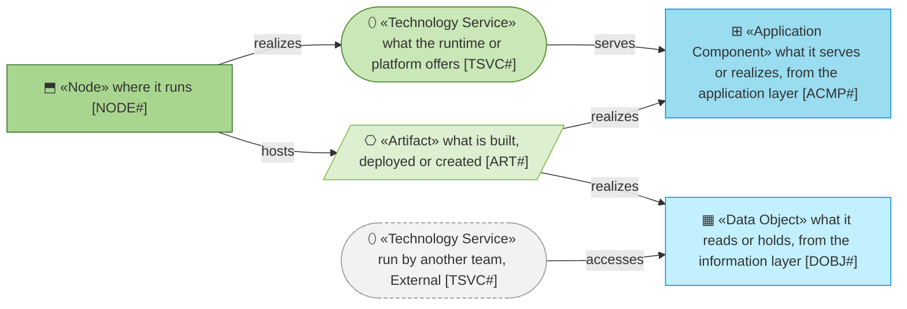
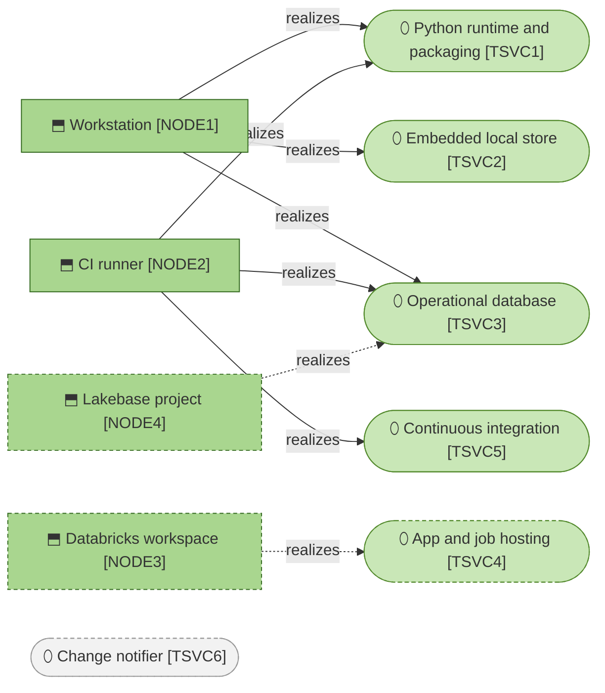

# Technology Layer

_[← Model home](../README.md)_

The runtimes, stores and machines the hub is built, tested and run on, and the load they are built for.

**ArchiMate viewpoint:** Technology layer: Technology Service, Node, Artifact.

## Documents

| # | Document | Elements | Question it answers |
| - | -------- | -------- | ------------------- |
| 1 | [1_technology-services.md](./1_technology-services.md) | Technology Services, with their products and versions; Nodes | What does the hub run on, which version, and why that one? |
| 2 | [2_deployment.md](./2_deployment.md) | Artifacts, and the checks that run on every change | How does the code get from the repository to where it runs? |
| 3 | [3_capacity-and-throughput.md](./3_capacity-and-throughput.md) | The declared capacity, and the measured throughput | How much is the hub built for, and how fast does it go? |

## Metamodel

Green ramps from service through artifact to node. The application component and the data object are visitors and keep their cyan. A grey dashed service is run by another team. A dashed border or edge is not true yet.

## Layer view

The hub runs today on a workstation and on the continuous integration (CI) runner, against DuckDB and Postgres. The dashed nodes and hosting are the platform, deployed in [initiative 4](../6_transition/2_sequence.md#sequence). The grey change notifier belongs to the data platform team.
