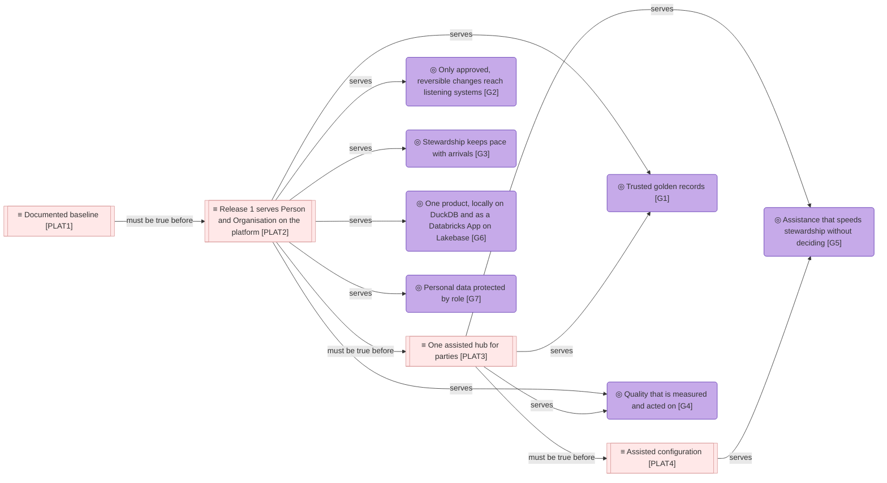
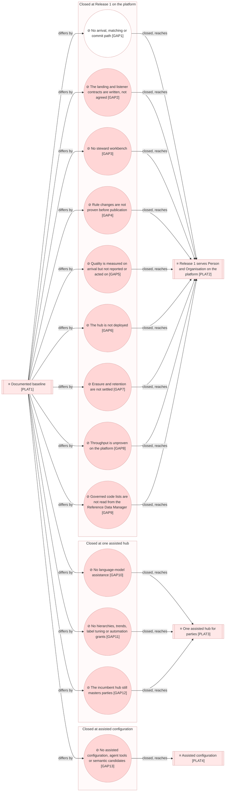

# Target state

_[← Roadmap](./README.md) · [Model home](../README.md)_

**ArchiMate viewpoint:** Implementation & Migration: Plateau, Gap.

**Status:** ◐ Draft catalogue — written for initiative 2, Foundations; not yet validated.

## Plateaus

Every goal of the [strategy](../1_strategy/1_motivation.md#goals) is served by at least one target. Release 1 carries six of the seven goals; [goal [`G5`] Assistance that speeds stewardship without deciding](../1_strategy/1_motivation.md#goals) waits for the language-model services of Release 2 and Release 3.

| ID | Plateau | Serves | Status | Reached by | Source | Notes |
| -- | ------- | ------ | ------ | ---------- | ------ | ----- |
| `PLAT1` | **Documented baseline** — the strategy and the key business elements are written and validated, and no code exists | — | Reached | [Initiative 1](../scope/1_strategy-discovery.md), strategy discovery | [Scope document 1](../scope/1_strategy-discovery.md) | |
| `PLAT2` | **Release 1 serves Person and Organisation on the platform** — sources land, arrive and commit on Lakebase; stewards decide in the workbench; rule changes are proven by a dry run; quality is reported and acted on; the landing and listener contracts are agreed; erasure is ready | [Goal [`G1`] Trusted golden records](../1_strategy/1_motivation.md#goals) goal [`G2`] Only approved, reversible changes reach listening systems goal [`G3`] Stewardship keeps pace with arrivals goal [`G4`] Quality that is measured and acted on goal [`G6`] One product, locally on DuckDB and as a Databricks App on Lakebase goal [`G7`] Personal data protected by role | In flight | Initiatives 2, 3 and 4 ([sequence](./2_sequence.md#sequence)) | [Answers 1 and 4](../reference/2026-09-26-request-and-answers.md#answers); [Blueprint](../reference/README.md#founding-material) §7 | Initiative 2 closes `GAP1` |
| `PLAT3` | **One assisted hub for parties** — case narratives, questions answered with cited records, onboarding from a sample file, hierarchies, trends, label tuning and automation grants; the incumbent hub's IDs, history and open exceptions carried over, and the switch-over made | Goal [`G1`] Trusted golden records goal [`G4`] Quality that is measured and acted on goal [`G5`] Assistance that speeds stewardship without deciding | Planned | Initiatives 5 and 6 | [Answer 2](../reference/2026-09-26-request-and-answers.md#answers); [driver [`DRV3`] Master data management moves onto the data platform](../1_strategy/1_motivation.md#drivers); adopted — the switch-over from the incumbent hub as a destination | The switch-over as a destination awaits the product owner's confirmation |
| `PLAT4` | **Assisted configuration** — rules drafted with assistance, agent tools and semantic candidates, as Release 3 | Goal [`G5`] Assistance that speeds stewardship without deciding | Planned | Initiative 7 | Blueprint §4; [answer 2](../reference/2026-09-26-request-and-answers.md#answers) | |

## Gaps

Each gap sits with the plateau that closes it. `GAP1` is drawn white because initiative 2 closed it. Most gaps close at `PLAT2`, because Release 1 is where the hub first meets real data, other teams and spend.

| ID | Gap | Baseline | Concerns | Closed by | Status | Source | Notes |
| -- | --- | -------- | -------- | --------- | ------ | ------ | ----- |
| `GAP1` | **No arrival, matching or commit path** | Absent at `PLAT1`: no code | [Business service [`BSVC2`] Arrival resolution](../2_business/2_business-services.md#business-services) business service [`BSVC7`] Published golden records and change feed [actor [`ACT6`] Automated matcher](../2_business/1_business-actors-and-roles.md#actors) | `PLAT2`, through [initiative 2](./2_sequence.md#sequence) | Closed — initiative 2 | [Scope document 1](../scope/1_strategy-discovery.md) | |
| `GAP2` | **The landing and listener contracts are written, not agreed** | Absent at `PLAT1`: no interface was written | [Contract [`CTR1`] Landing contract](../2_business/1_business-actors-and-roles.md#contracts) contract [`CTR2`] Listener contract | `PLAT2`, through initiative 4 | Open — narrowed by initiative 2: both interfaces are written, as the hub's proposal to the two teams | [Answer 5](../reference/2026-09-26-request-and-answers.md#answers) | Closing it needs the integration team and the data platform team |
| `GAP3` | **No steward workbench** | Absent at `PLAT1`: stewards have no screens; three business services and the workbench component wait for initiative 3 | [Business service [`BSVC1`] Record lookup and history](../2_business/2_business-services.md#business-services) business service [`BSVC3`] Stewardship work business service [`BSVC4`] Change approval [actor [`ACT7`] Work router](../2_business/1_business-actors-and-roles.md#actors) actor [`ACT8`] Quality breaker [application component [`ACMP12`] Steward workbench](../4_application/2_application-components.md#application-components) | `PLAT2`, through initiative 3 | Open | [Scope document 1](../scope/1_strategy-discovery.md); Blueprint §3 | |
| `GAP4` | **Rule changes are not proven before publication** | Absent at `PLAT1`: no model or rule set could be published | [Capability [`CAP3.2`] Rule tuning and impact preview](../1_strategy/2_capabilities-and-resources.md#capabilities) [rule [`RULE4`] Governance changes are proven before they are published](../2_business/5_domain-context-and-rules.md#business-rules) [value stream stage [`VS1.6`] Govern](../1_strategy/3_value-stream.md#value-stream) | `PLAT2`, through initiative 4 | Open — narrowed by initiative 2: a model or rule set is published only before any golden record, under a bootstrap authority; no dry run exists | Blueprint §5.5 | |
| `GAP5` | **Quality is measured on arrival but not reported or acted on** | Absent at `PLAT1`: no quality rule ran | [Business service [`BSVC6`] Quality and operations insight](../2_business/2_business-services.md#business-services) [capability [`CAP6.2`] Issue and contract management](../1_strategy/2_capabilities-and-resources.md#capabilities) [business object [`BOBJ11`] Quality issue](../2_business/4_business-objects.md#business-objects) | `PLAT2`, through initiative 4 | Open — narrowed by initiative 2: rule failures are stored per record; no scorecard or issue exists | Blueprint §2; DAMA-DMBOK2 Revised ch. 13 | |
| `GAP6` | **The hub is not deployed** | Absent at `PLAT1`: no code existed to deploy | [Resource [`RES2`] Platform hosting, store and compute](../1_strategy/2_capabilities-and-resources.md#resources) [actor [`ACT4`] Hub administrators](../2_business/1_business-actors-and-roles.md#actors) [technology service [`TSVC4`] App and job hosting](../5_technology/1_technology-services.md#technology-services) [node [`NODE3`] Databricks workspace](../5_technology/1_technology-services.md#nodes) node [`NODE4`] Lakebase project [application component [`ACMP13`] Deployment bundle and jobs](../4_application/2_application-components.md#application-components) [business service [`BSVC8`] Access and privacy administration](../2_business/2_business-services.md#business-services): workspace groups mapped to roles | `PLAT2`, through initiative 4 | Open — narrowed by initiative 2: it runs on a workstation and in continuous integration only, where every person on a shared store is a consumer | Blueprint §5.6 | Closing it is spend, which the product owner grants |
| `GAP7` | **Erasure and retention are not settled** | Absent at `PLAT1`: no store held a personal value | [Rule [`RULE5`] Destruction needs an owner and an administrator](../2_business/5_domain-context-and-rules.md#business-rules) [outcome [`OUT7`] An erasure request is carried out and reported](../1_strategy/1_motivation.md#outcomes) | `PLAT2`, through initiative 4 | Open — narrowed by initiative 2: the vault and a guarded redaction exist; no erasure workflow or retention periods do | [Answer 1](../reference/2026-09-26-request-and-answers.md#answers) | Closing it needs an agreement on who erases downstream copies and how long history is kept |
| `GAP8` | **Throughput is unproven on the platform** | Absent at `PLAT1`: nothing was measured | [Outcome [`OUT1`] Person and Organisation mastered end to end at Release 1 volume](../1_strategy/1_motivation.md#outcomes) [assessment [`ASM3`] Release 1 volumes stay under a million golden records per entity](../1_strategy/1_motivation.md#assessments) | `PLAT2`, through initiative 4 | Open — narrowed by initiative 2: measured on a workstation, on DuckDB and Postgres | [Answer 3](../reference/2026-09-26-request-and-answers.md#answers) | Closing it is spend |
| `GAP9` | **Governed code lists are not read from the Reference Data Manager** | Absent at `PLAT1`: no code list was read | [Resource [`RES4`] Governed code lists](../1_strategy/2_capabilities-and-resources.md#resources) [data object [`DOBJ1.3`] Code-list copy](../3_information/2_data-objects.md#master-data-configuration) | `PLAT2`, through initiative 4 | Open — narrowed by initiative 2: code-list copies load from files | [Decision 15](../decisions/15_code-list-snapshots.md) | |
| `GAP10` | **No language-model assistance** | Absent at `PLAT1`: no assistance of any kind | [Business service [`BSVC9`] Assisted stewardship and configuration](../2_business/2_business-services.md#business-services) [actor [`ACT9`] AI assistant](../2_business/1_business-actors-and-roles.md#actors) [resource [`RES6`] Language-model endpoint](../1_strategy/2_capabilities-and-resources.md#resources) [outcome [`OUT5`] Case narratives shorten review decisions](../1_strategy/1_motivation.md#outcomes) | `PLAT3`, through initiative 5 | Open — narrowed by initiative 2: the stub answers; the endpoint and the AI assistant wait for Release 2 | [Answer 2](../reference/2026-09-26-request-and-answers.md#answers) | |
| `GAP11` | **No hierarchies, trends, label tuning or automation grants** | Absent: the Release 2 parts of three capabilities wait for initiative 5, and no automation grant exists | [Capability [`CAP4.2`] Identity and relationship management](../1_strategy/2_capabilities-and-resources.md#capabilities) capability [`CAP6.1`] Quality measurement and monitoring capability [`CAP3.2`] Rule tuning and impact preview | `PLAT3`, through initiative 5 | Open | Blueprint §4; [answer 2](../reference/2026-09-26-request-and-answers.md#answers) | An automation grant widens the automated matcher's band, and needs a decision of its own |
| `GAP12` | **The incumbent hub still masters parties** | Absent at `PLAT1`, and still: the incumbent hub holds the parties' IDs and history | [Capability [`CAP2.3`] Migration from the incumbent hub](../1_strategy/2_capabilities-and-resources.md#capabilities) | `PLAT3`, through initiative 6 | Open | [Request](../reference/2026-09-26-request-and-answers.md#the-request); [driver [`DRV3`] Master data management moves onto the data platform](../1_strategy/1_motivation.md#drivers) | Closing it needs a private mapping and a parallel run |
| `GAP13` | **No assisted configuration, agent tools or semantic candidates** | Absent: assisted configuration and the semantic candidates of matching wait for Release 3 | [Capability [`CAP8.2`] Assisted configuration](../1_strategy/2_capabilities-and-resources.md#capabilities) capability [`CAP3.1`] Matching and clustering | `PLAT4`, through initiative 7 | Open | Blueprint §4 | |
