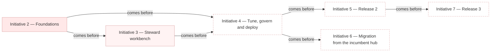

# Sequence

_[← Roadmap](./README.md) · [Model home](../README.md)_

**ArchiMate viewpoint:** Implementation & Migration: the order of the initiatives that close the gaps.

**Status:** ● Validated, 2026-09-27.

## Sequence

Initiative 3 is in progress, and its stories merge one by one. Each initiative starts once the ones before it are delivered. Dependencies order the work, not dates, so a late initiative moves those after it and nothing else. Release 2 and the migration both need the hub deployed and governed, and may run side by side.

| Initiative | Name | Closes | Moves toward | Depends on | Status | Source |
| ---------- | ---- | ------ | ------------ | ---------- | ------ | ------ |
| 2 | Foundations | [Gap [`GAP1`] No arrival, matching or commit path](./1_target-state.md#gaps) | [Plateau [`PLAT2`] Release 1 serves Person and Organisation on the platform](./1_target-state.md#plateaus) | — | Delivered | [Answer 4](../reference/2026-09-26-request-and-answers.md#answers) |
| 3 | Steward workbench | Gap [`GAP3`] No steward workbench | Plateau [`PLAT2`] Release 1 serves Person and Organisation on the platform | 2 | In progress — stories 3.1, 3.2 and 3.3 delivered | Answer 4; [scope document 3](../scope/3_steward-workbench.md) |
| 4 | Tune, govern and deploy | Gap [`GAP2`] The landing and listener contracts are written, not agreed gap [`GAP4`] Rule changes are not proven before publication gap [`GAP5`] Quality is measured on arrival but not reported or acted on gap [`GAP6`] The hub is not deployed gap [`GAP7`] Erasure and retention are not settled gap [`GAP8`] Throughput is unproven on the platform gap [`GAP9`] Governed code lists are not read from the Reference Data Manager | Plateau [`PLAT2`] Release 1 serves Person and Organisation on the platform | 2, 3 | Planned | Answer 4 |
| 5 | Release 2 | Gap [`GAP10`] No language-model assistance gap [`GAP11`] No hierarchies, trends, label tuning or automation grants | [Plateau [`PLAT3`] One assisted hub for parties](./1_target-state.md#plateaus) | 4 | Planned | adopted — [Blueprint](../reference/README.md#founding-material) §7 |
| 6 | Migration from the incumbent hub | Gap [`GAP12`] The incumbent hub still masters parties | Plateau [`PLAT3`] One assisted hub for parties | 4 | Planned | adopted — Blueprint §7 |
| 7 | Release 3 | Gap [`GAP13`] No assisted configuration, agent tools or semantic candidates | [Plateau [`PLAT4`] Assisted configuration](./1_target-state.md#plateaus) | 5 | Planned | adopted — Blueprint §7 |

## Outside the roadmap

Two pieces of work are left unsequenced on purpose, because each needs a decision first.

| Not sequenced | What it needs before it can be |
| ------------- | ------------------------------ |
| External enrichment of records from an outside register | A licensed register, and a decision on data leaving the platform |
| A web interface for other systems, in the representational state transfer (REST) style | An authentication decision. The command line, the masked read views and batch matching cover the need today |

Two states are deliberate, and are not gaps:

- **The hub never propagates.** Carrying committed changes to listening systems belongs to the change notifier and the integration platform, under [principle [`P1`] The hub never propagates](../1_strategy/1_motivation.md#principles).
- **A sync to the lakehouse serves analytics only.** It is never the route to listening systems, as [answer 5](../reference/2026-09-26-request-and-answers.md#answers) decided.

## Keeping it current

Each initiative's scope document names the gaps it closes. The same pull request marks those gaps `Closed` in the [target state](./1_target-state.md#gaps) and moves its initiative's status here. A plateau that is reached stays, marked `Reached`, with the initiatives that reached it. A plateau that is abandoned stays too, marked `Abandoned`, with why. Whoever runs the initiative, a person or the coding agent, makes these edits.
