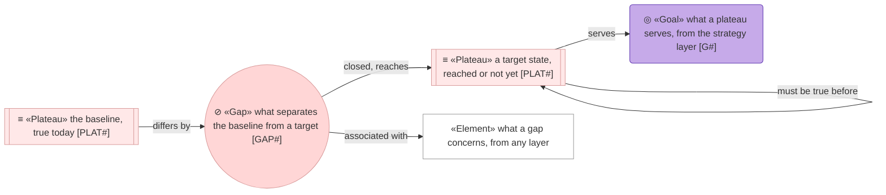
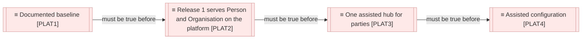

# Roadmap

_[← Model home](../README.md) · [Scope documents](../scope/README.md)_

Where the hub is going, what stands between it and today, and the order the distance is closed in.

**ArchiMate viewpoint:** Implementation & Migration: Plateau, Gap. The one place in the model that describes a future; every numbered layer describes today.

## Documents

| # | Document | Elements | Question it answers |
| - | -------- | -------- | ------------------- |
| 1 | [1_target-state.md](./1_target-state.md) | Plateaus, Gaps | Where should the hub be, and what is missing between here and there? |
| 2 | [2_sequence.md](./2_sequence.md) | — | In what order are the gaps closed, and what has to be true first? |

## Metamodel

Both element types take the Implementation & Migration rose, ramped from plateau to gap. A goal is a visitor and keeps its violet; the element a gap concerns keeps its own layer's shape and colour wherever it is drawn. Edges are solid: the dependency between two plateaus is true today, whether or not either is reached. What is not reached yet is a plateau's own status, which its row carries in one of four words.

| Status | Means |
| ------ | ----- |
| **Planned** | Named and approved as intent. Nothing is in flight |
| **In flight** | An initiative is open against it. Its scope document names the gaps it closes |
| **Reached** | The state is true today. The row stays, naming the initiative that arrived at it |
| **Abandoned** | No longer the intent. The row stays, with why |

## Layer view

Thirteen gaps separate the [plateau [`PLAT1`] Documented baseline](./1_target-state.md#plateaus) from the targets. Nine close at plateau [`PLAT2`] Release 1 serves Person and Organisation on the platform, and initiative 2 has closed one of them. Three close at plateau [`PLAT3`] One assisted hub for parties, and one at plateau [`PLAT4`] Assisted configuration. The [sequence](./2_sequence.md#sequence) orders the initiatives that close them.
